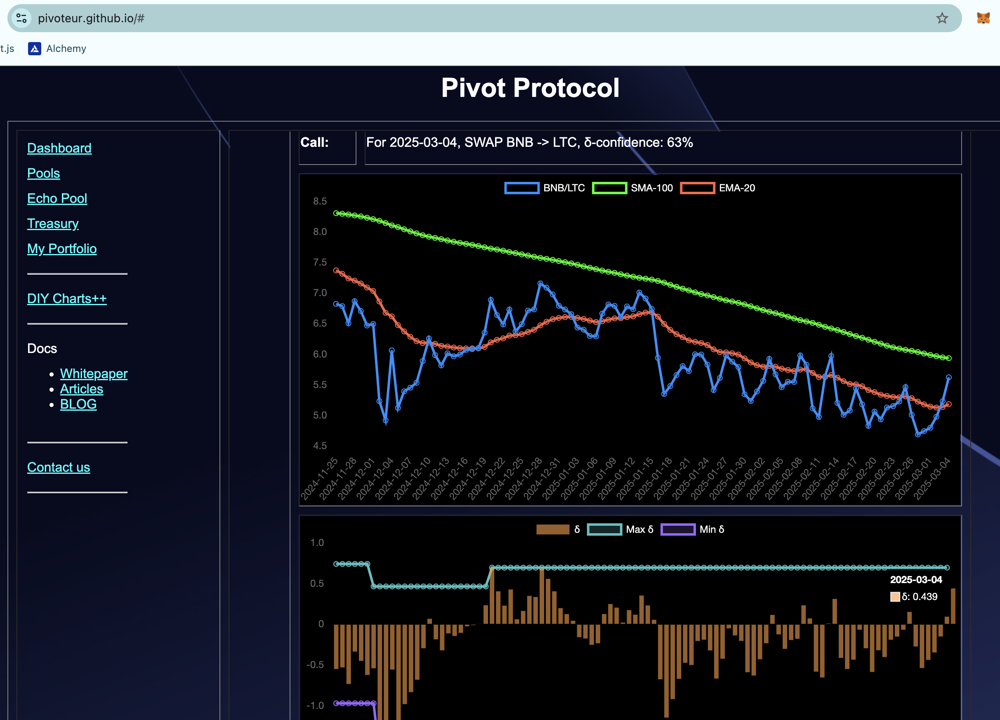
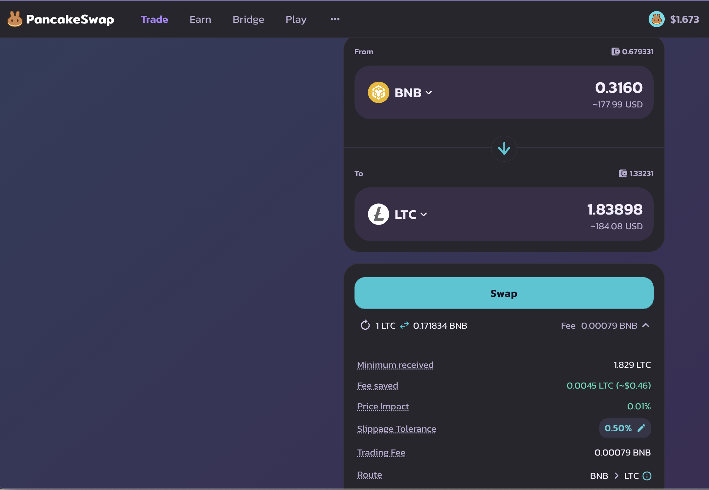
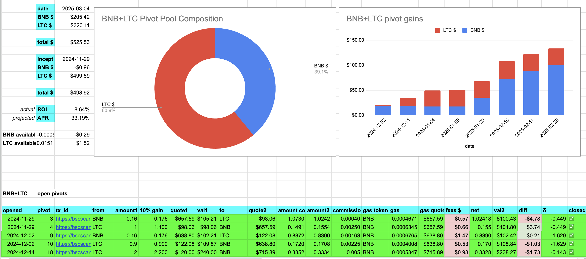
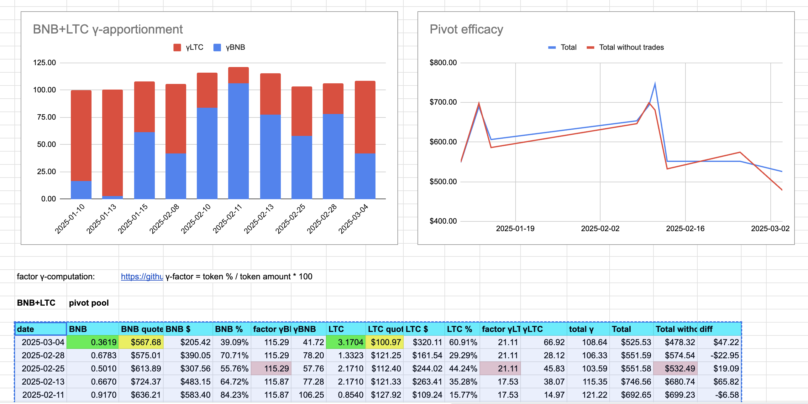
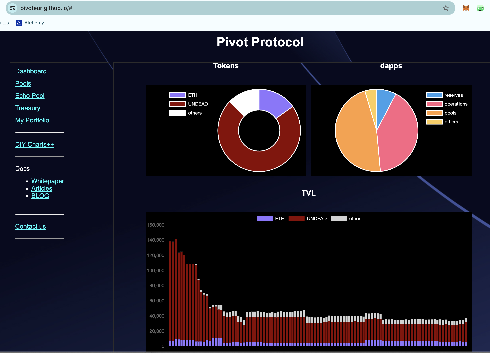
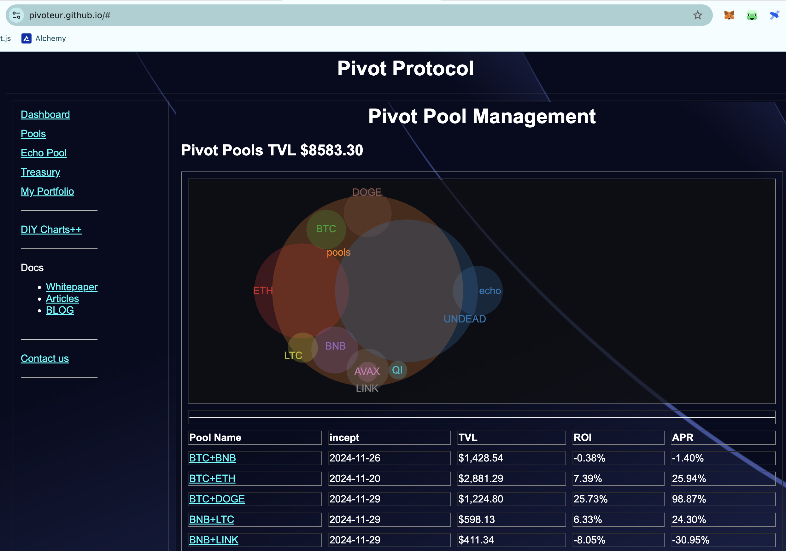

# PIVOTS

## BNB+LTC

No close pivots, but a δ swing to the positive calls to open a BNB-on-LTC pivot: this I do.

The BNB+LTC pivot pool composition and γ-apportionment are as charted. 

# Conclusion

This concludes pivots for today; HAND! 😊

The [Pivot protocol](https://pivoteur.github.io/#)

