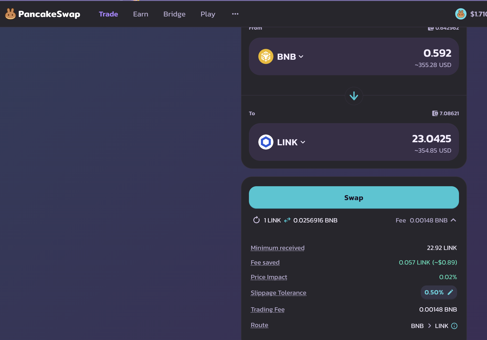
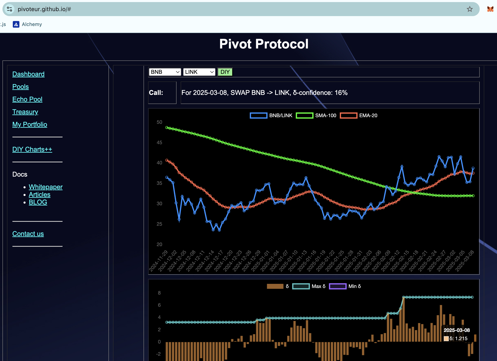
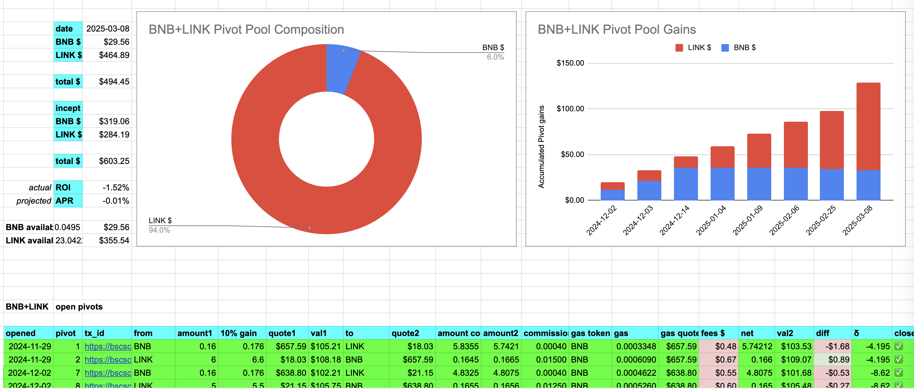
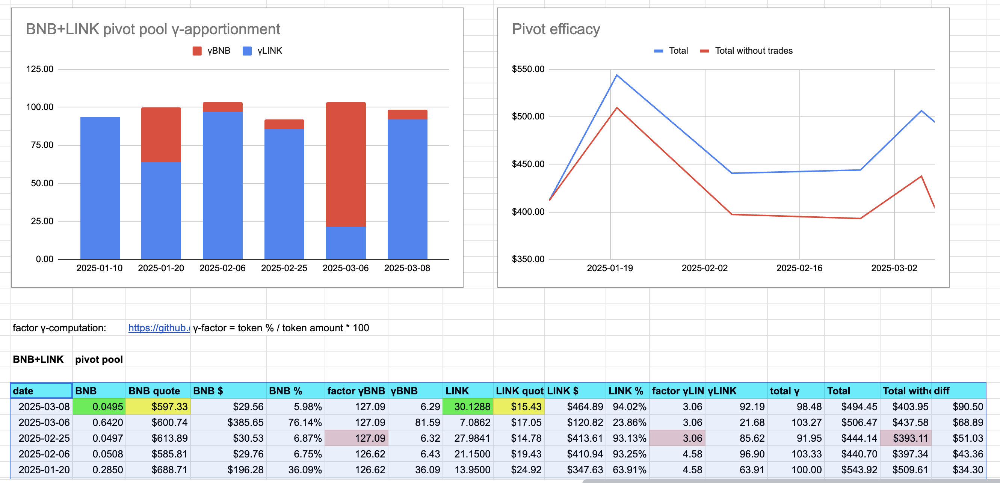
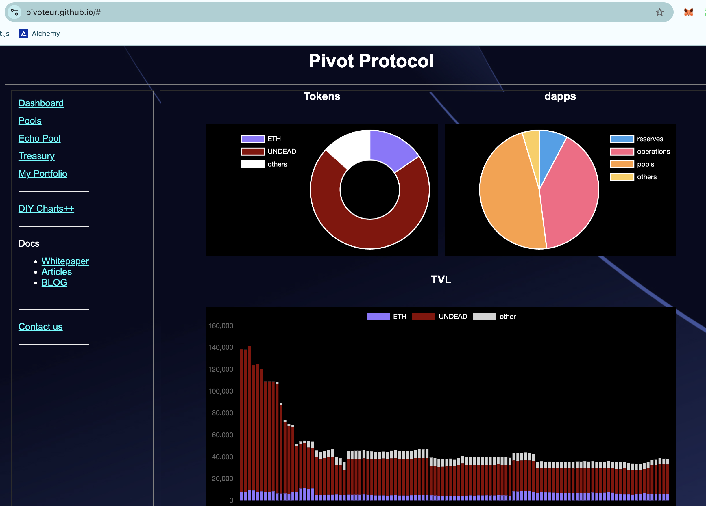
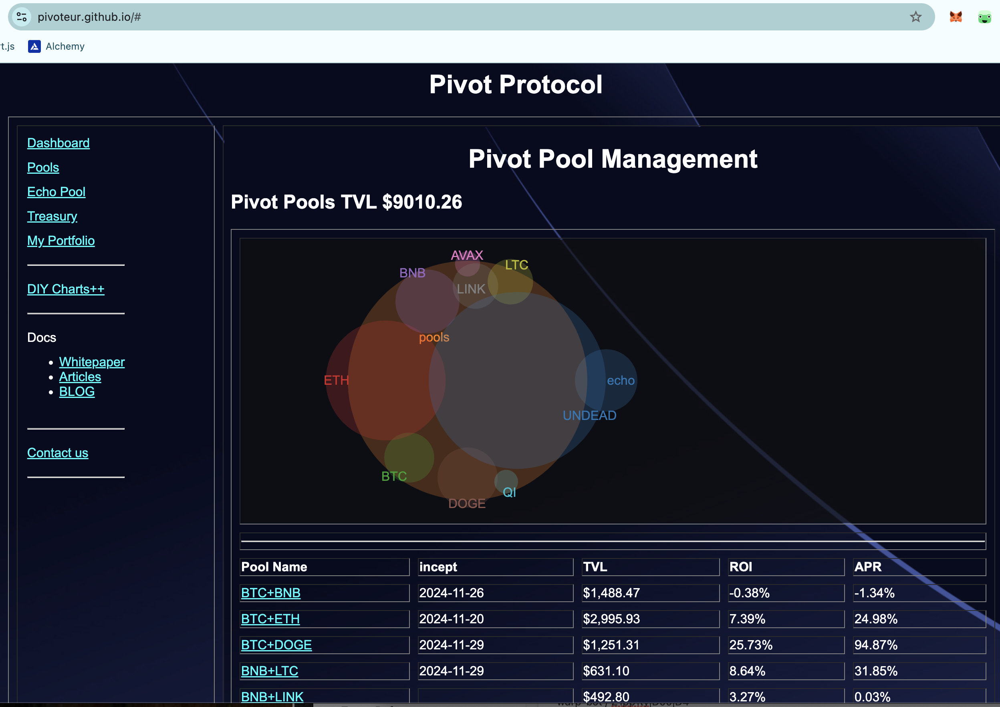

2025-03-08

Hello, all!

# PIVOTS

## BNB+LINK

I close a LINK-on-BNB pivot for gains of:

* actual ROI: 9.72% / 1774.00% APR projected
* or: $33-gain on $355 pivot
* or: 20.9 $LINK -> $BNB -> 23 $LINK

The positive δ calls to open a BNB-on-LINK pivot, but all $BNB is already engaged.

# Conclusion

This concludes pivots for today.

The [Pivot protocol](https://pivoteur.github.io/#)
