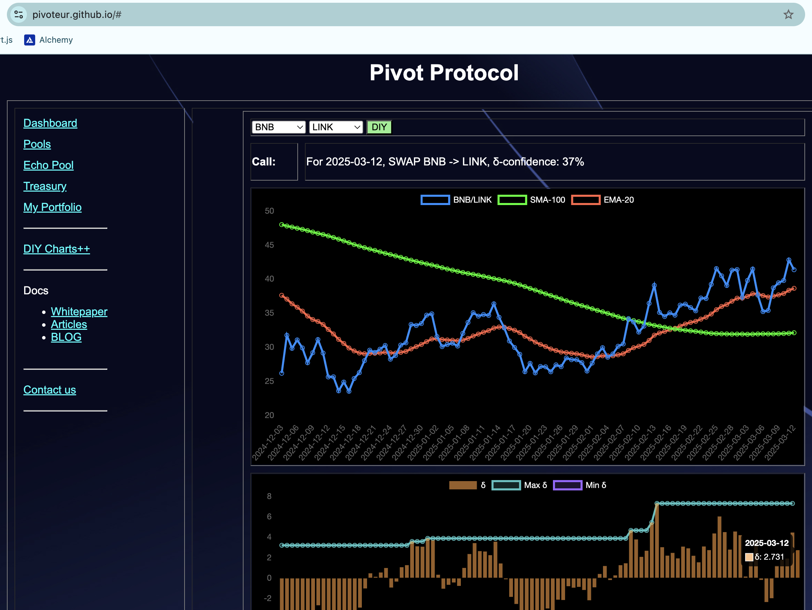
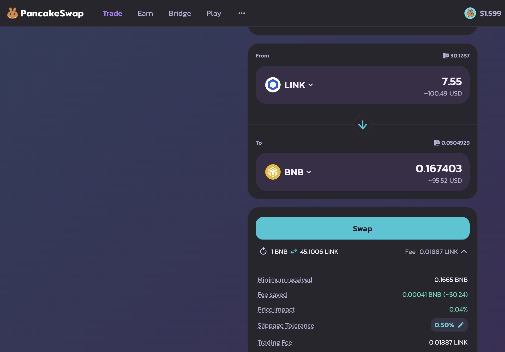
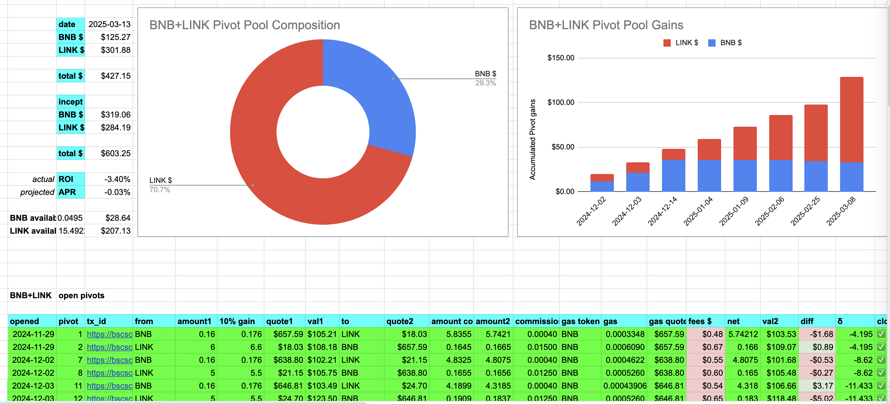
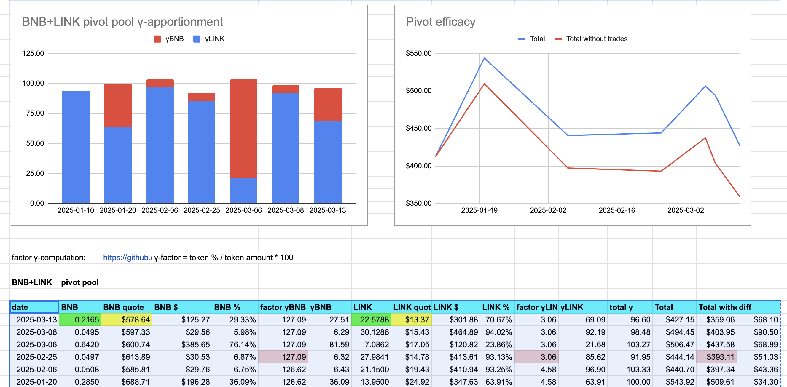
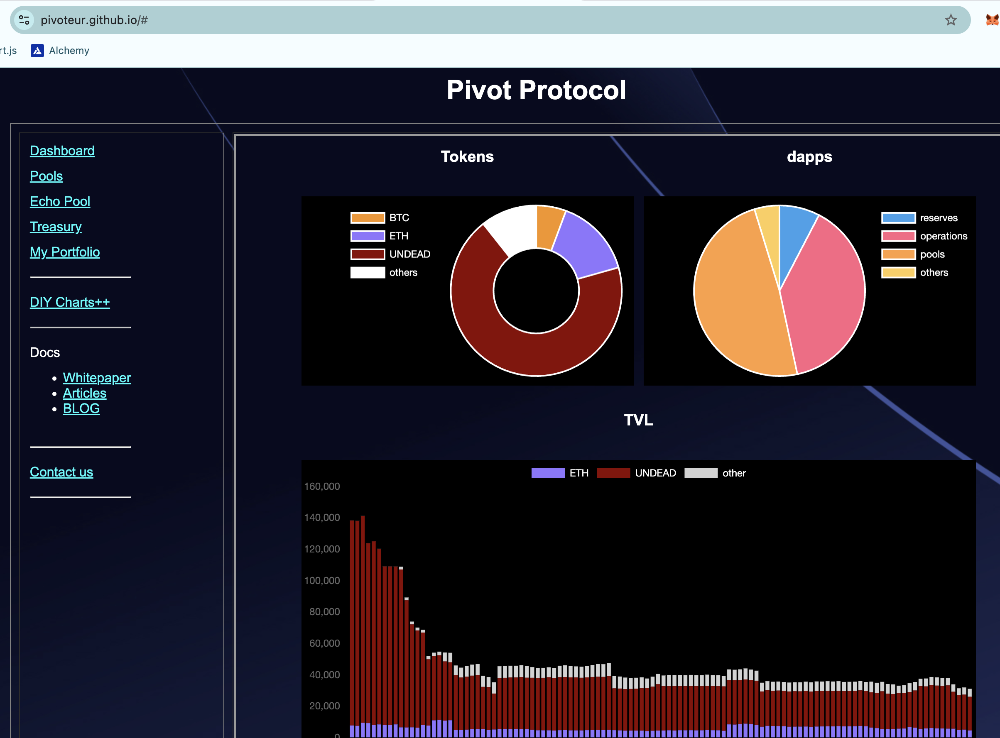
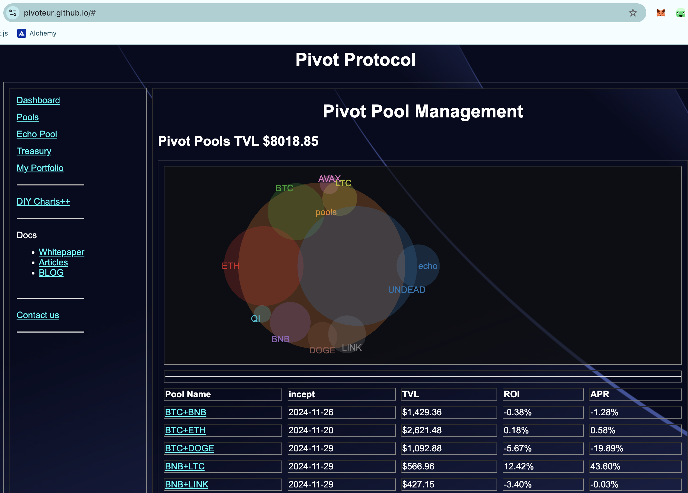

# PIVOTS

## BTC+ETH

No close pivots, and a positive δ calls to open a BTC-on-ETH pivot, but all $BTC is already committed to pivots.

As per [new policy](../../../../meetings/2025/03/09/README.md), I'm opening an ETH-on-BTC hedge.

## BTC+DOGE

No close pivots. A positive δ calls to open a BTC-on-DOGE pivot, but all $BTC is already committed to pivots. I open a DOGE-on-BTC hedge.

WOOT! 💥

## BNB+LTC

I close LTC-on-BNB pivot for gains of:

* actual ROI: 12.10% / 84.92% APR projected
* or: 2.1 $LTC -> $BNB -> 2.25 $LTC
* or: $23-gain on a $250-pivot

The positive δ calls to open a BNB-on-LTC pivot but all $BNB is committed. Instead I open an LTC-on-BNB hedge.

## BNB+LINK

No close pivots. A positive δ calls to open a BNB-on-LINK pivot, but all $BNB is already committed. Instead, I open a LINK-on-BNB hedge.

The BNB+LINK composition and γ-apportionment are as charted. 

# Conclusion

This concludes pivots for today.

The [Pivot protocol](https://pivoteur.github.io/#)
