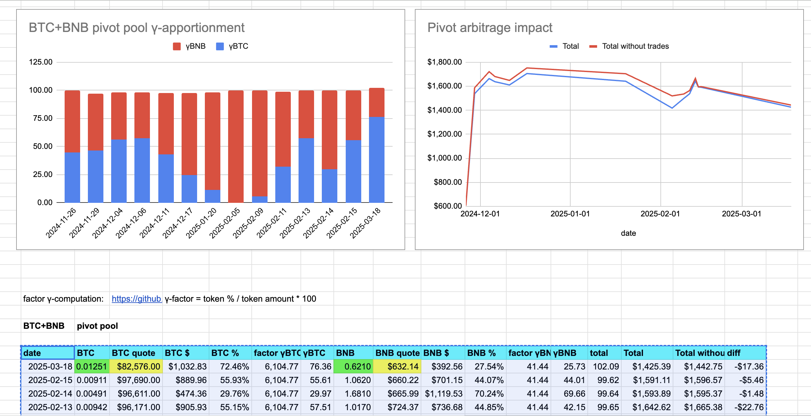

2025-03-18 

# Status of $UNDEAD 

 
 
 
 

* rank: 7322 
* quote: $0.00237 
* market cap: $35,220 
* 24-hr volume: $128,686 
* 24-hr volume δ: -$1,887 

When we get LPs funded on multiple blockchains, what will $UNDEAD look like then? 

[$UNDEAD data source](https://www.coingecko.com/en/coins/undead-blocks)

@UndeadBlocks 

# PIVOTS

BTC+BNB

WOOT! 💥

I close a BTC-on-BNB pivot for gains of:

* actual ROI: 13.02% / 52.21% APR projected
* or: 0.003 $BTC -> $BNB -> 0.0034
* or: $32-gain on $318-pivot

The negative δ calls to open a BNB-on-BTC pivot, but all $BNB is committed.

BTC+BNB pivot pool charts

# Pivot Arbitrage

I don't know how many times I have to repeat this so that everybody in the world gets this, so this is my job now:

💥💥💥
PIVOT ARBITRAGE MATERALIZES $BTC FROM $BTC (pivoting on another asset) (or materalizes whatever you want to materialize by pivoting on another asset)!
💥💥💥

Let's put this into context.

Let's say you have 100 $BTC. Yay! And good for you.

With pivot arbitrage, your ROI can be 10% or more on that $BTC (in the pivot above, it's actually 13%).

That's just ROI, not projected APR.

Are you getting that from your $BTC? Because you can.

# Conclusion

This concludes pivots for today.

The [Pivot protocol](https://pivoteur.github.io/#)
