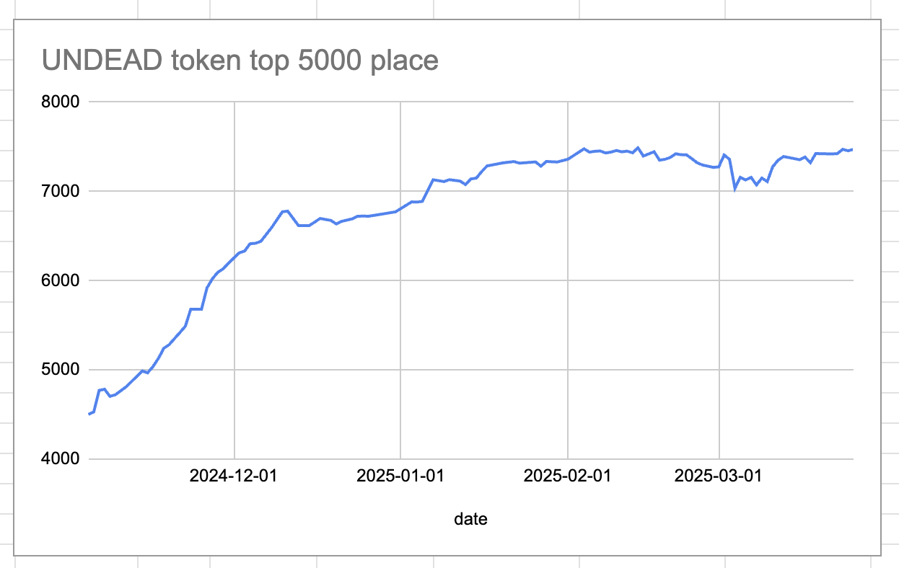
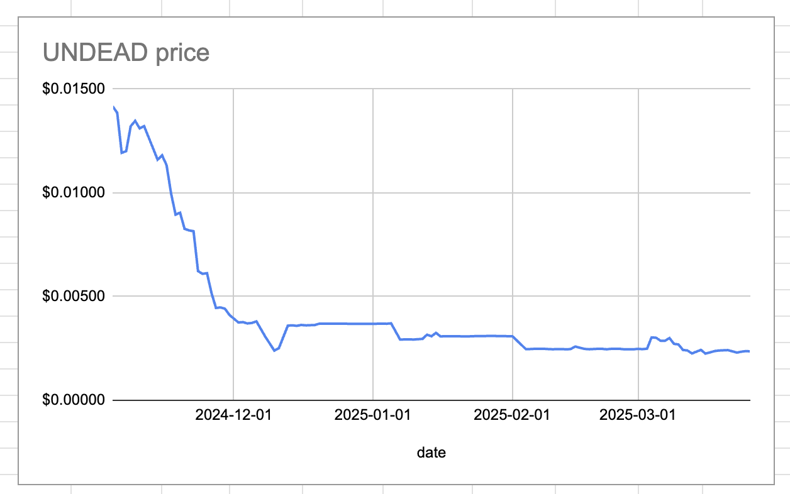
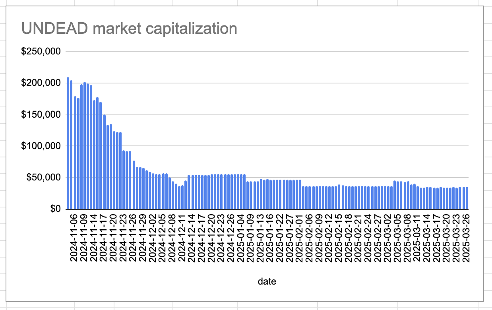
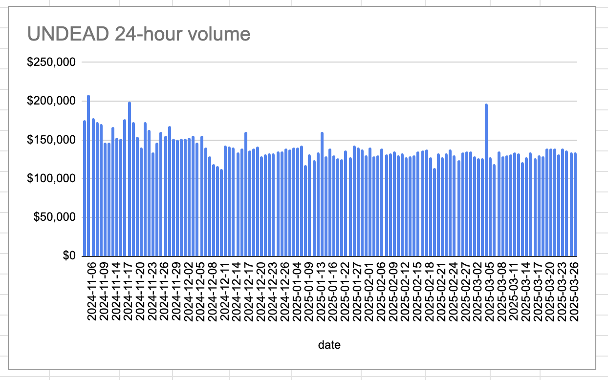
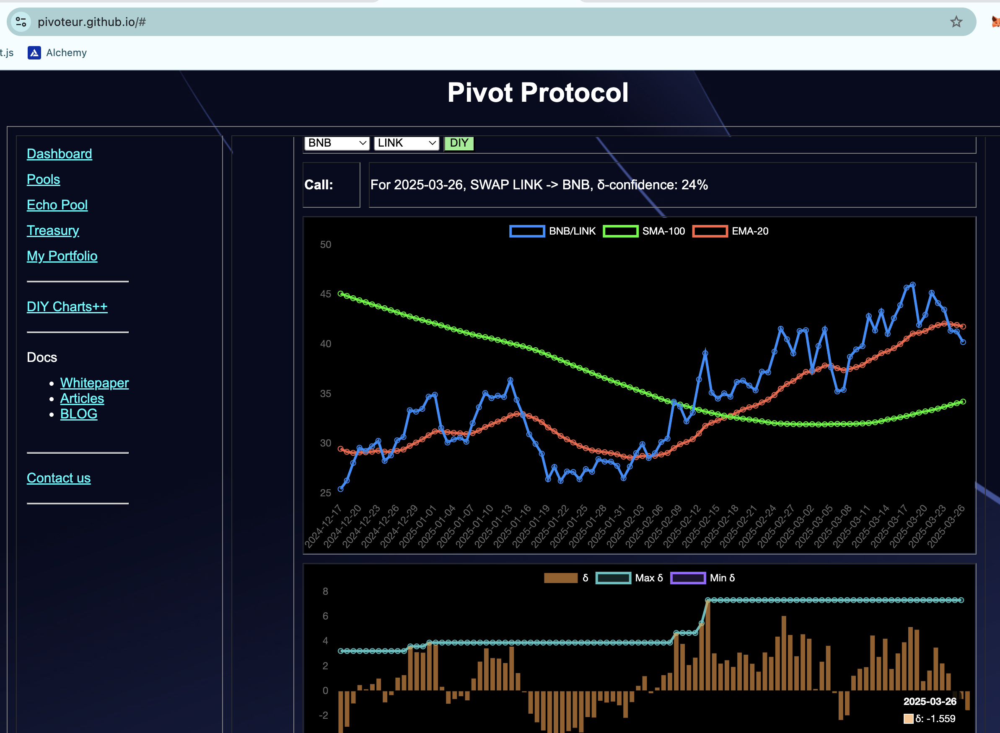
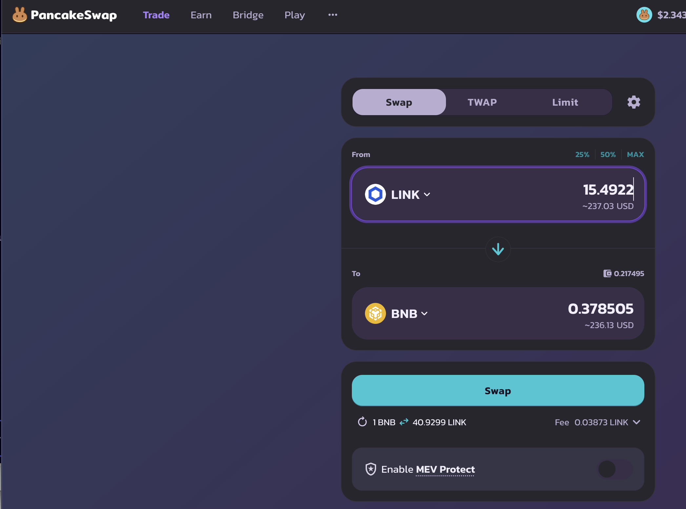
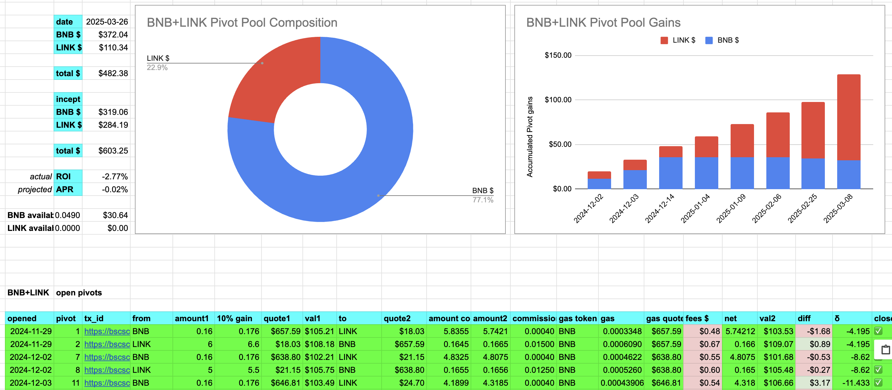
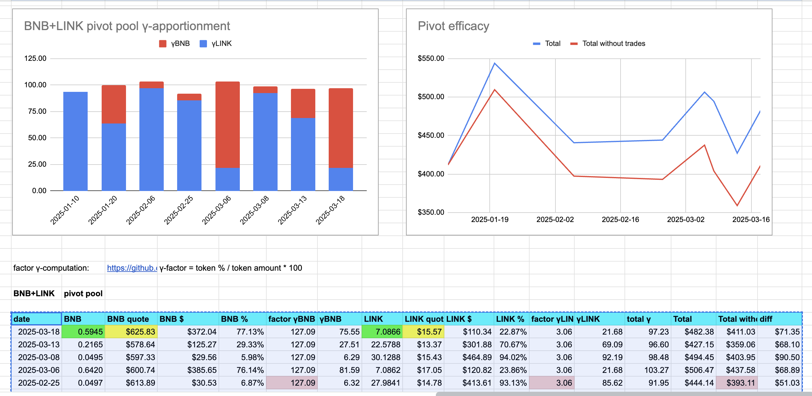
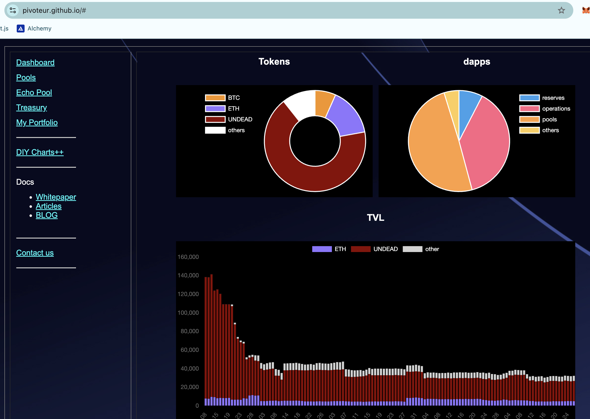
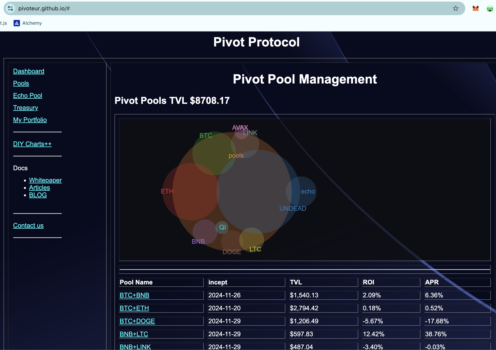

2025-03-26 

# Status of $UNDEAD 

 
 
 
 

* rank: 7472 
* quote: $0.00236 
* market cap: $34,896 
* 24-hr volume: $134,066 
* 24-hr volume δ: $453 

When we get LPs funded on multiple blockchains, what will $UNDEAD look like? 

[$UNDEAD data source](https://www.coingecko.com/en/coins/undead-blocks) 

# PIVOTS

## BNB+LINK

No close pivots. A negative δ calls to open a LINK-on-BNB pivot. This I do.

The BNB+LINK pivot pool composition and γ-apportionment are as charted. 

# Conclusion

This concludes pivots for today.

The [Pivot protocol](https://pivoteur.github.io/#)
