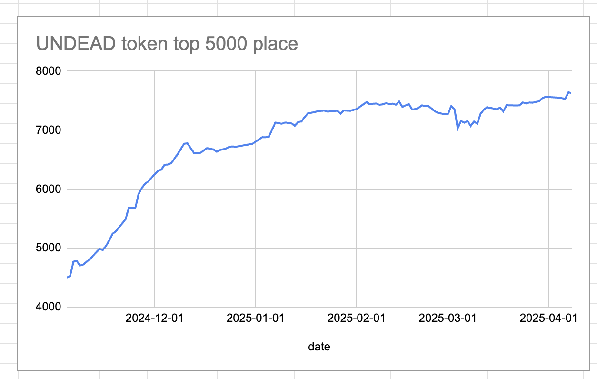
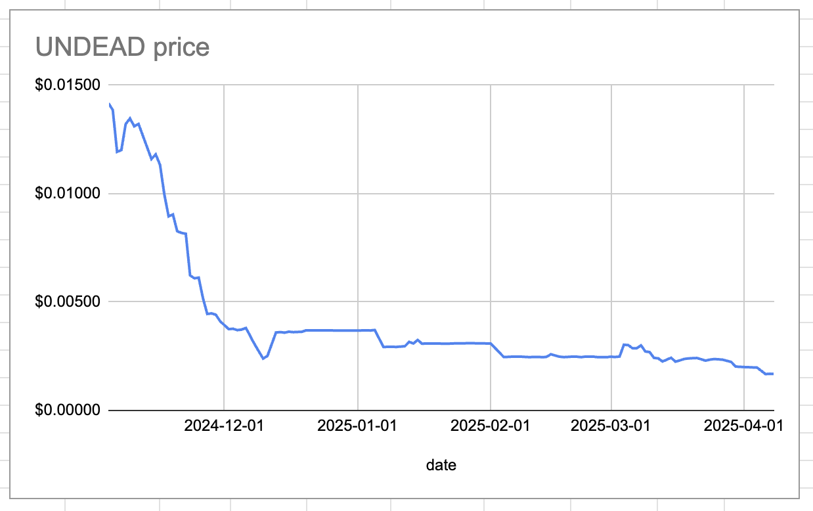
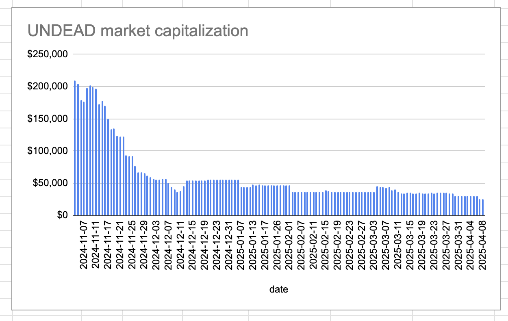
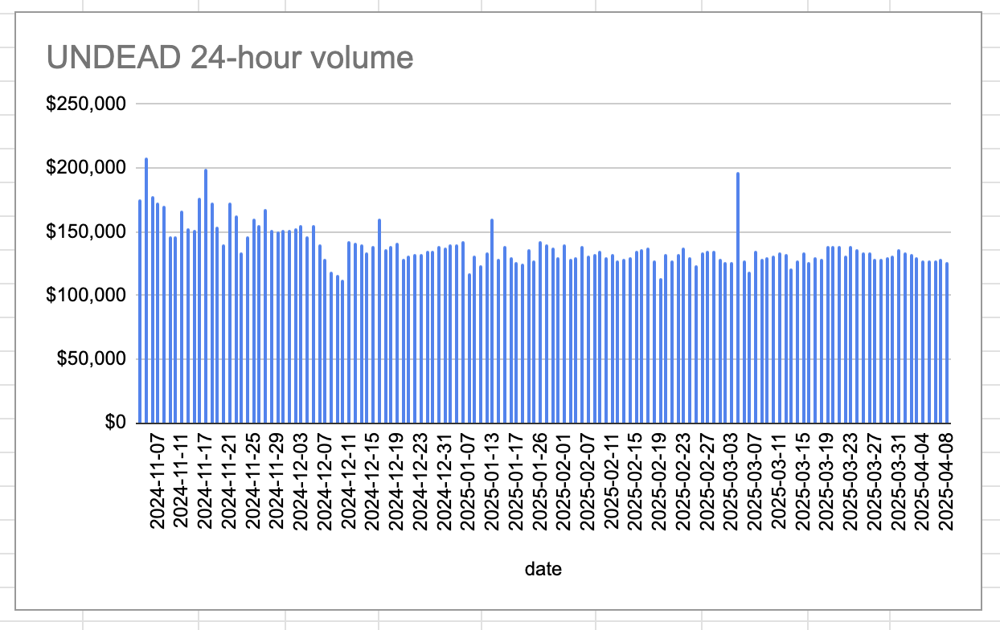
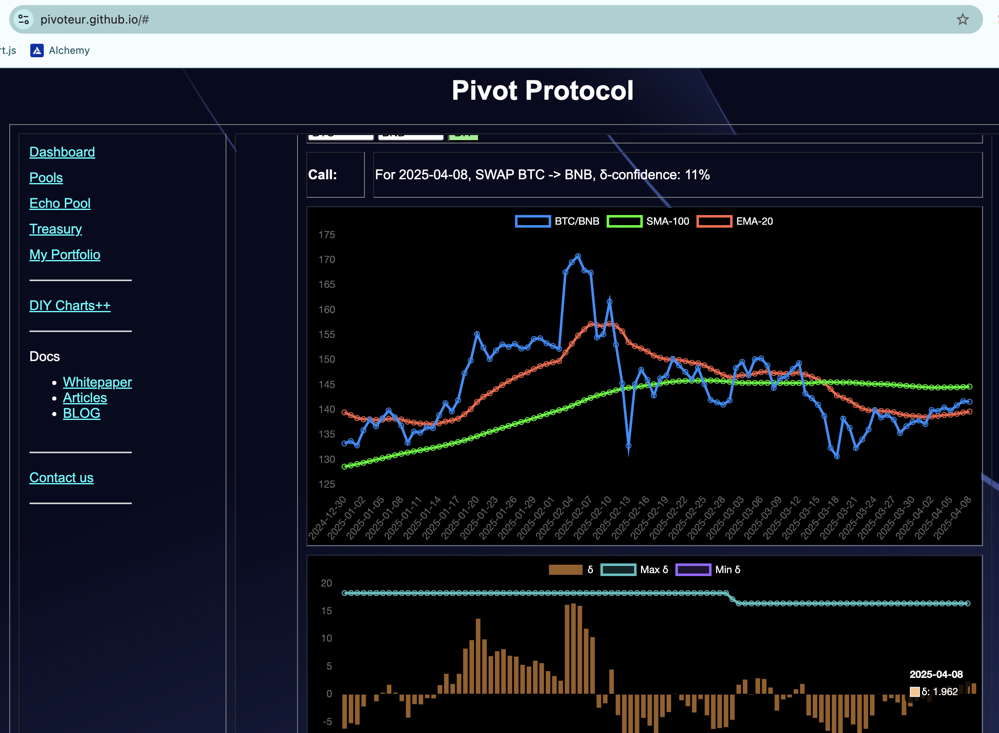
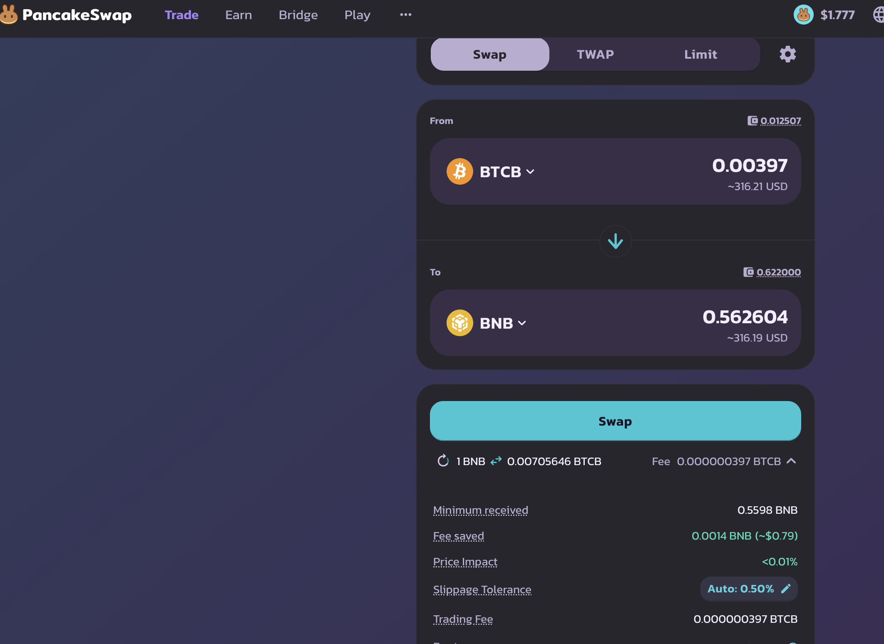
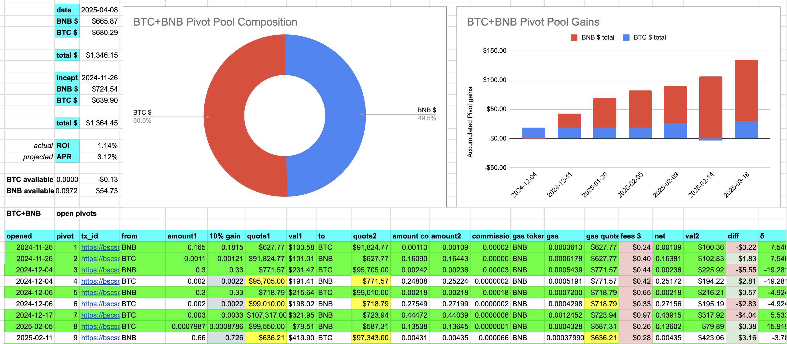
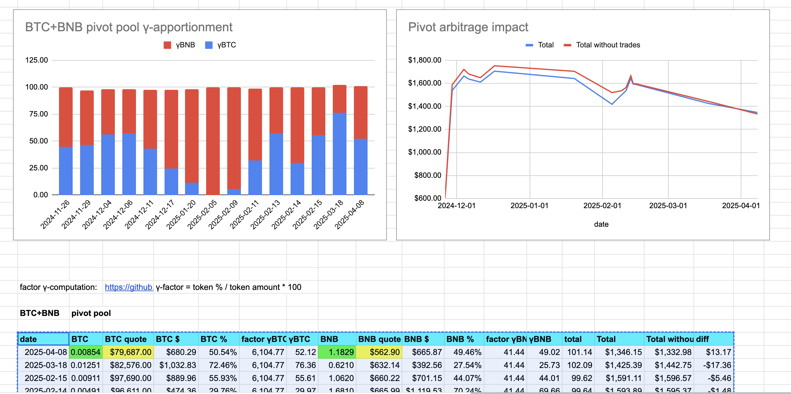

2025-04-08 

# Status of $UNDEAD 

 
 
 
 

* rank: 7628 
* quote: $0.00169 
* market cap: $25,628 
* 24-hr volume: $126,116 
* 24-hr volume δ: -$2,618 

When we get LPs funded on multiple blockchains, what will $UNDEAD look like? 

[$UNDEAD data source](https://www.coingecko.com/en/coins/undead-blocks) 

# PIVOTS

## BTC+BNB

No close pivots, but the δ, finally being positive again, calls to open a BTC-on-BNB pivot, which I do.

The BTC+BNB composition and γ-apportionment are as charted. 

