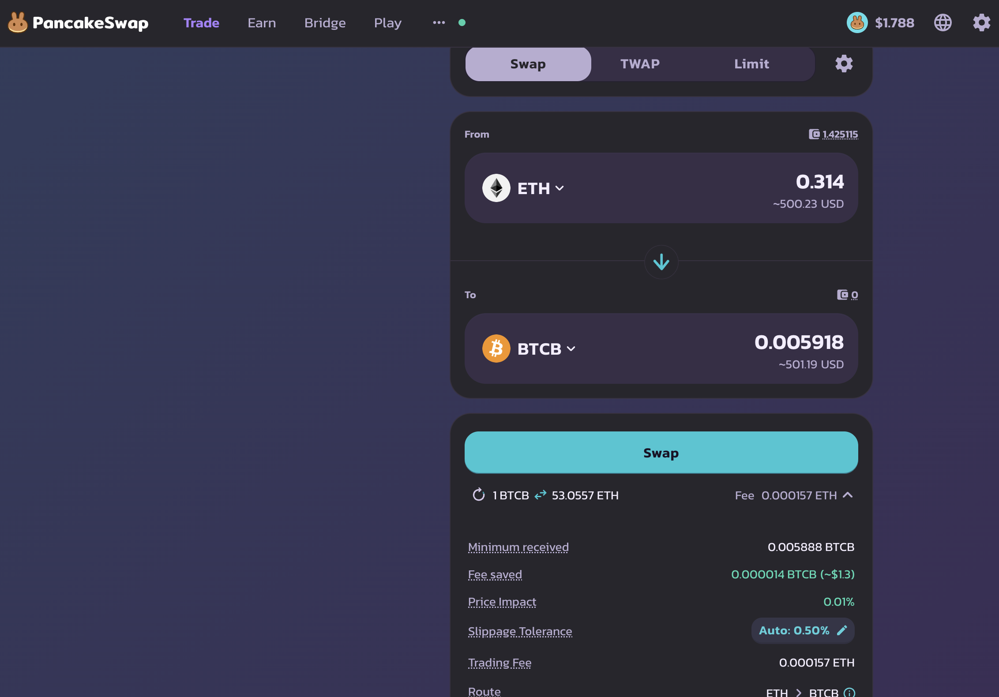

2025-04-17 

# Status of $UNDEAD 

 
 
 
 

* rank: 7774 
* quote: $0.00172 
* market cap: $25,185 
* 24-hr volume: $173,223 
* 24-hr volume δ: -$2,984 

When we get LPs funded on multiple blockchains, what will $UNDEAD look like? 

[$UNDEAD data source](https://www.coingecko.com/en/coins/undead-blocks) 

# PIVOTS

## BTC+ETH

I close an ETH-on-BTC hedge for gains of:

* actual ROI: 21.54% / 224.65% APR projected
* or: 0.263 $ETH -> $BTC -> 0.319 $ETH
* or: $90-gain on $500-pivot

The positive δ calls to open a BTC-on-ETH pivot, but all $BTC is committed, so I open an ETH-on-BTC hedge

The BTC+ETH composition and γ-apportionment are as charted. 

## BTC+DOGE

I close a DOGE-on-BTC hedge for gains of:

* actual ROI: 10.94% / 114.06% APR projected
* or: $51-gain on $500-hedge
* or: 3000 $DOGE -> $BTC -> 3320 $DOGE

The positive δ calls to open a BTC-on-DOGE pivot but all $BTC is committed, so I open a DOGE-on-BTC hedge, instead. 

The BTC+DOGE pivot pool composition and γ-apportionment are as charted.

## BNB+LTC

I close an LTC-on-BNB hedge for gains of:

* actual ROI: 19.62% / 204.64% APR projected
* or: 1.13 $LTC -> $BNB -> 1.352 $LTC
* or: $17-gain on $110-hedge

The positive δ calls to open a BNB-on-LTC pivot, but all $BNB is commited. Instead, I open an LTC-on-BNB hedge. 

The BNB+LTC pivot pool composition and γ-apportionment are as charted. 

## BNB+LINK

I close a LINK-on-BNB pivot for gains of:

* actual ROI: 10.97% / 114.40% APR projected
* or: 15.5 $LINK -> $BNB -> 17.9 $LINK
* or: $28-gain on $236-pivot

The positive δ calls to open a BNB-on-LINK pivot but all $BNB is commited. Instead I open a LINK-on-BNB hedge. 

The BNB+LINK pivot pool composition and γ-apportionment are as charted. 

# Conclusion

This concludes the pivots for today

* 4 pivots (3 hedge-trades and 1 close-pivot)
* gains of $187.07 on $1,345.02 traded
* ROI: 13.91%

[The Pivot protocol](https://pivoteur.github.io/#)
