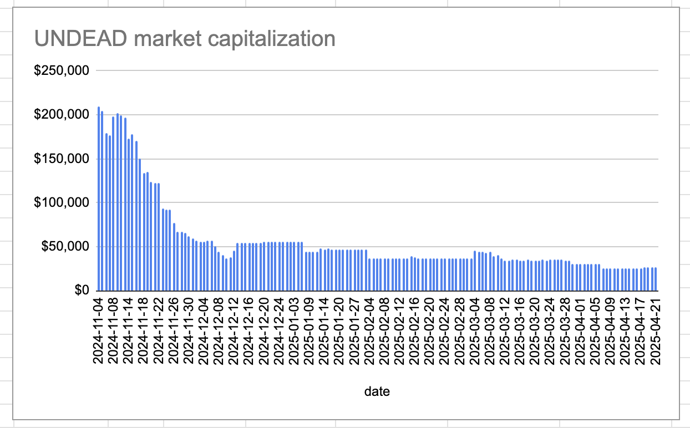

2025-04-21 

# Status of $UNDEAD 

 
 
 
 

* rank: 7748 
* quote: $0.00177 
* market cap: $26,308 
* 24-hr volume: $156,247 (δ: $5,088 ) 

When we get LPs funded on multiple blockchains, what will $UNDEAD look like? 

[$UNDEAD data source](https://www.coingecko.com/en/coins/undead-blocks) 

# PIVOTS

## BNB+LINK

No close pivots. A negative δ calls to open a LINK-on-BNB pivot, which I do.

The BNB+LINK composition and γ-apportionment are as charted. 

# Conclusion

This concludes pivots for today.

[The Pivot protocol](https://pivoteur.github.io/#)
