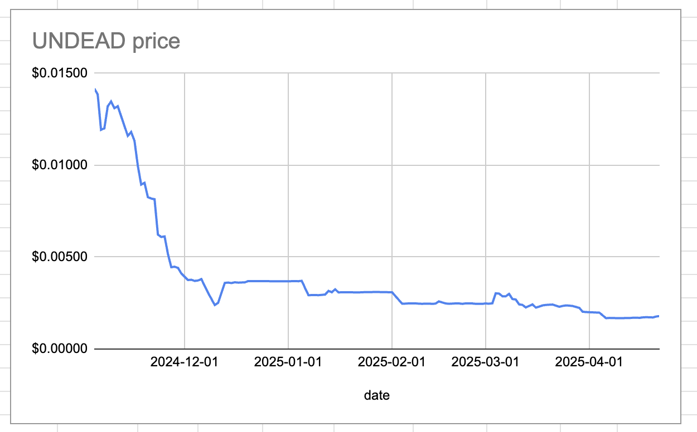
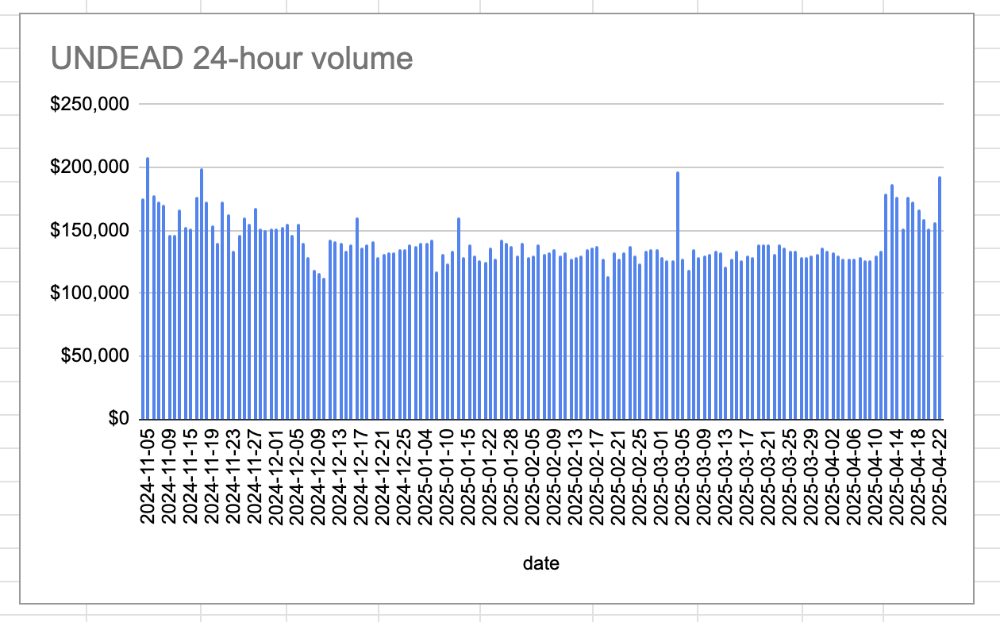
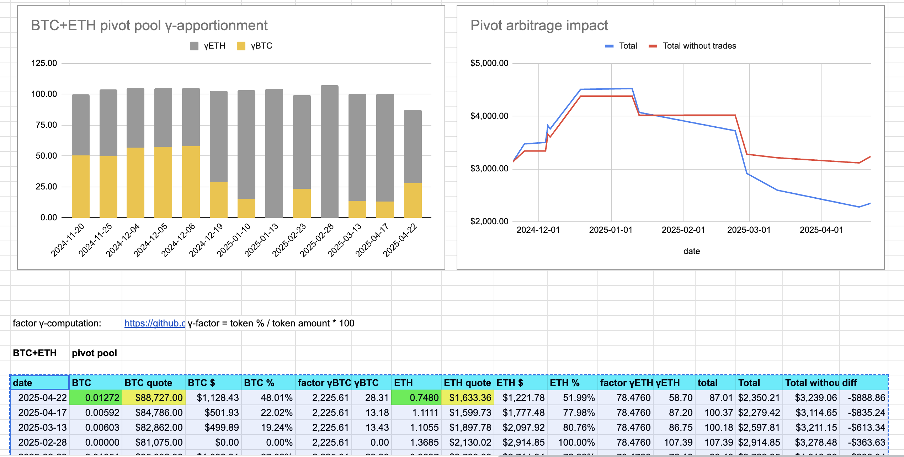

2025-04-22 

# Status of $UNDEAD 

 
 
 
 

* rank: 7753 
* quote: $0.00179 
* market cap: $26,884 
* 24-hr volume: $192,620 (δ: $36,373 ) 

When we get LPs funded on multiple blockchains, what will $UNDEAD look like? 

[$UNDEAD data source](https://www.coingecko.com/en/coins/undead-blocks) 

# PIVOTS

## BTC+ETH

No close pivots. 

The positive δ calls to open a BTC-on-ETH pivot but all BTC is committed. Instead, I open an ETH-on-BTC hedge.

The BTC+ETH pivot pool composition and γ-apportionment is as charted. 

