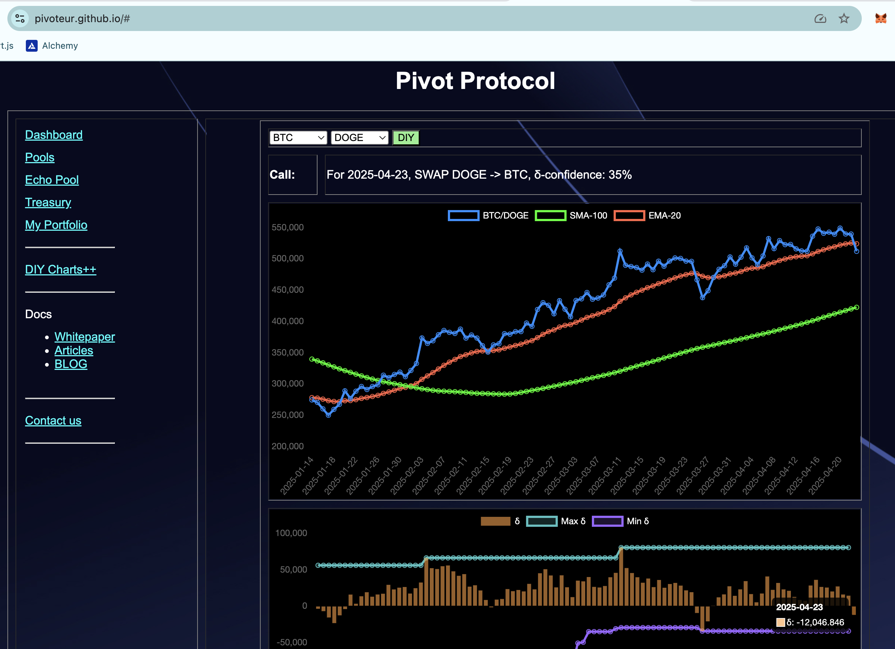
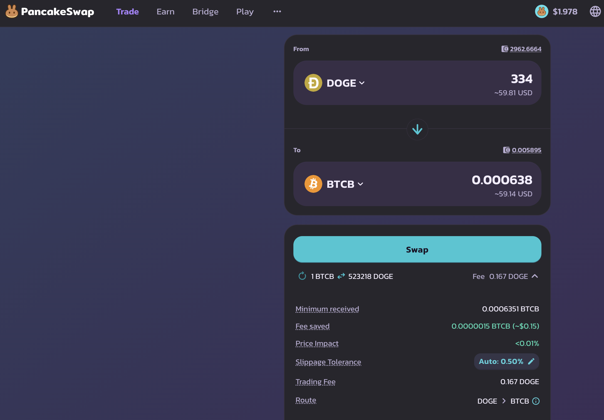
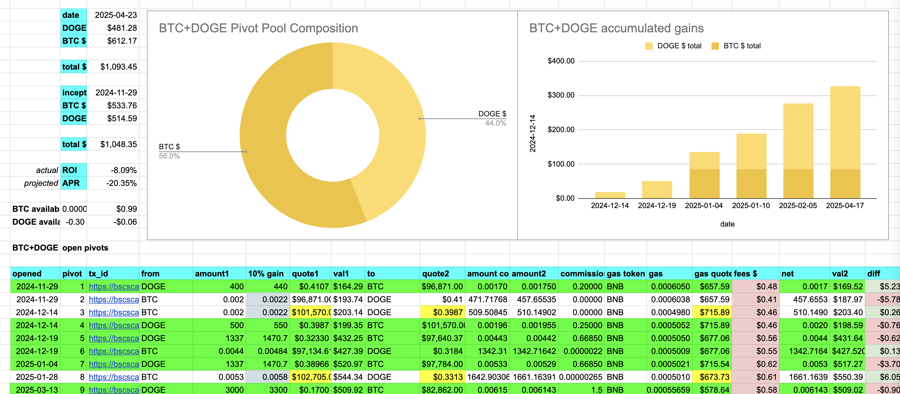
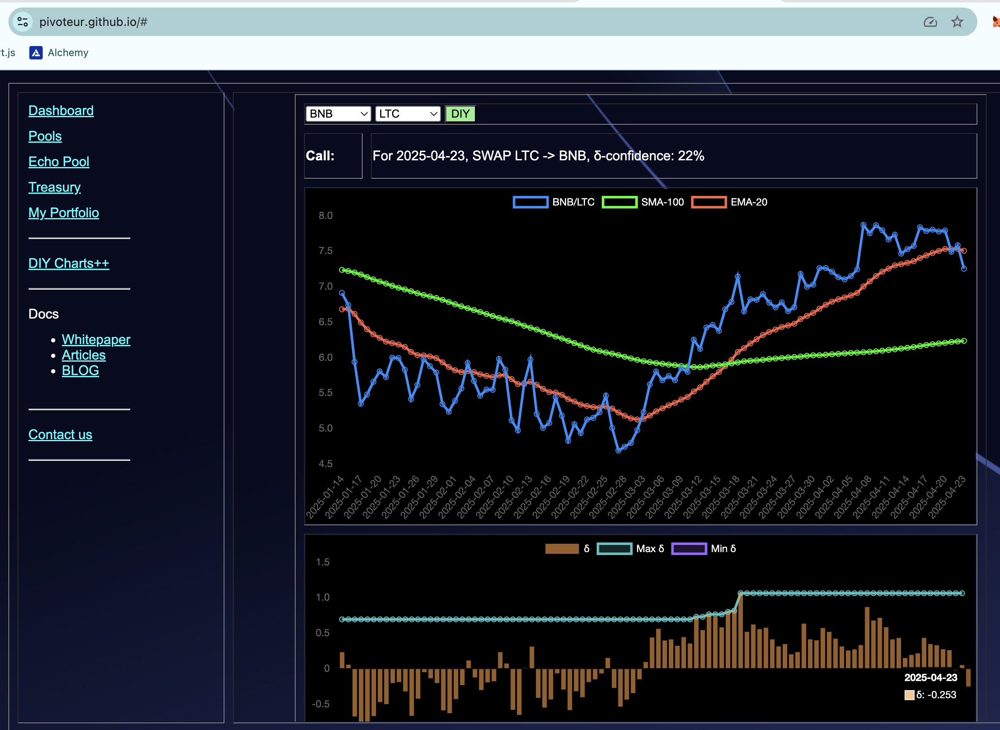
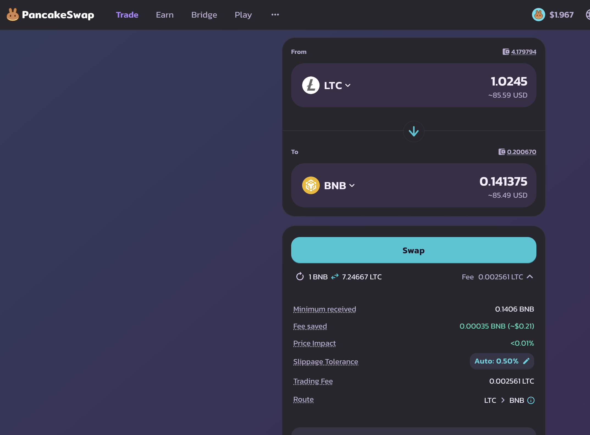
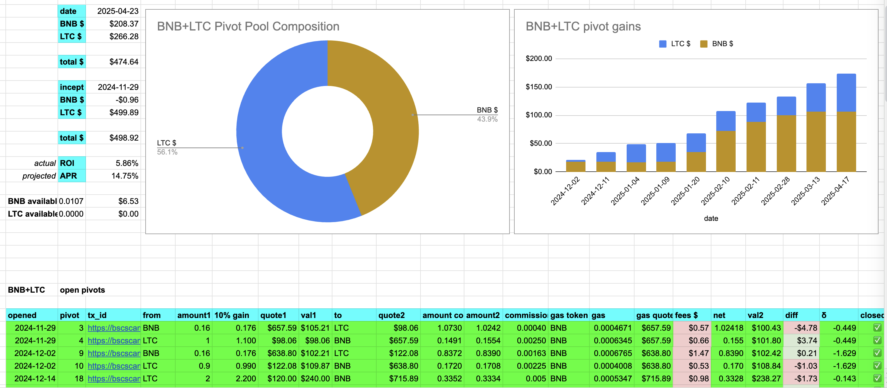
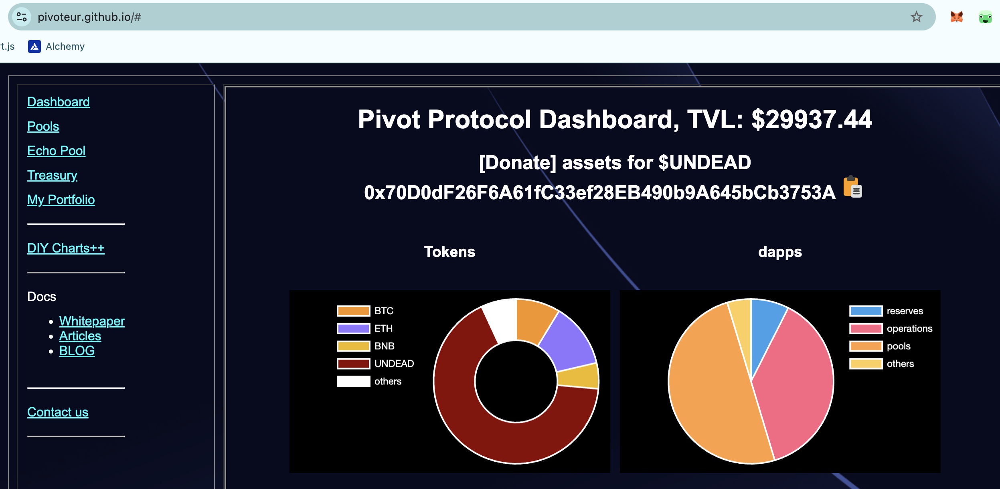
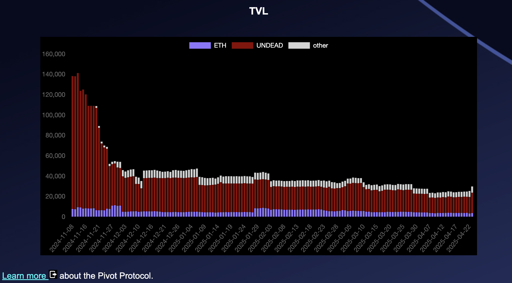

2025-04-23 

# Status of $UNDEAD 

 
 
 
 

* rank: 7575 
* quote: $0.00219 
* market cap: $33,076 
* 24-hr volume: $214,636 (δ: $22,016 ) 

When we get LPs funded on multiple blockchains, what will $UNDEAD look like? 

[$UNDEAD data source](https://www.coingecko.com/en/coins/undead-blocks) 

# PIVOTS

## BTC+DOGE

No close pivots. A negative δ calls to open a DOGE-on-BTC pivot, which I do.

The BTC+DOGE pivot pool composition and γ-apportionment are as charted. 

## BNB+LTC

No close pivots. A negative δ calls to open an LTC-on-BNB pivot, which I do.

The BNB+LTC pivot pool composition and γ-apportionment are as charted.

# Conclusion

This concludes pivots for today.

[The Pivot protocol](https://pivoteur.github.io/#)

