2025-06-02 

# Status of $UNDEAD 

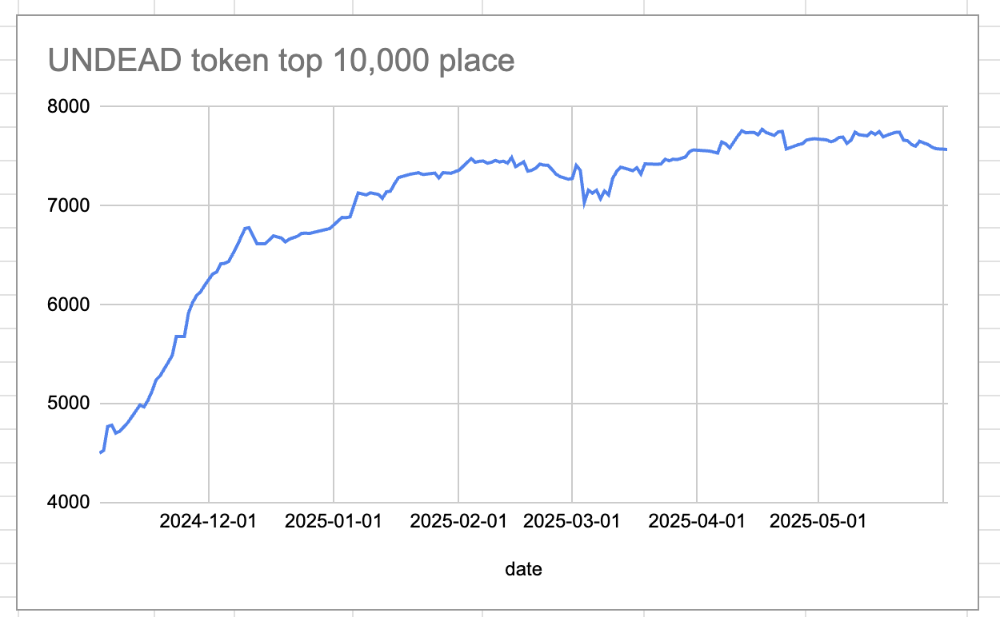 
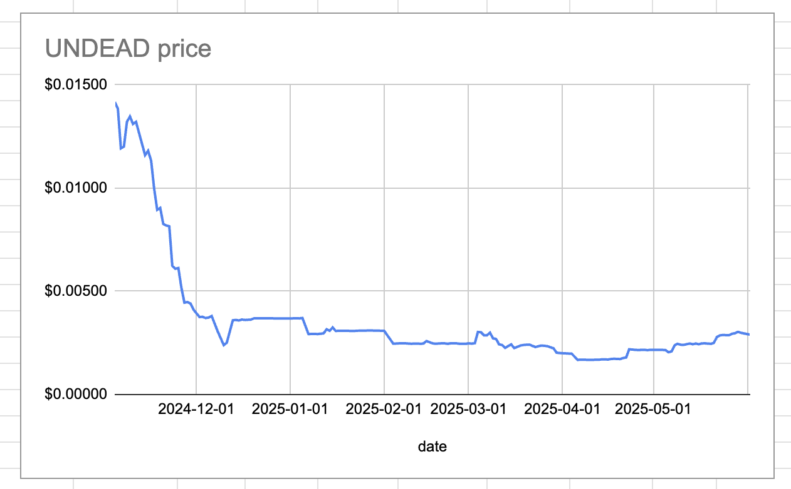 
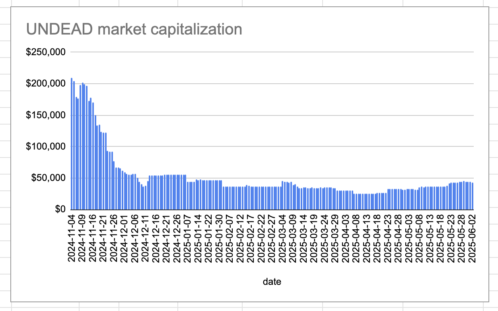 
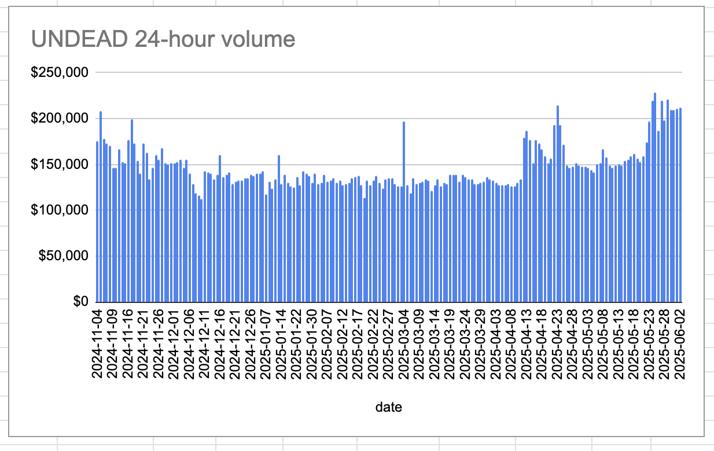 

* rank: 7570 
* quote: $0.00290 
* market cap: $43,483 
* 24-hr volume: $211,931 (δ: $926 ) 

When we get LPs funded on multiple blockchains, what will $UNDEAD look like? 

[$UNDEAD data source](https://www.coingecko.com/en/coins/undead-blocks) 

# PIVOTS

I am refocusing all efforts on $UNDEAD revitalization. I have set aside 5M $UNDEAD for when $UNDEAD is traded on other blockchains and moved all remaining $UNDEAD to the Echo pool, which is an ETH+UNDEAD pivot pool.

No close pivots today.

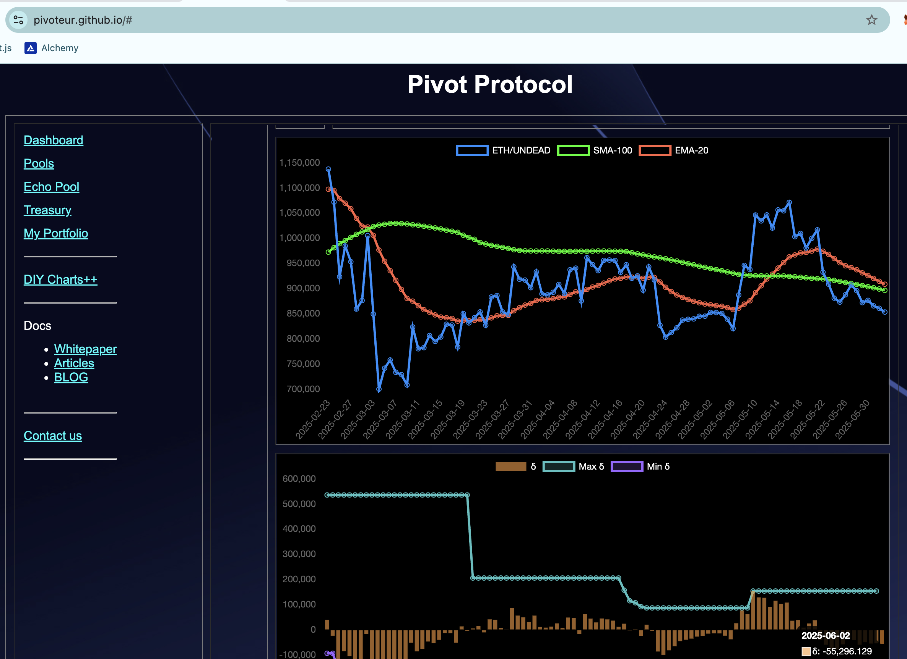
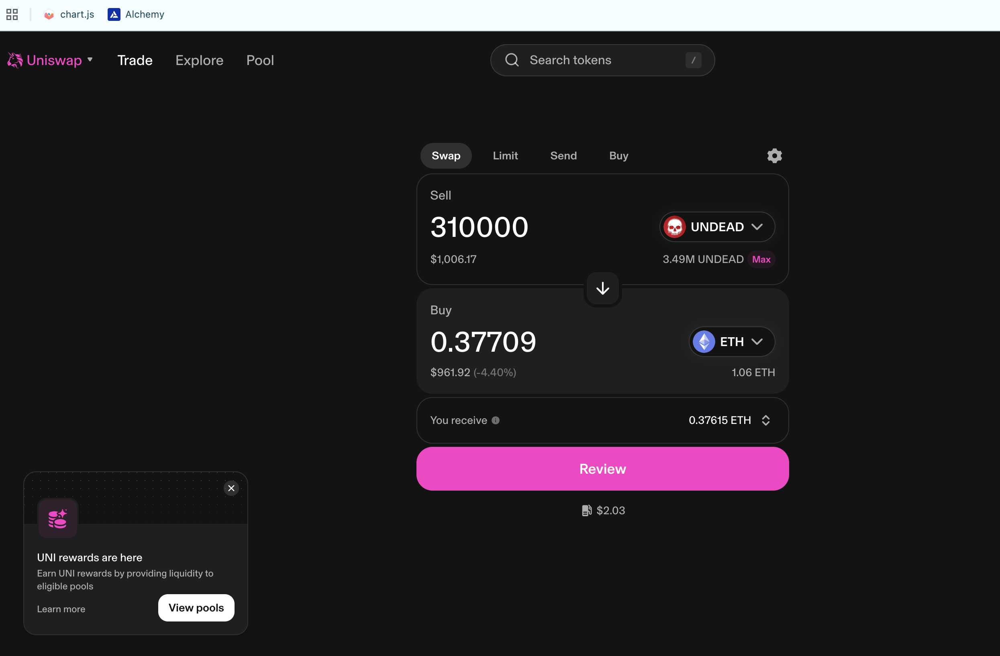
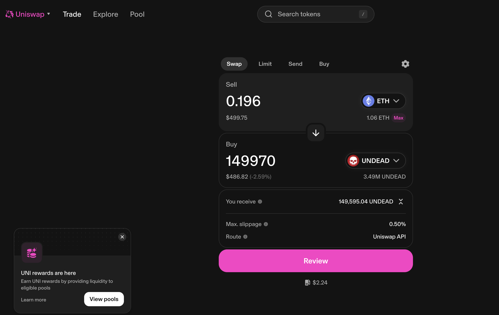

I open a new pivot and hedge.

n.b.: As I have both $ETH and $UNDEAD in hand, I can do a virtual UNDEAD/ETH swap, therefore not selling $UNDEAD. The ETH-on-UNDEAD hedge is an actual swap, however, so I do buy $UNDEAD.

After liquidity-infusion, the Echo pool's composition and γ-apportionment are as charted. 

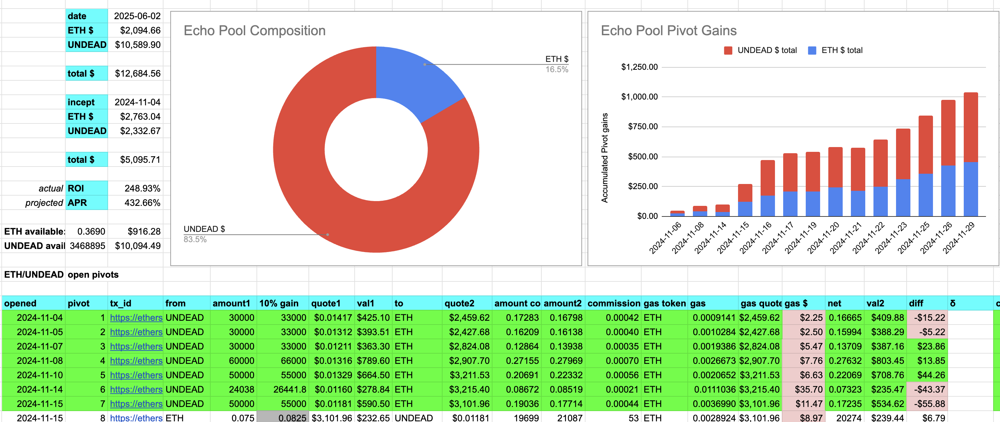
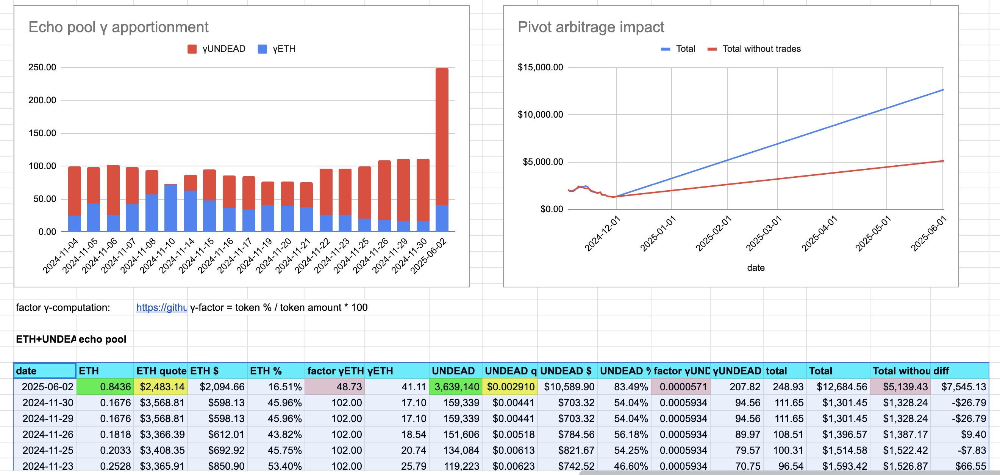

# CONCLUSION 

This concludes pivot-activity for today. 

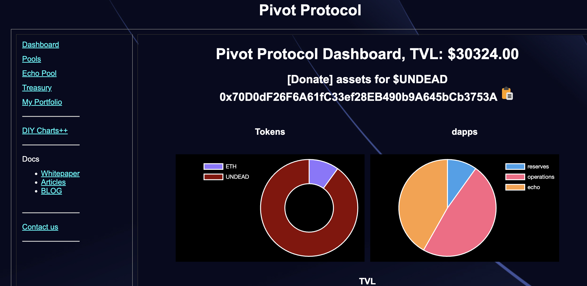 
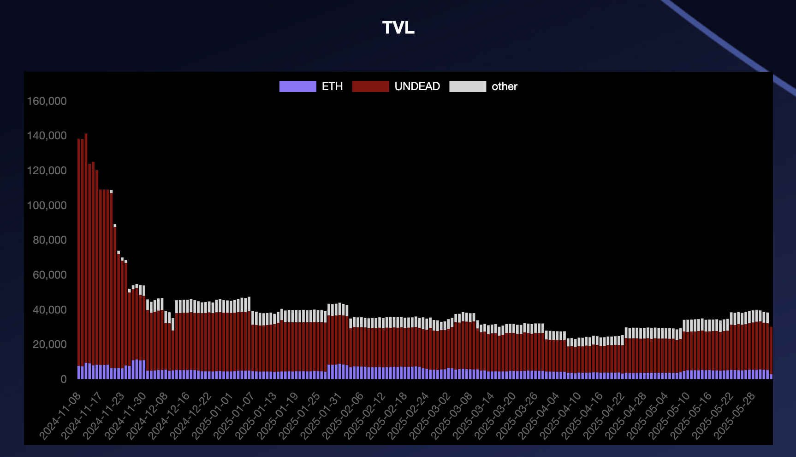 

[The Pivot protocol](https://pivoteur.github.io/#) 
