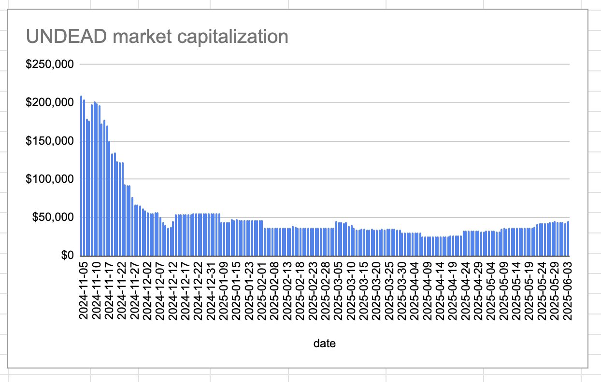

2025-06-03 

# Status of $UNDEAD 

 
 
 
 

* rank: 7554 
* quote: $0.00303 
* market cap: $45,857 
* 24-hr volume: $208,367 (δ: -$3,564 ) 

When we get LPs funded on multiple blockchains, what will $UNDEAD look like? 

[$UNDEAD data source](https://www.coingecko.com/en/coins/undead-blocks) 

## ANALYSIS/Wistful Thinking

Okay, $UNDEAD ticked up by 5% from yesterday. Was that because I placed an open pivot order? What if I just keep opening pivots every day until the cows come home? Will I single-handedly resurrect the token?

NUPE! This'll require a concerted effort.

On the topic of pivots, ...

# PIVOTS

## ETH+UNDEAD

No close pivots today. The negative δ calls to open an UNDEAD-on-ETH pivot, which I do virtually. The $ETH-supply is exhausted with this pivot, so I do not do a hedge the other way. 

So: no actual trading volume from pivots today.

# CONCLUSION 

This concludes pivot-activity for today. 

 
 

[The Pivot protocol](https://pivoteur.github.io/#) 
