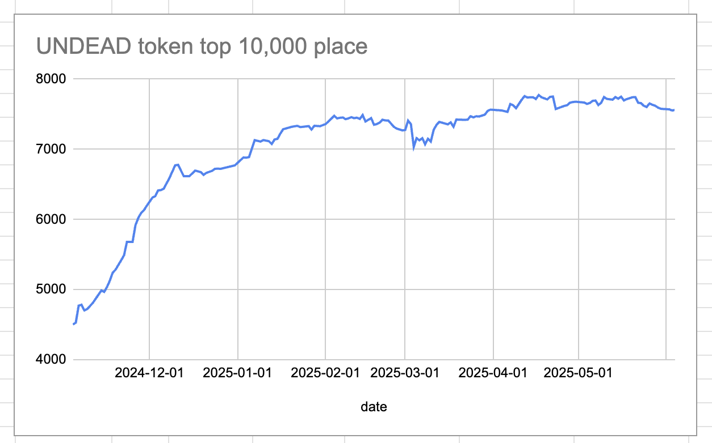
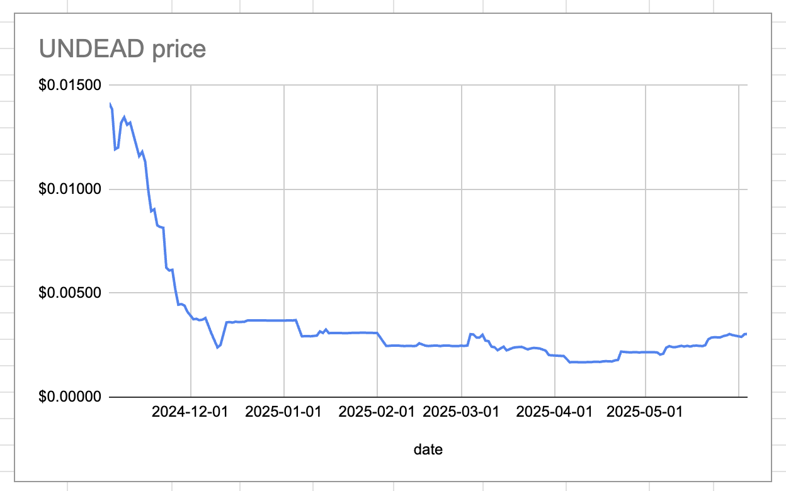
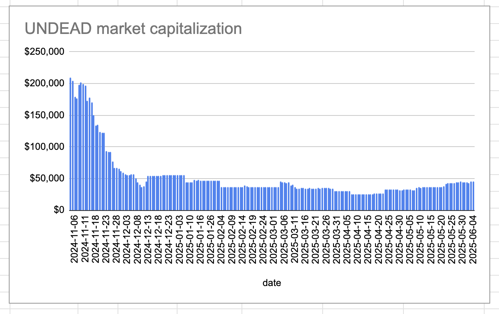
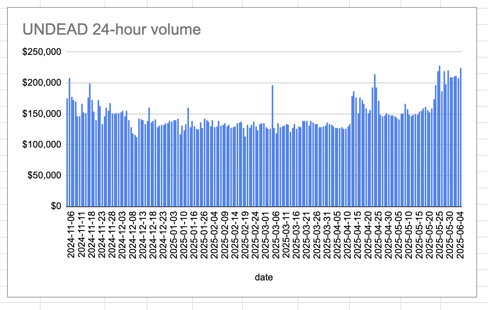
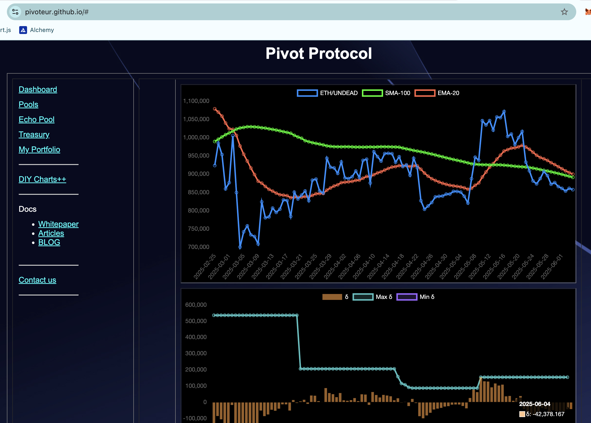
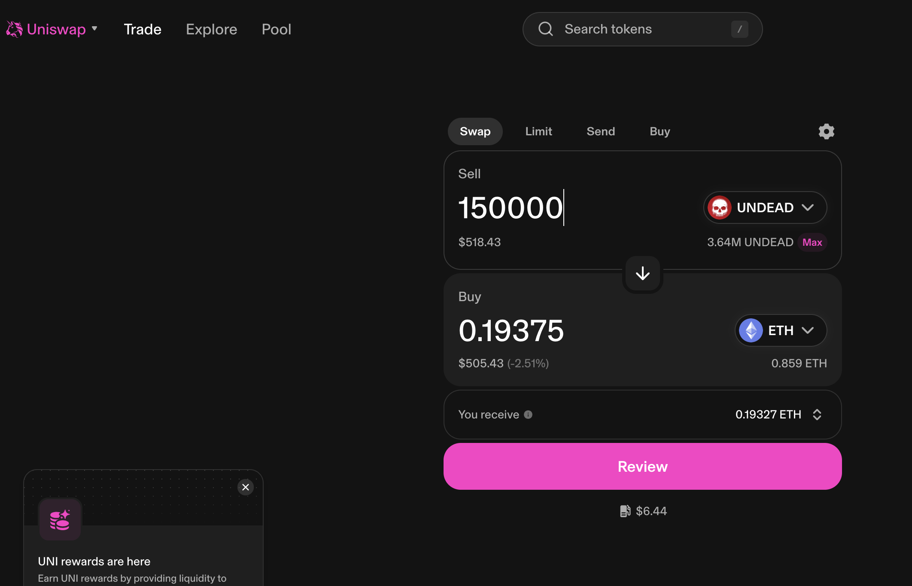
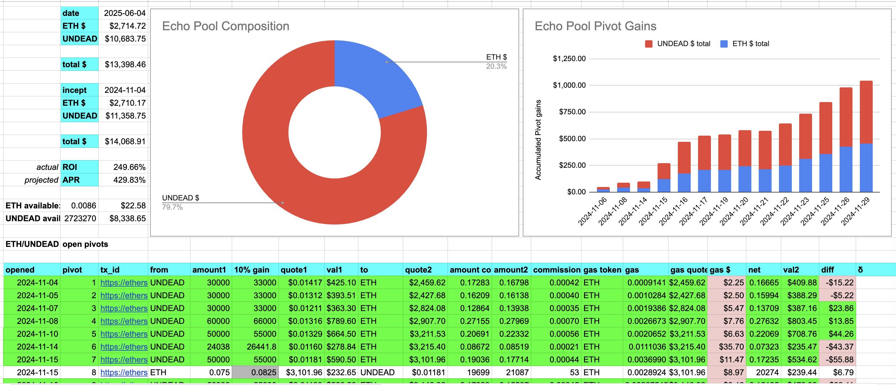
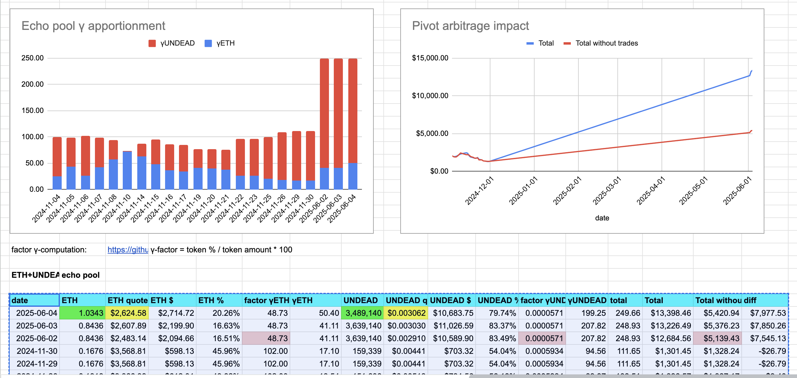
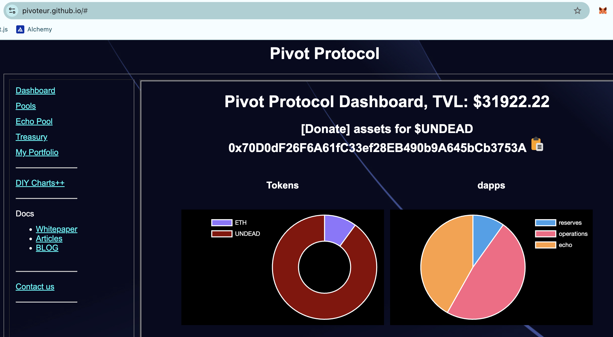
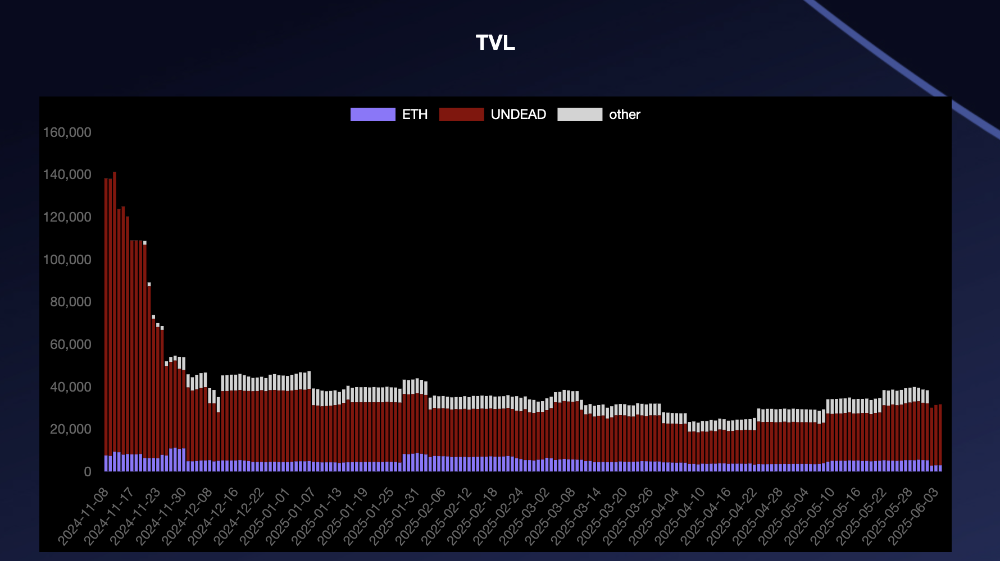

2025-06-04 

# Status of $UNDEAD 

 
 
 
 

* rank: 7562 
* quote: $0.00304 
* market cap: $45,655 
* 24-hr volume: $224,699 (δ: $16,332 ) 

When we get LPs funded on multiple blockchains, what will $UNDEAD look like? 

[$UNDEAD data source](https://www.coingecko.com/en/coins/undead-blocks) 

# PIVOTS

## ETH+UNDEAD

The negative δ calls to open an UNDEAD-on-ETH pivot, which I do (real this time, not virtual). 

The Echo pool composition and γ-apportionment are as charted. 

# CONCLUSION 

This concludes pivot-activity for today. 

 
 

[The Pivot protocol](https://pivoteur.github.io/#) 
