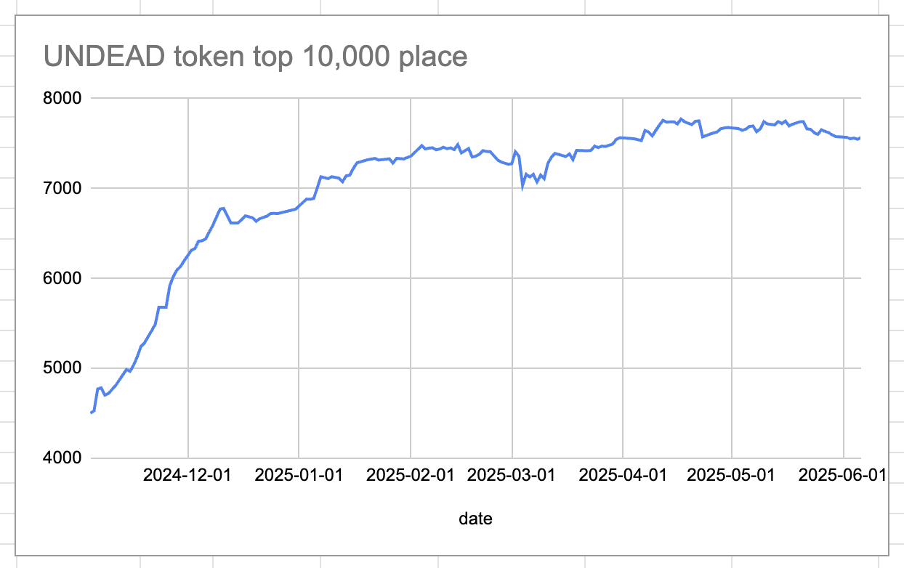
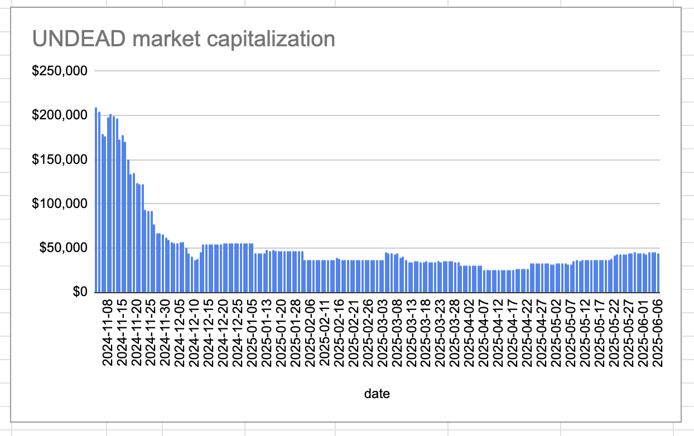

2025-06-06 

# Status of $UNDEAD 

 
 
 
 

* rank: 7568 
* quote: $0.00292 
* market cap: $43,761 
* 24-hr volume: $153,316 (δ: -$7,367 ) 

When we get LPs funded on multiple blockchains, what will $UNDEAD look like? 

[$UNDEAD data source](https://www.coingecko.com/en/coins/undead-blocks) 
# PIVOTS 

## ETH+UNDEAD 

The negative calls to open an UNDEAD on ETH pivot, which I do. 

 
 

The Echo pool composition and γ-apportionment are as charted. 

 
 
