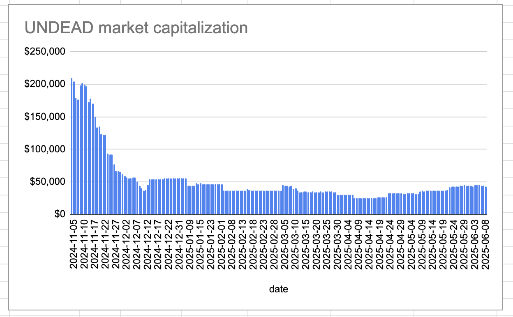

2025-06-08 

# Status of $UNDEAD 

 
 
 
 

* rank: 7660 
* quote: $0.00286 
* market cap: $42,862 
* 24-hr volume: $223,453 (δ: $29,664 ) 

When we get LPs funded on multiple blockchains, what will $UNDEAD look like? 

[$UNDEAD data source](https://www.coingecko.com/en/coins/undead-blocks) 

# PIVOTS

OOOOOH! We ALMOST had a close-pivot today!

A 10% ROI would be 165k $UNDEAD and that's what shown, but the commission takes away 500 $UNDEAD, so it's NOT QUITE hitting the close-pivot threshold.

Maybe tomorrow.

Pivot arbitrage requires both patience and conviction.
# PIVOTS 

## ETH+UNDEAD 

The negative calls to open an UNDEAD on ETH pivot, which I do. 

 
 

The Echo pool composition and γ-apportionment are as charted. 

 
 
# CONCLUSION 

This concludes pivot-activity for today. 

 
 

[The Pivot protocol](https://pivoteur.github.io/#) 
