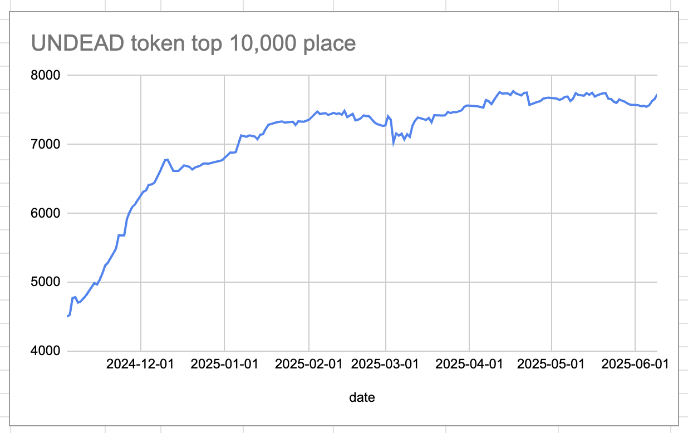
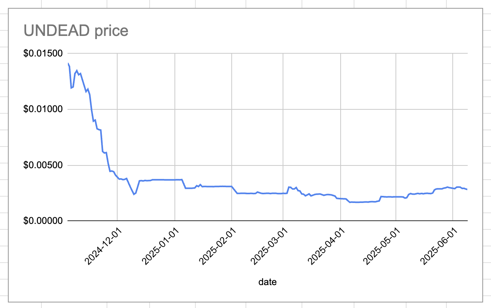
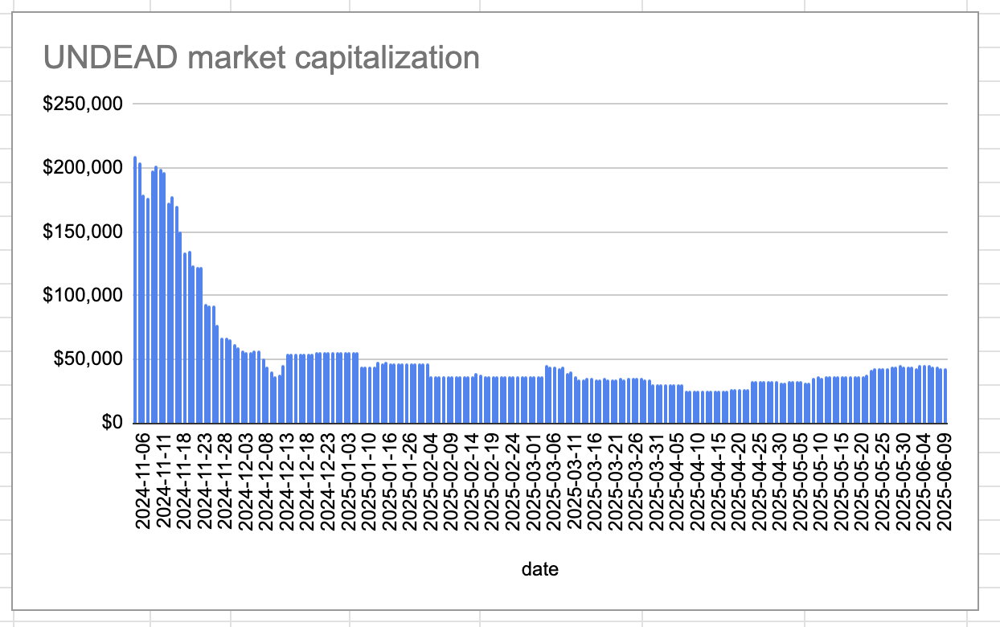
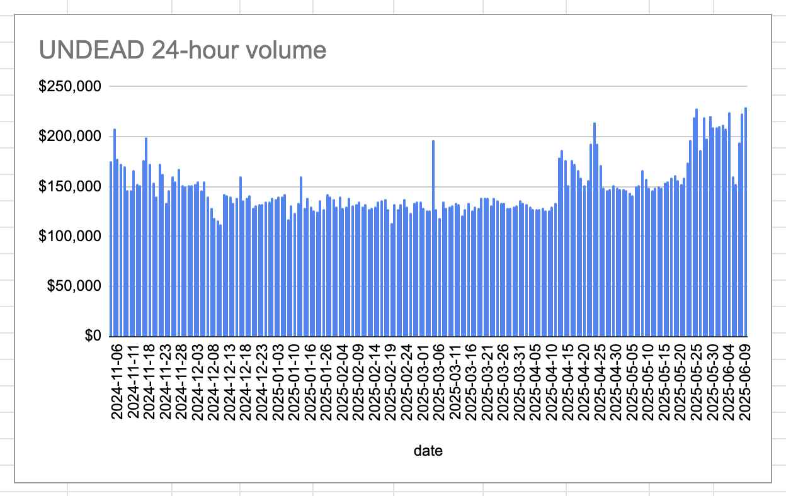
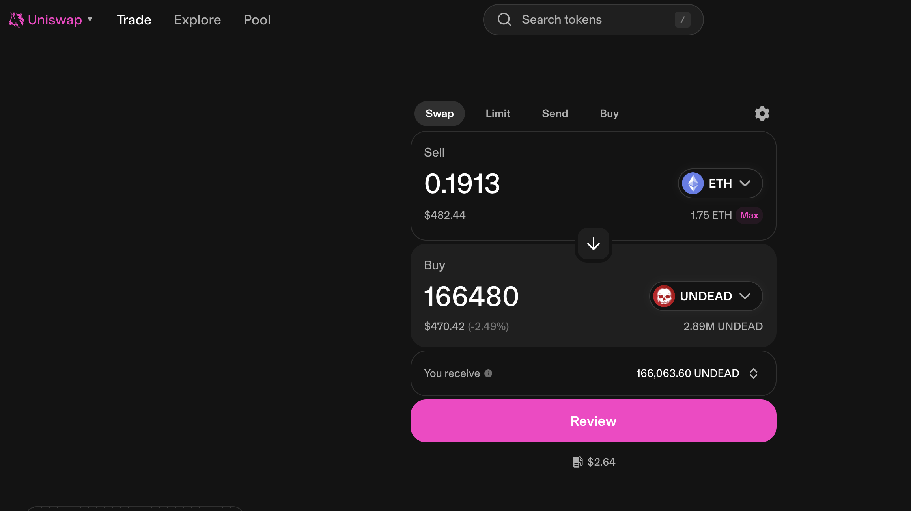
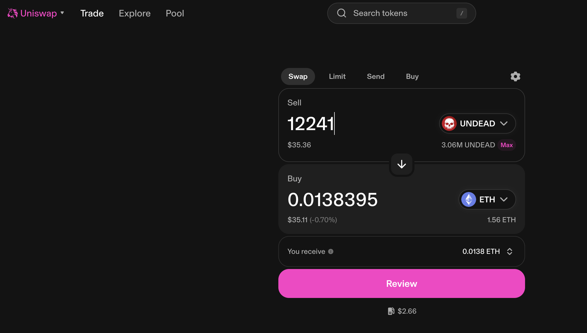
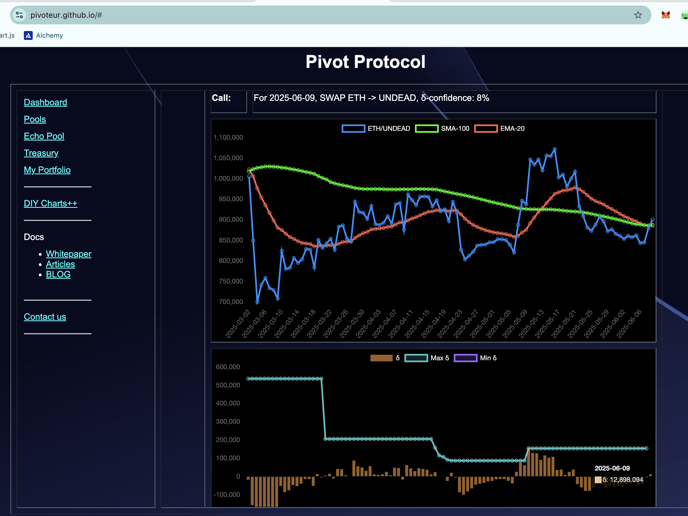
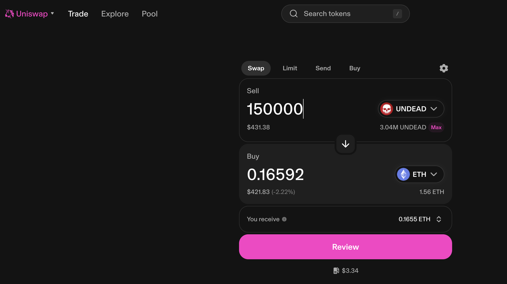
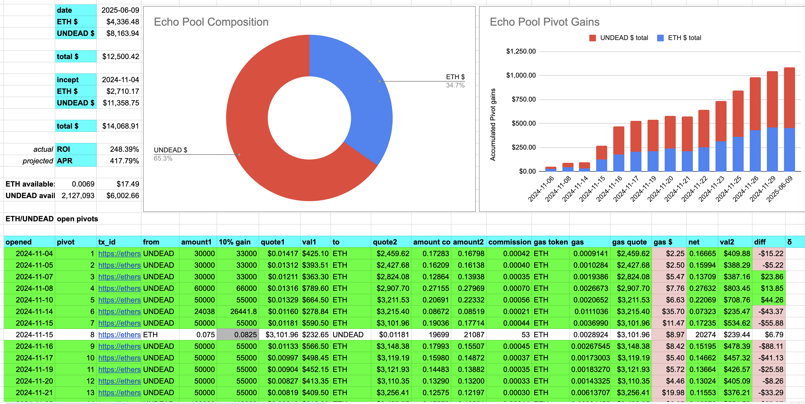
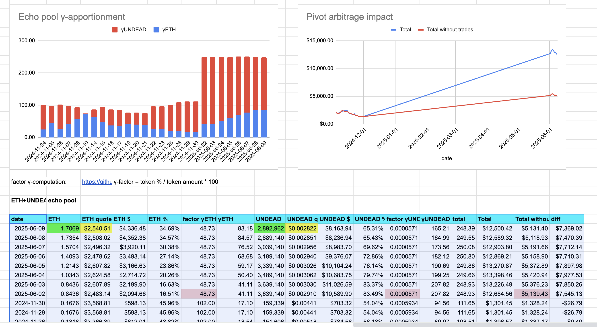

2025-06-09 

# Status of $UNDEAD 

 
 
 
 

* rank: 7730 
* quote: $0.00282 
* market cap: $42,798 
* 24-hr volume: $229,433 (δ: $5,980 ) 

When we get LPs funded on multiple blockchains, what will $UNDEAD look like? 

[$UNDEAD data source](https://www.coingecko.com/en/coins/undead-blocks) 

# PIVOTS

## ETH+UNDEAD

I close an UNDEAD-on-ETH pivot for gains of:

* actual ROI: 10.27% / 749.43% APR projected
* or: 150k $UNDEAD -> $ETH -> 166k $UNDEAD
* or: $43-gain on $500 pivoted

I convert 80% of the gains to $ETH to distribute as exit liquidity. The rest stays in the pool.

# PIVOTS 

## ETH+UNDEAD 

The positive calls to open an ETH on UNDEAD pivot, but all $ETH is committed. Instead, I open an UNDEAD-on-ETH pivot. This is technically a hedge, but since the δ is mid, I'll just pivot, anyway.

 
 

The Echo pool composition and γ-apportionment are as charted. 

 
 
