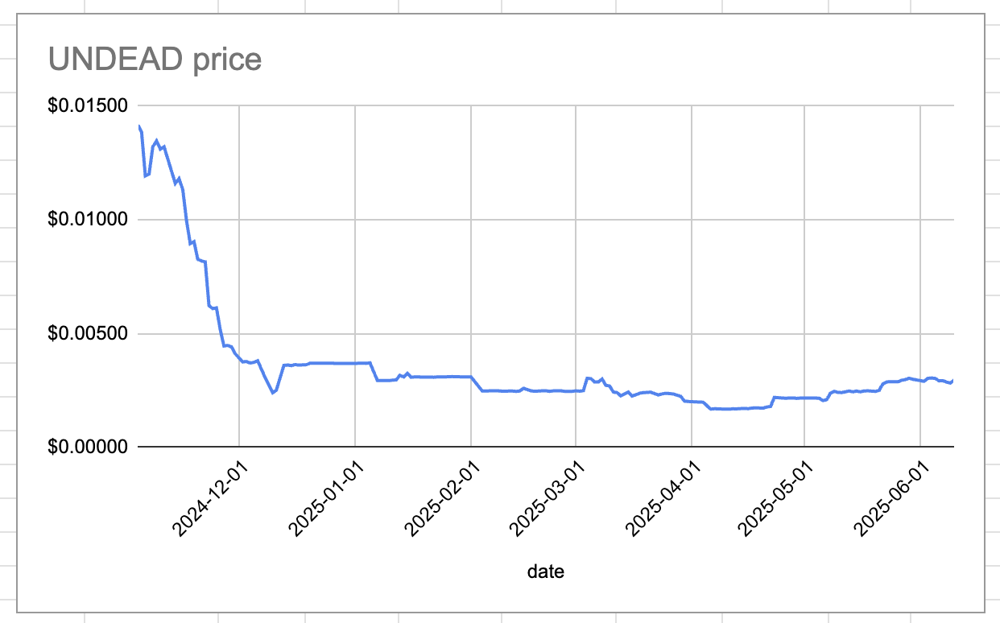
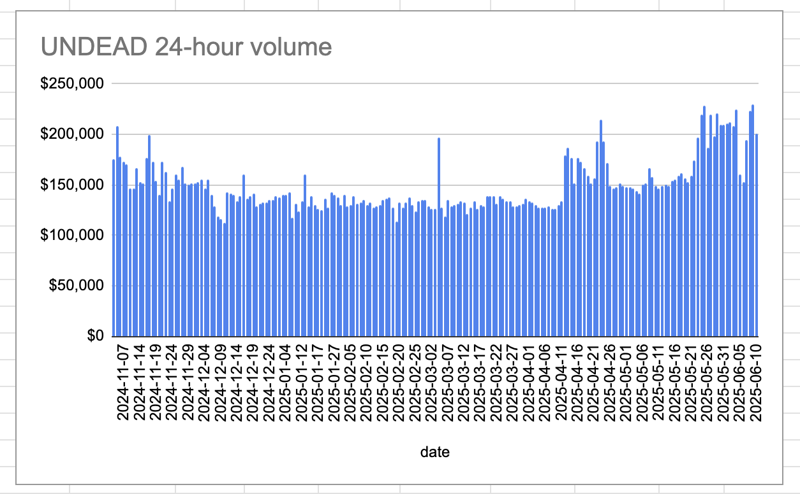

2025-06-10 

# Status of $UNDEAD 

 
 
 
 

* rank: 7753 
* quote: $0.00295 
* market cap: $43,800 
* 24-hr volume: $200,963 (δ: -$28,470 ) 

When we get LPs funded on multiple blockchains, what will $UNDEAD look like? 

[$UNDEAD data source](https://www.coingecko.com/en/coins/undead-blocks) 

# PIVOTS

## ETH+UNDEAD

I close an UNDEAD-on-ETH pivot for gains of:

* actual ROI: 10.10% / 526.52% APR projected
* or: 286k $UNDEAD -> $ETH -> 315.6k $UNDEAD
* or: $84-gained on $939 pivoted

Slippage was TERRIBLE! but we still made a profit on this pivot. I exit 80% of the gain.

