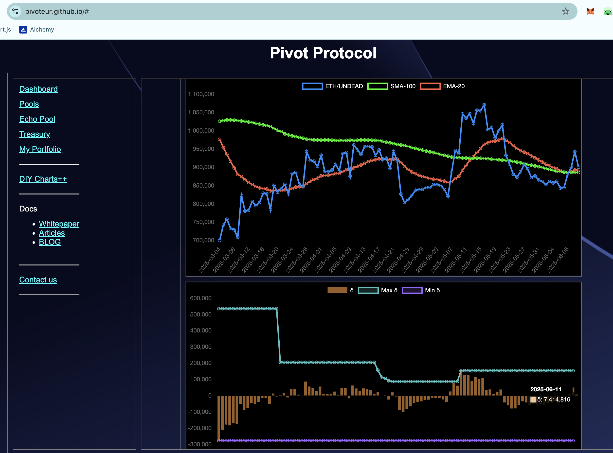

# 2025-06-11 Status of $UNDEAD 

 
 
 
 

* rank: 7708 
* quote: $0.00310 
* market cap: $46,547 
* 24-hr volume: $233,152 (δ: $32,189 ) 

When we get LPs funded on multiple blockchains, what will $UNDEAD look like? 

[$UNDEAD data source](https://www.coingecko.com/en/coins/undead-blocks) 
## $UNDEAD performance analysis, 2025-06-11 

* "δ" indicates change since 2025-06-05 
* "a" is annualized since 2025-06-05 

 
 
 
 

* rank: 7708 (δ: -2.12% ) , a: -128.95% 
* quote: $0.00310 (δ: 2.35% ) , a: 142.74% 
* market cap: $46,547 (δ: 2.54% ) , a: 154.75% 
* 24-hr volume: $233,152 (δ: 45.10% ) , a: 2743.62% 

[2025-06-05 $UNDEAD report (archived)](https://github.com/pivoteur/biz/tree/main/blog/2025/06/05) 
# PIVOTS 

## ETH+UNDEAD 

The meh δ calls to open an UNDEAD on ETH pivot, which I do. 

 
 

The Echo pool composition and γ-apportionment are as charted. 

 
 
