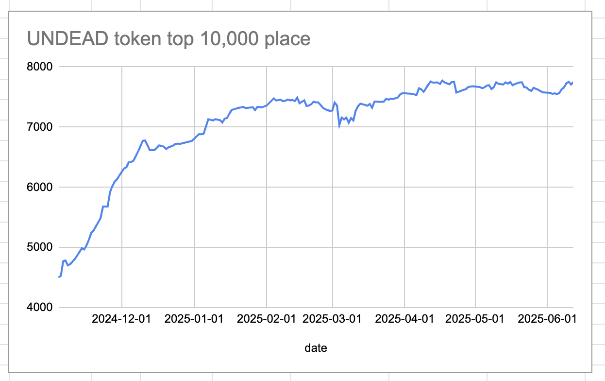
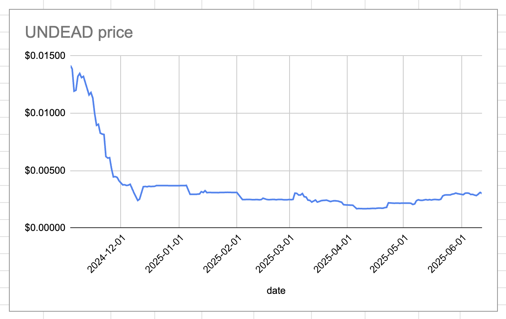
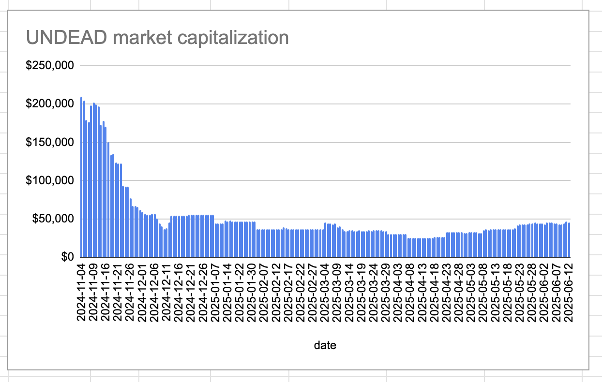
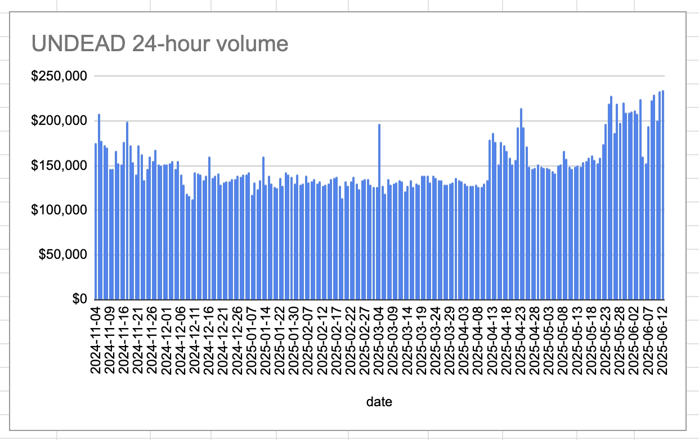

# 2025-06-12 Status of $UNDEAD 

 
 
 
 

* rank: 7752 
* quote: $0.00300 
* market cap: $45,516 
* 24-hr volume: $235,280 (δ: $2,128 ) 

When we get LPs funded on multiple blockchains, what will $UNDEAD look like? 

[$UNDEAD data source](https://www.coingecko.com/en/coins/undead-blocks) 
## $UNDEAD performance analysis, 2025-06-12 

* "δ" indicates change since 2025-06-05 
* "a" is annualized since 2025-06-05 

 
 
 
 

* rank: 7752 (δ: -2.70% ) , a: -140.93% 
* quote: $0.00300 (δ: -0.93% ) , a: -48.25% 
* market cap: $45,516 (δ: 0.27% ) , a: 14.24% 
* 24-hr volume: $235,280 (δ: 46.42% ) , a: 2420.73% 

[2025-06-05 $UNDEAD report (archived)](https://github.com/pivoteur/biz/tree/main/blog/2025/06/05) 
