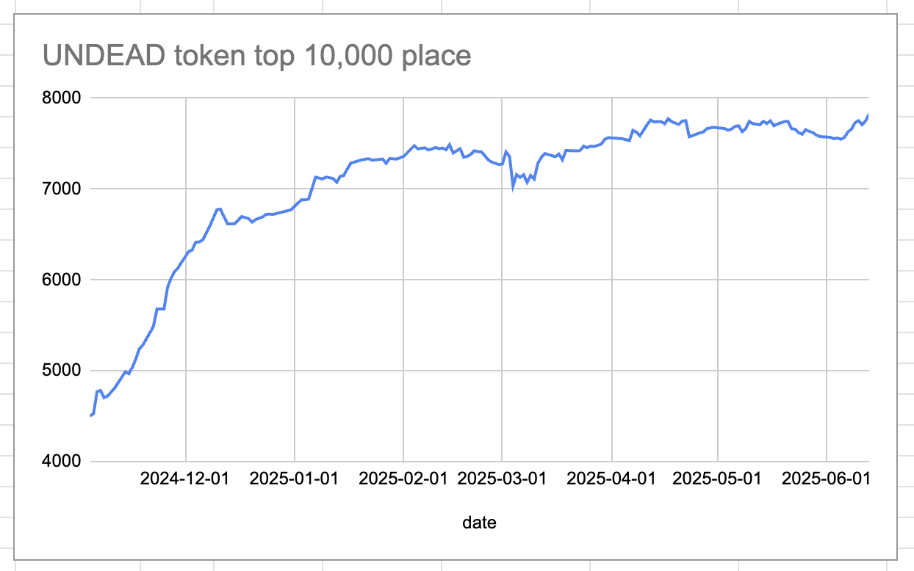
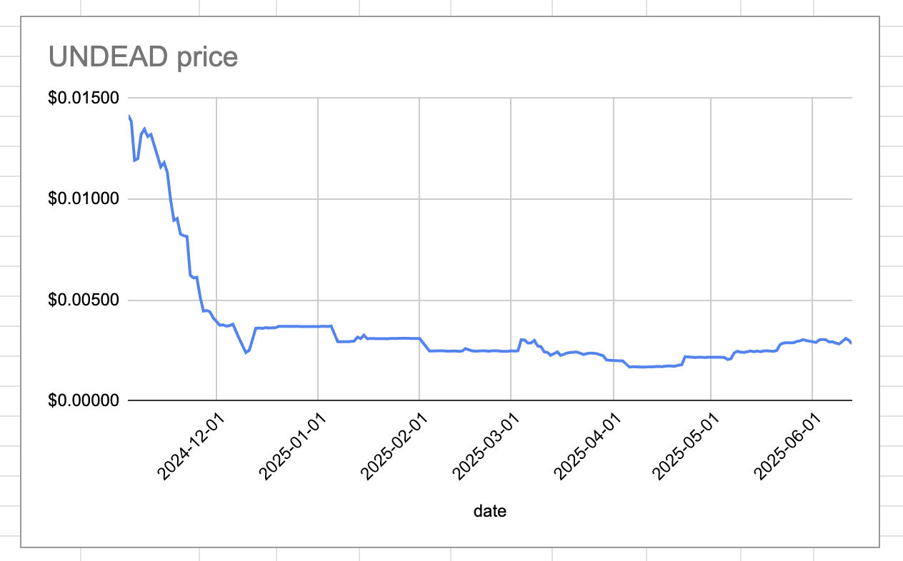
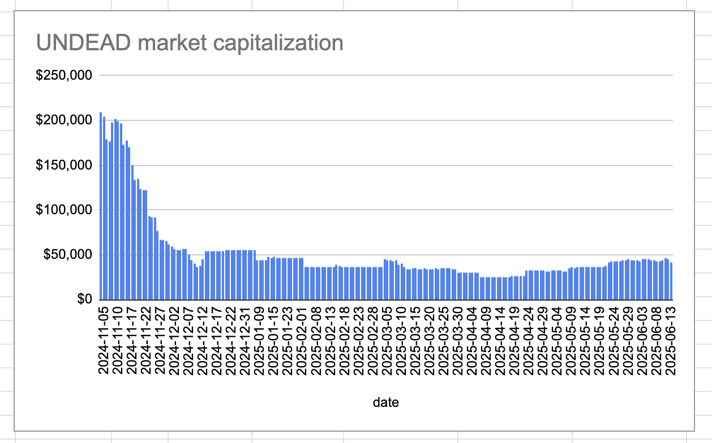
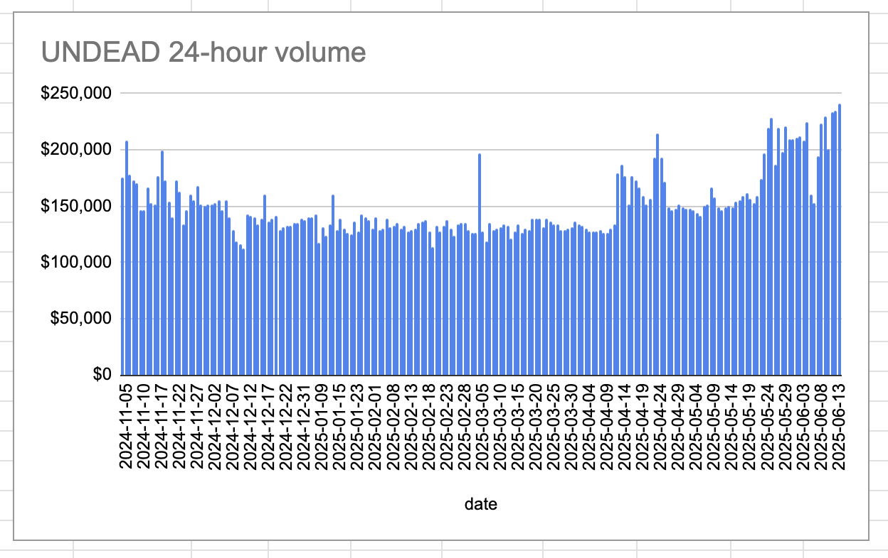
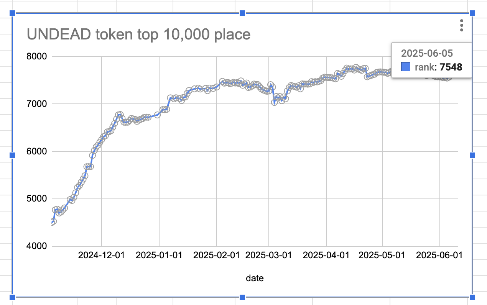
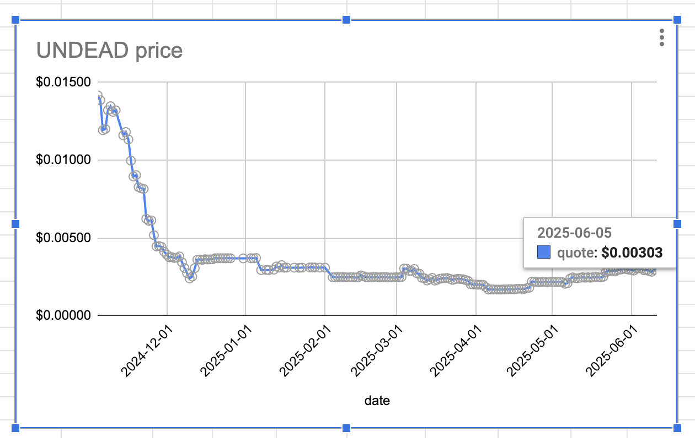
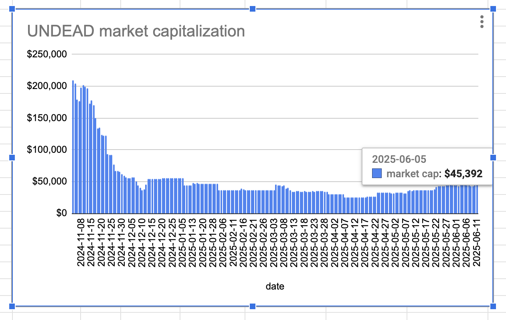
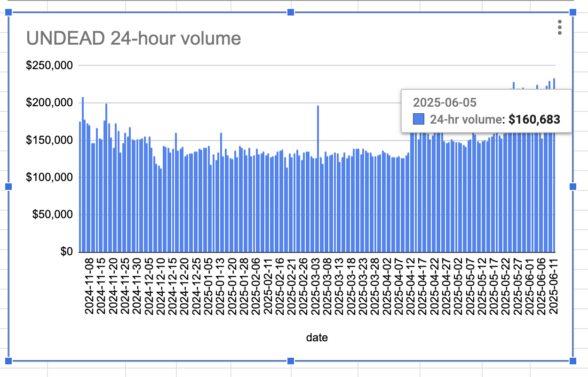
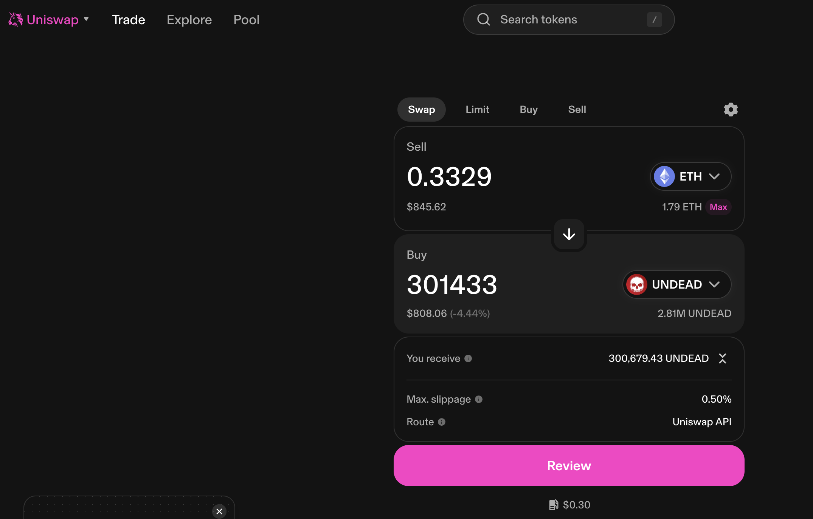

# 2025-06-13 Status of $UNDEAD 

 
 
 
 

* rank: 7827 
* quote: $0.00282 
* market cap: $42,107 
* 24-hr volume: $241,406 (δ: $6,126 ) 

When we get LPs funded on multiple blockchains, what will $UNDEAD look like? 

[$UNDEAD data source](https://www.coingecko.com/en/coins/undead-blocks)
## $UNDEAD performance analysis, 2025-06-13 

* "δ" indicates change since 2025-06-05 
* "a" is annualized since 2025-06-05 

 
 
 
 

* rank: 7827 (δ: -3.70% ) , a: -168.65% 
* quote: $0.00282 (δ: -6.68% ) , a: -304.57% 
* market cap: $42,107 (δ: -7.24% ) , a: -330.14% 
* 24-hr volume: $241,406 (δ: 50.24% ) , a: 2292.08% 

[2025-06-05 $UNDEAD report (archived)](https://github.com/pivoteur/biz/tree/main/blog/2025/06/05) 

# PIVOTS

## ETH+UNDEAD

I close 2 UNDEAD-on-ETH pivots with one trade, "conserving" $ETH, for gains of:

* actual ROI: 25.03% / 1142.08% APR projected
* or: 300k $UNDEAD -> $ETH -> 376k $UNDEAD
* or: $85-gain on $900 pivoted

I distribute 80% of the gains to stakers.

