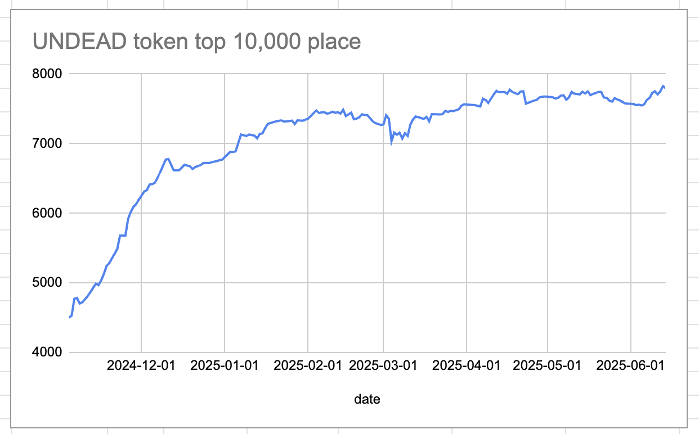
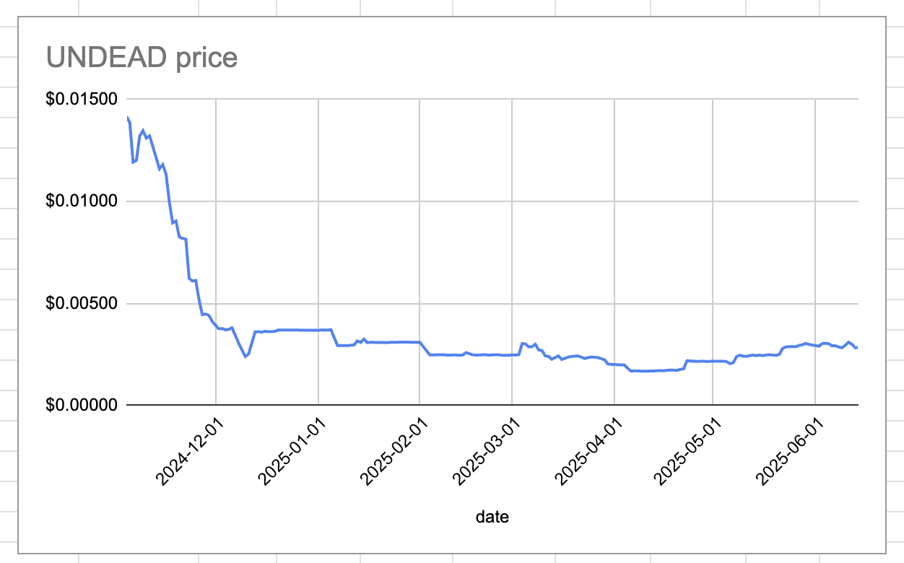
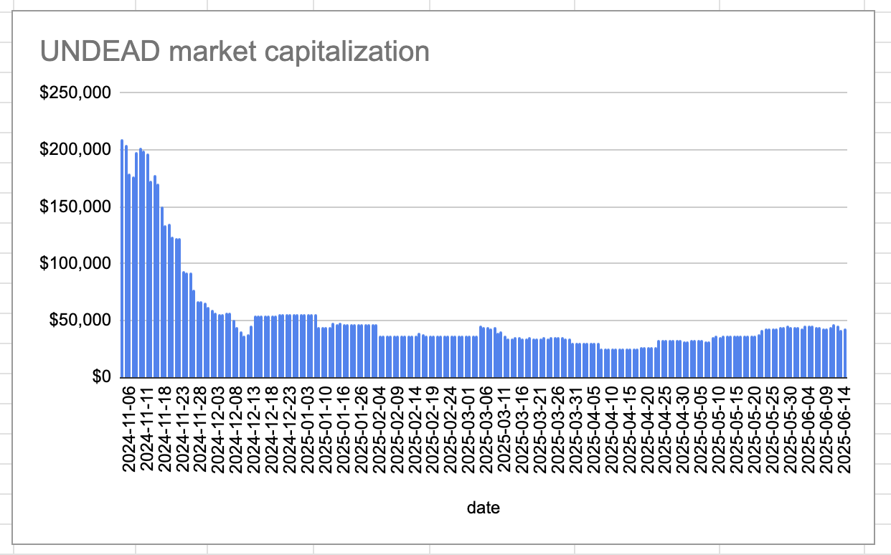
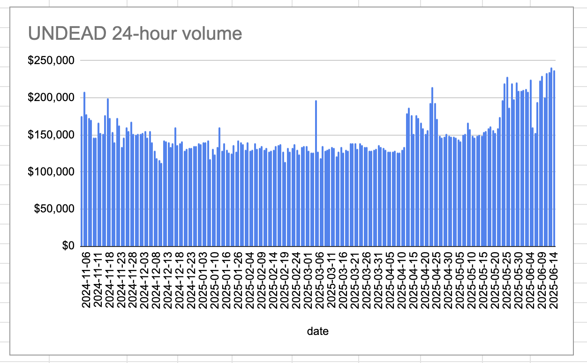

# 2025-06-14 Status of $UNDEAD 

 
 
 
 

* rank: 7795 
* quote: $0.00284 
* market cap: $42,582 
* 24-hr volume: $237,502 (δ: -$3,904 ) 

When we get LPs funded on multiple blockchains, what will $UNDEAD look like? 

[$UNDEAD data source](https://www.coingecko.com/en/coins/undead-blocks) 
## $UNDEAD performance analysis, 2025-06-14 

* "δ" indicates change since 2025-06-05 
* "a" is annualized since 2025-06-05 

 
 
 
 

* rank: 7795 (δ: -3.27% ) , a: -132.71% 
* quote: $0.00284 (δ: -6.01% ) , a: -243.92% 
* market cap: $42,582 (δ: -6.19% ) , a: -251.06% 
* 24-hr volume: $237,502 (δ: 47.81% ) , a: 1938.87% 

[2025-06-05 $UNDEAD report (archived)](https://github.com/pivoteur/biz/tree/main/blog/2025/06/05) 
