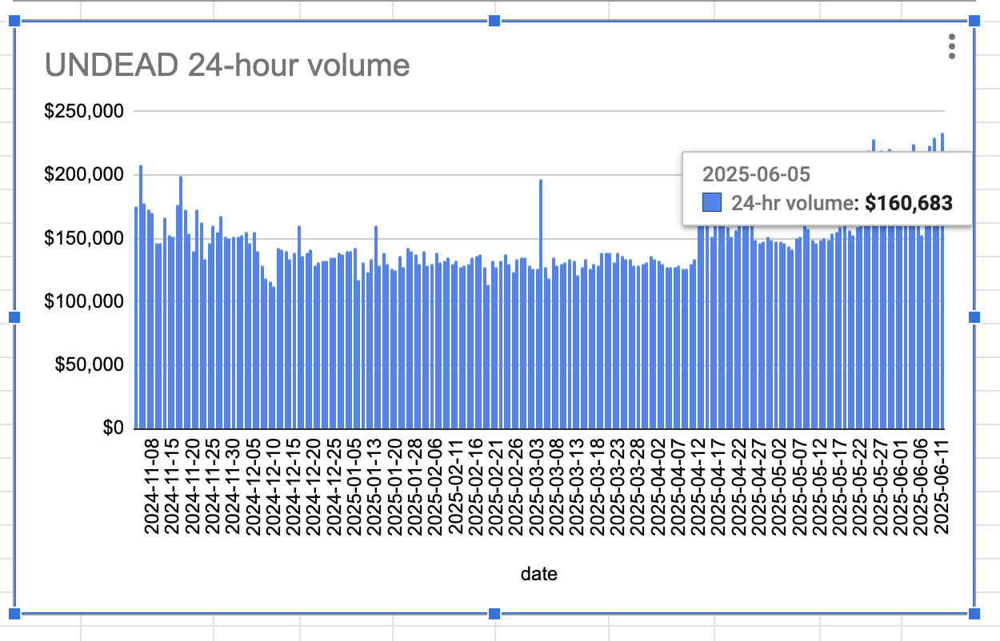

# 2025-06-15 Status of $UNDEAD 

 
 
 
 

* rank: 7818 
* quote: $0.00284 
* market cap: $42,152 
* 24-hr volume: $232,556 (δ: -$4,946 ) 

When we get LPs funded on multiple blockchains, what will $UNDEAD look like? 

[$UNDEAD data source](https://www.coingecko.com/en/coins/undead-blocks) 
## $UNDEAD performance analysis, 2025-06-15 

* "δ" indicates change since 2025-06-05 
* "a" is annualized since 2025-06-05 

 
 
 
 

* rank: 7818 (δ: -3.58% ) , a: -130.56% 
* quote: $0.00284 (δ: -6.21% ) , a: -226.77% 
* market cap: $42,152 (δ: -7.14% ) , a: -260.51% 
* 24-hr volume: $232,556 (δ: 44.73% ) , a: 1632.63% 

[2025-06-05 $UNDEAD report (archived)](https://github.com/pivoteur/biz/tree/main/blog/2025/06/05) 
