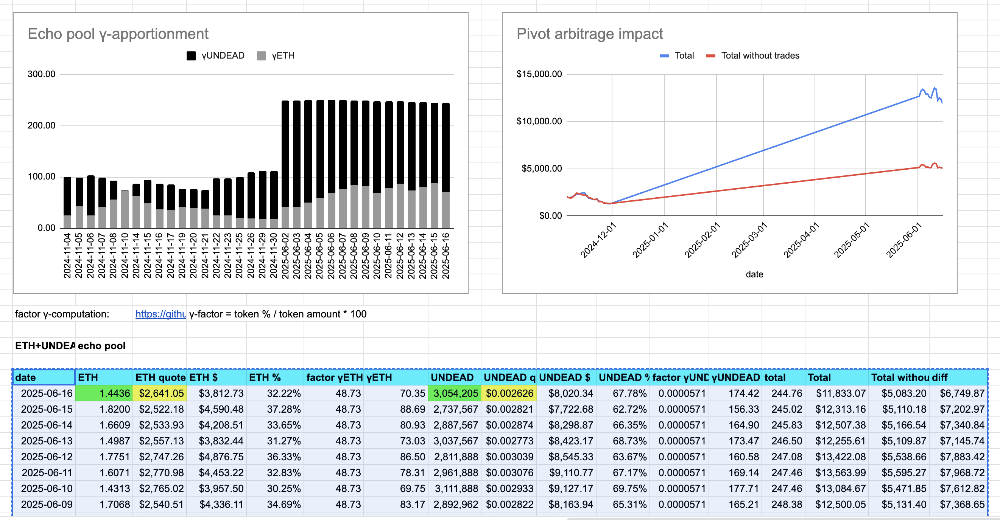

# 2025-06-16 Status of $UNDEAD 

 
 
 
 

* rank: 7936 
* quote: $0.00266 
* market cap: $39,443 
* 24-hr volume: $241,082 (δ: $8,526 ) 

When we get LPs funded on multiple blockchains, what will $UNDEAD look like? 

[$UNDEAD data source](https://www.coingecko.com/en/coins/undead-blocks) 
## $UNDEAD performance analysis, 2025-06-16 

* "δ" indicates change since 2025-06-05 
* "a" is annualized since 2025-06-05 

 
 
 
 

* rank: 7936 (δ: -5.14% ) , a: -170.57% 
* quote: $0.00266 (δ: -12.23% ) , a: -405.73% 
* market cap: $39,443 (δ: -13.11% ) , a: -434.89% 
* 24-hr volume: $241,082 (δ: 50.04% ) , a: 1660.28% 

[2025-06-05 $UNDEAD report (archived)](https://github.com/pivoteur/biz/tree/main/blog/2025/06/05) 

# PIVOTS

## ETH+UNDEAD

I close 1 pivot for gains of:

* actual ROI: 10.75% / 280.31% APR projected
* or: $87-gain on $934 pivoted
* or: 310k $UNDEAD -> $ETH -> 344k $UNDEAD

Slippage was 4.78% on @Uniswap ... ugh!

Even so: PIVOTS WORK! 😎

I distribute 80% of the $UNDEAD gains, ...

The thing about Ethereum, ... and most all blockchains, I suppose, is that it's more costly to distribute non-protocol tokens, SO!

I swap $UNDEAD to $ETH and distribute that.

Fees were an order of magnitude smaller (from 50¢ to 5¢). 

The positive δ calls to open an ETH-on-UNDEAD pivot, which I do. 

 
 

The Echo pool composition and γ-apportionment are as charted. 

 
 
