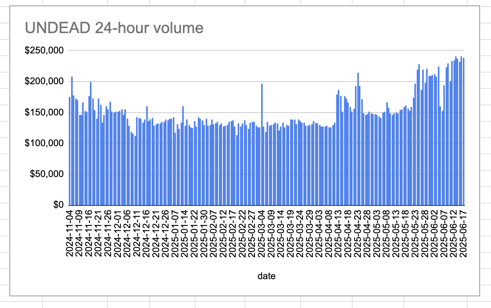

# 2025-06-17 Status of $UNDEAD 

 
 
 
 

* rank: 7860 
* quote: $0.00271 
* market cap: $40,607 
* 24-hr volume: $238,178 (δ: -$2,904 ) 

When we get LPs funded on multiple blockchains, what will $UNDEAD look like? 

[$UNDEAD data source](https://www.coingecko.com/en/coins/undead-blocks) 
## $UNDEAD performance analysis, 2025-06-17 

* "δ" indicates change since 2025-06-05 
* "a" is annualized since 2025-06-05 

 
 
 
 

* rank: 7860 (δ: -4.13% ) , a: -125.73% 
* quote: $0.00271 (δ: -10.54% ) , a: -320.65% 
* market cap: $40,607 (δ: -10.54% ) , a: -320.61% 
* 24-hr volume: $238,178 (δ: 48.23% ) , a: 1466.95% 

[2025-06-05 $UNDEAD report (archived)](https://github.com/pivoteur/biz/tree/main/blog/2025/06/05) 
