# 2025-06-18 Status of $UNDEAD 

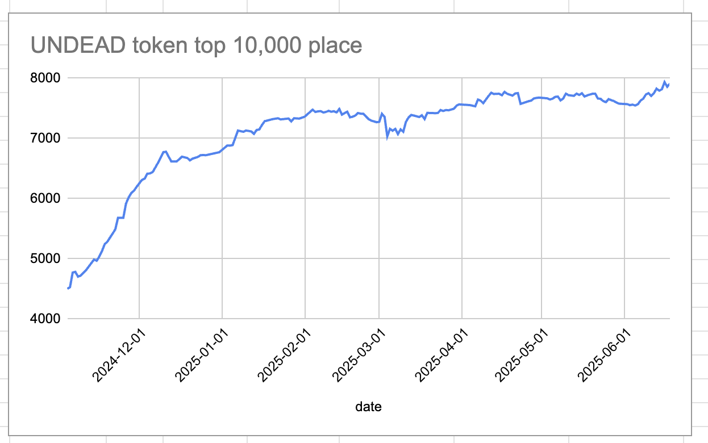 
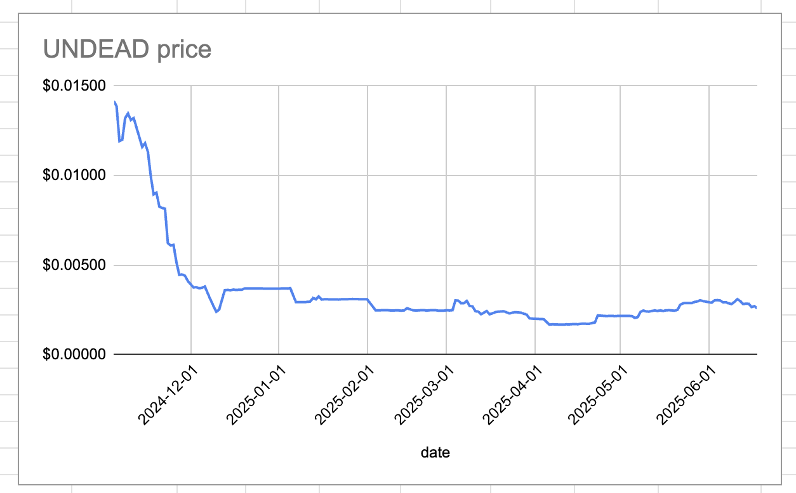 
 
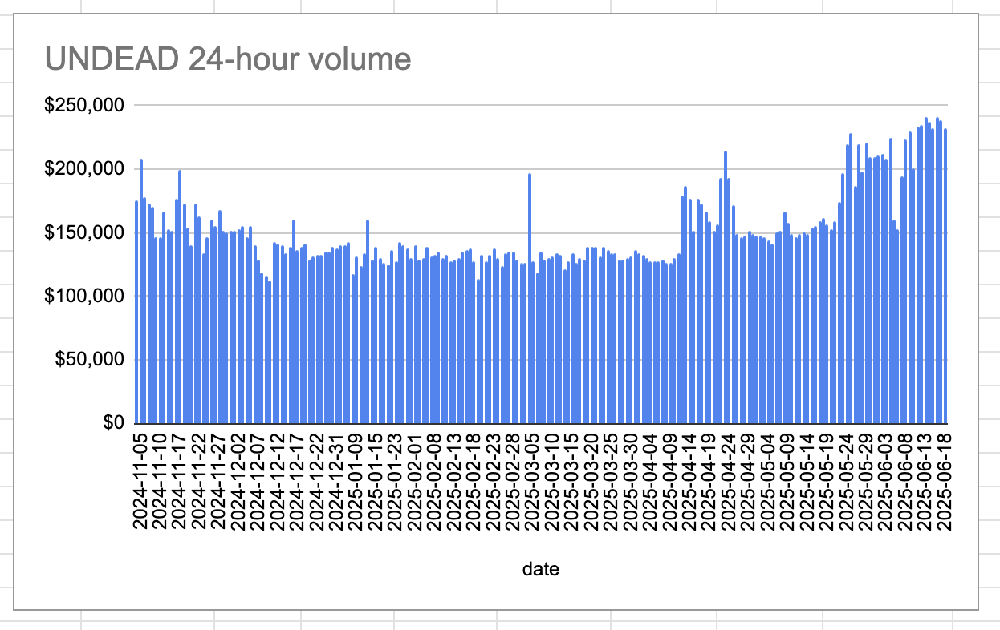 

* rank: 7910 
* quote: $0.00259 
* market cap: $38,967 
* 24-hr volume: $232,291 (δ: -$5,887 ) 

When we get LPs funded on multiple blockchains, what will $UNDEAD look like? 

[$UNDEAD data source](https://www.coingecko.com/en/coins/undead-blocks) 
## $UNDEAD performance analysis, 2025-06-18 

* "δ" indicates change since 2025-06-05 
* "a" is annualized since 2025-06-05 

 
 
 
 

* rank: 7910 (δ: -4.80% ) , a: -134.66% 
* quote: $0.00259 (δ: -14.54% ) , a: -408.26% 
* market cap: $38,967 (δ: -14.15% ) , a: -397.39% 
* 24-hr volume: $232,291 (δ: 44.56% ) , a: 1251.24% 

[2025-06-05 $UNDEAD report (archived)](https://github.com/pivoteur/biz/tree/main/blog/2025/06/05) 
# PIVOTS 

## ETH+UNDEAD 

No close pivots (BUT WE WERE SO CLOSE TO CLOSING ONE IF BUT FOR THE COMMISSION! ... but, oh, well: @Uniswap devs gotta eat, eh?)

The positive δ calls to open an ETH-on-UNDEAD pivot, which I do. 

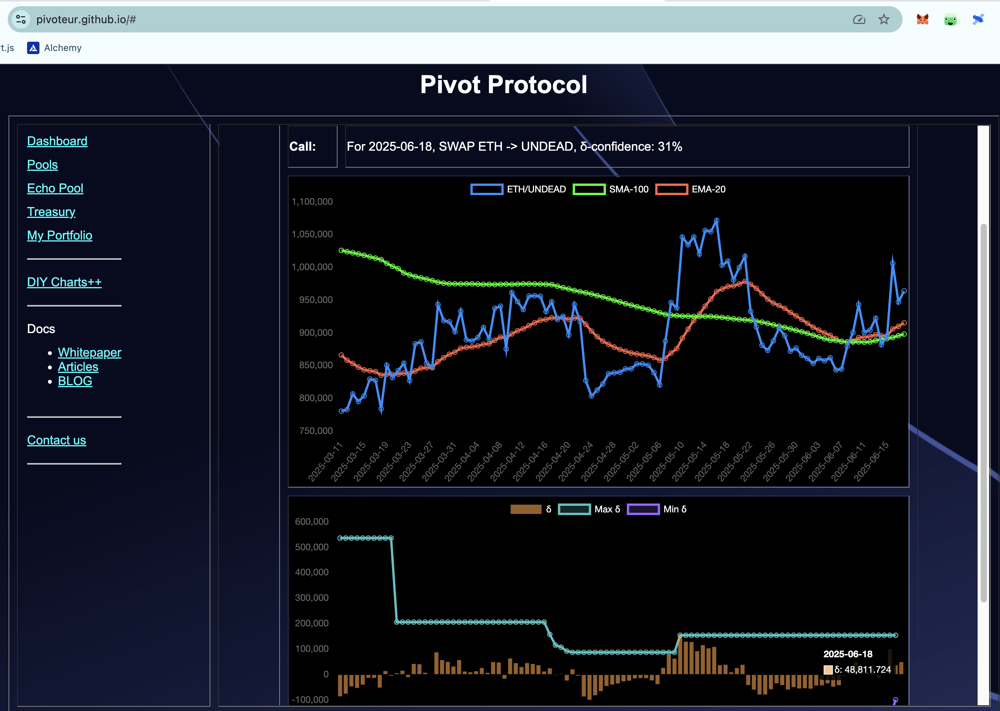 
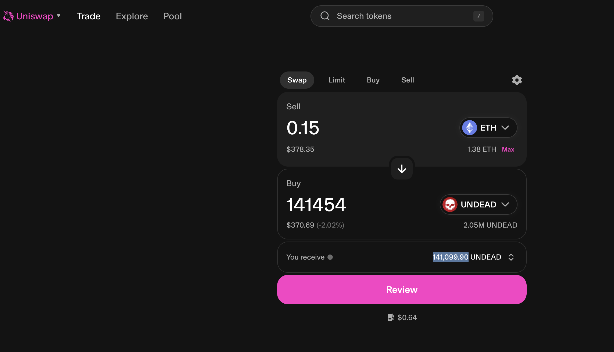 

The Echo pool composition and γ-apportionment are as charted. 

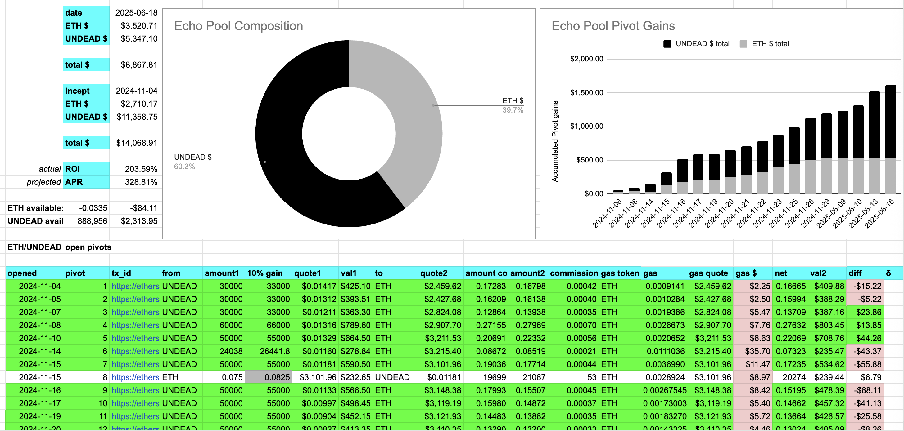 
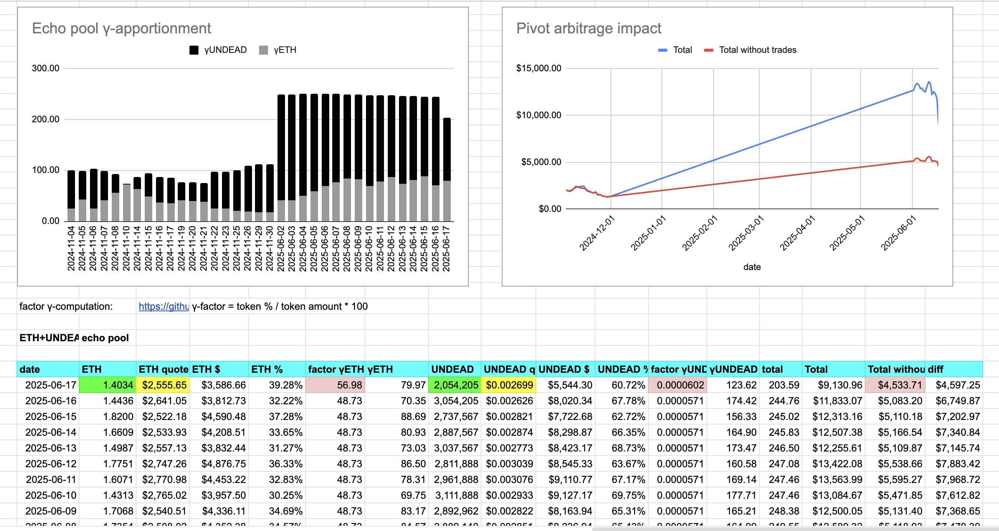 

## UNDEAD+USDC 

No close pivots. 

The negative δ calls to open an USDC-on-UNDEAD pivot, which I do. 

I also hedge with an UNDEAD-on-USDC pivot. 

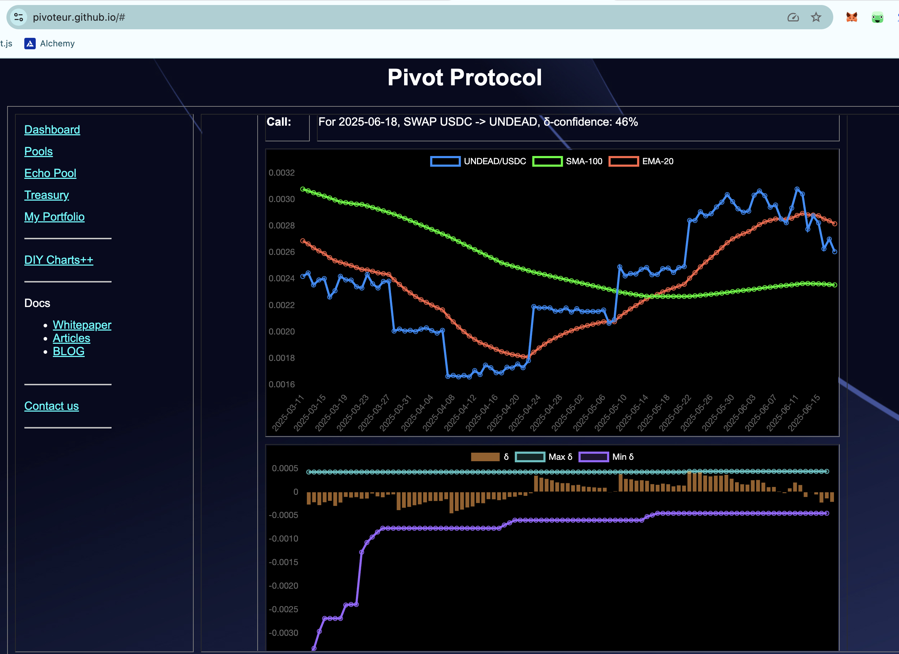 
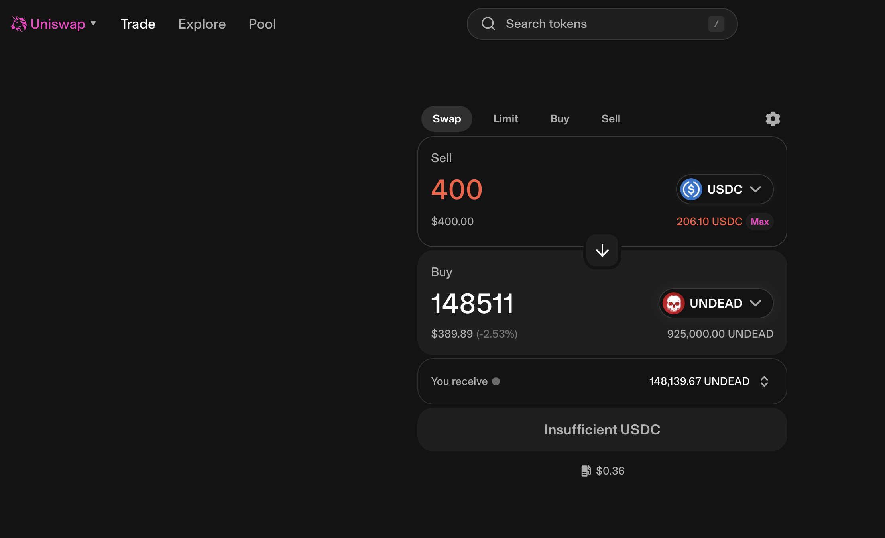 
 

The UNDEAD+USDC pivot pool composition and γ-apportionment are as charted. 

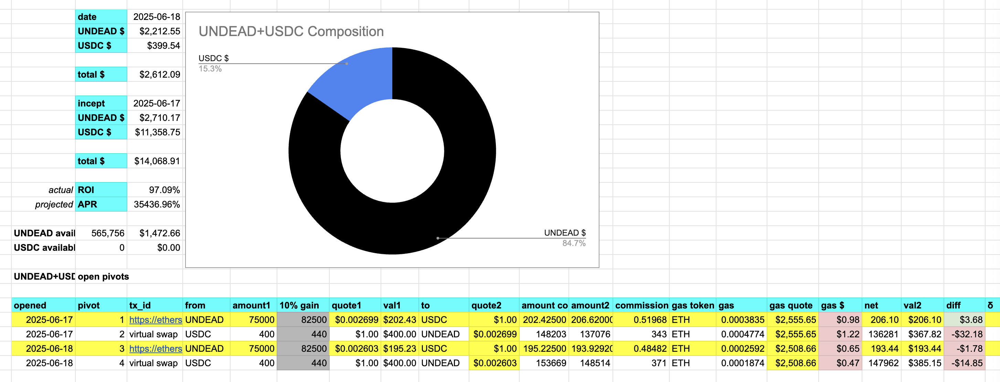 
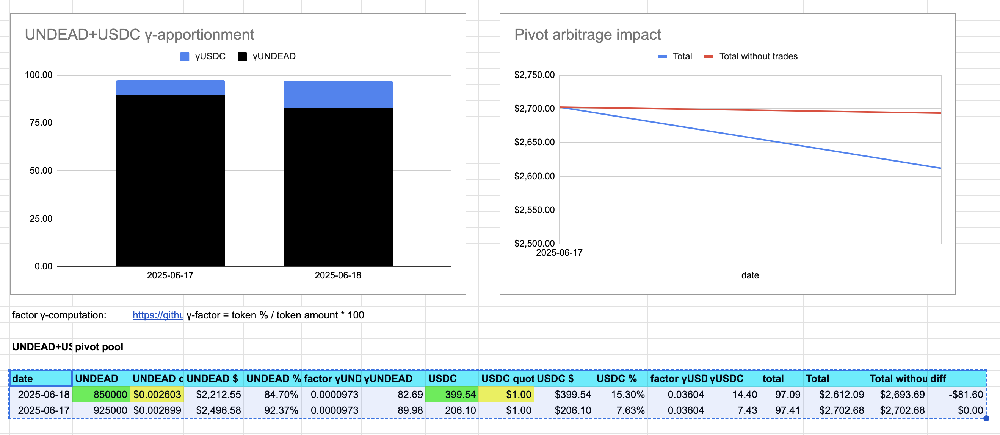 

# Providing Liquidity on Uniswap 

I provide 100k $UNDEAD and an equivalent amount of the pair for 
both the ETH/UNDEAD LP and the UNDEAD/USDC LP on Uniswap. 

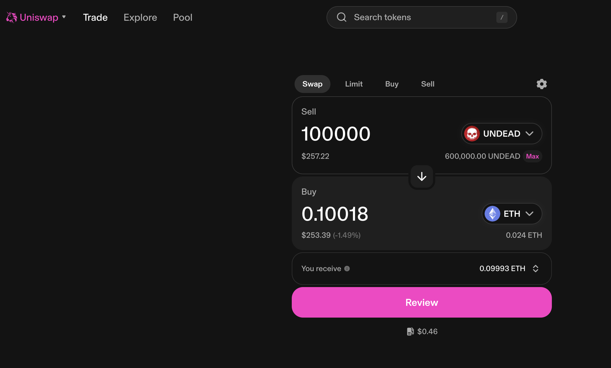 
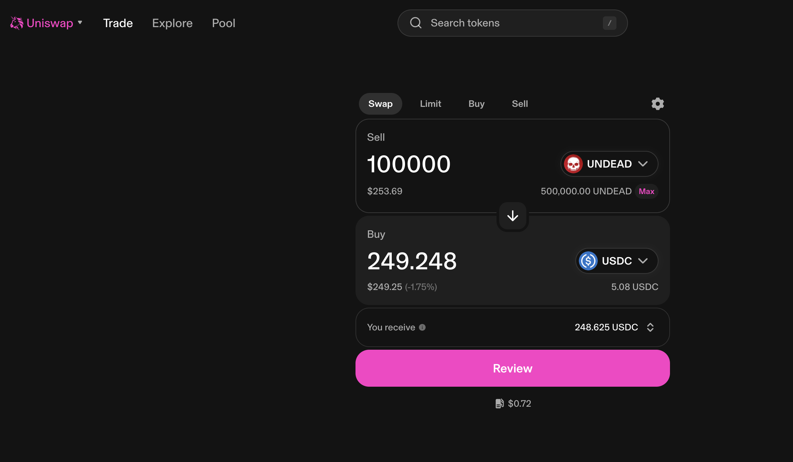 
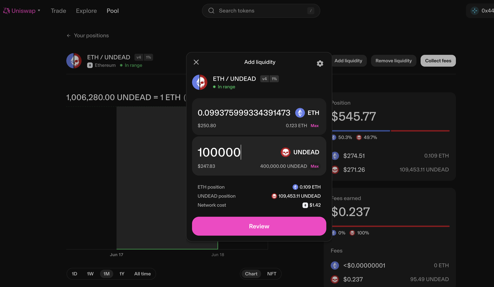 
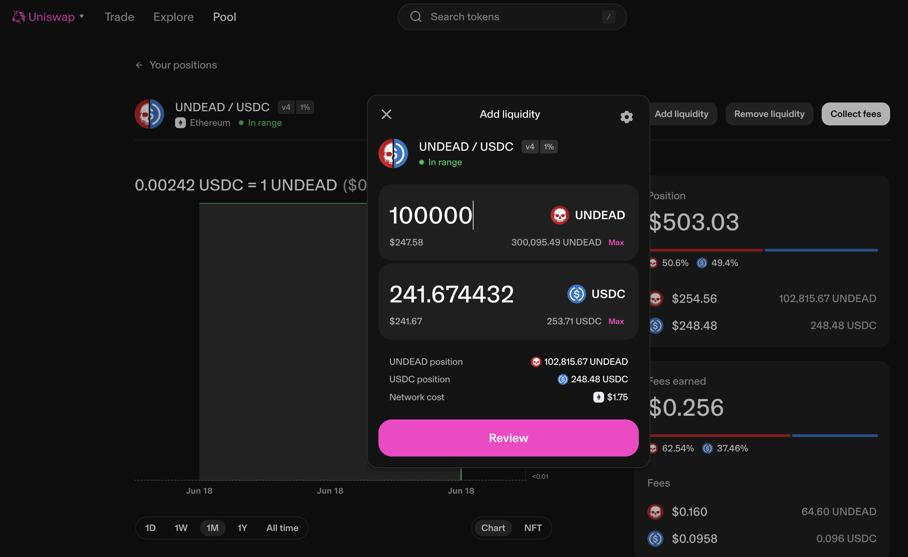 

# CONCLUSION 

This concludes pivot-activity for today. 

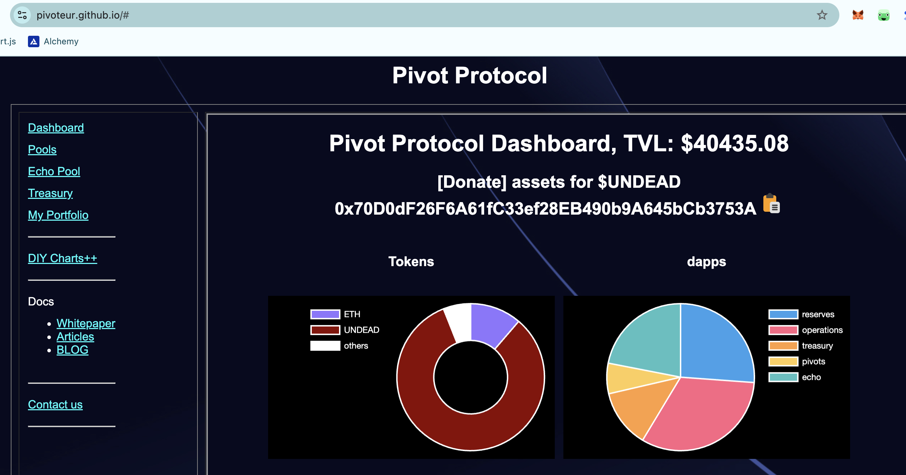 
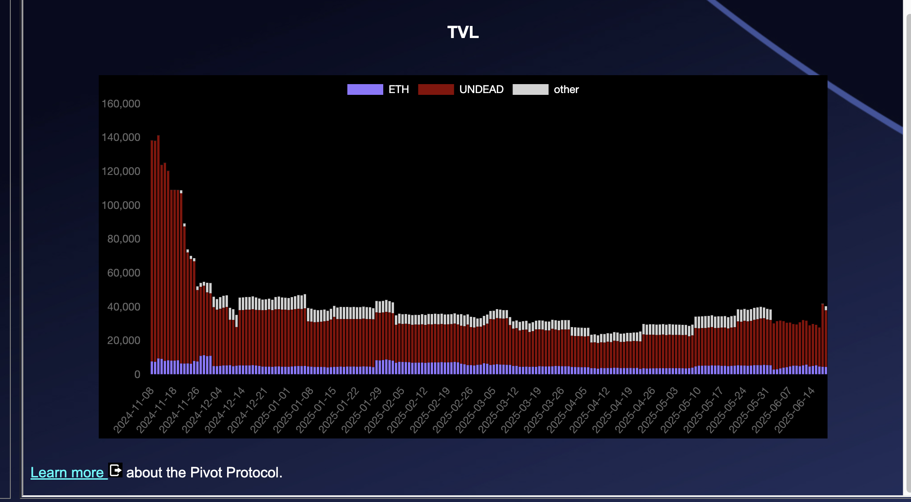 

[The Pivot protocol](https://pivoteur.github.io/#) 
