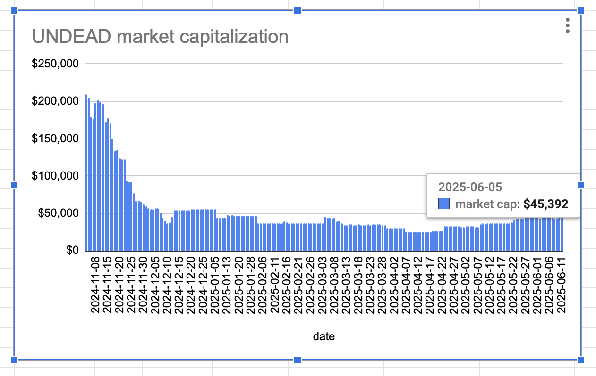

# 2025-06-19 Status of $UNDEAD 

 
 
 
 

* rank: 7966 
* quote: $0.00251 
* market cap: $37,676 
* 24-hr volume: $219,457 (δ: -$12,834 ) 

When we get LPs funded on multiple blockchains, what will $UNDEAD look like? 

[$UNDEAD data source](https://www.coingecko.com/en/coins/undead-blocks) 
## $UNDEAD performance analysis, 2025-06-19 

* "δ" indicates change since 2025-06-05 
* "a" is annualized since 2025-06-05 

 
 
 
 

* rank: 7966 (δ: -5.54% ) , a: -144.38% 
* quote: $0.00251 (δ: -16.99% ) , a: -442.85% 
* market cap: $37,676 (δ: -17.00% ) , a: -443.19% 
* 24-hr volume: $219,457 (δ: 36.58% ) , a: 953.63% 

[2025-06-05 $UNDEAD report (archived)](https://github.com/pivoteur/biz/tree/main/blog/2025/06/05) 

# Operational change in workflow

What I usually do next is the pivots, THEN I provide liquidity to the pools on @Uniswap. But that's not efficient for the pivot-swaps, so, going forward, I'll provide liquidity to the Uniswap LPs then look at opening and closing pivots. #PSA 

# Providing Liquidity on Uniswap 

First I swap some $UNDEAD to both $ETH and $USDC in preparation to provide liquidity to the @uniswap pools. 

 
 
I provide 100k $UNDEAD and an equivalent amount of the pair for both the ETH/UNDEAD LP and the UNDEAD/USDC LP on Uniswap. 

 
 
 
 

# PIVOTS

## ETH+UNDEAD

I close 5 pivots for gains of:

* actual ROI: 11.37% / 450.95% APR projected
* or: 600k $UNDEAD -> $ETH -> 719k $UNDEAD (but losing 0.05 $ETH in the trades because I was tomfooling around)
* or: $151-gained on $1,340 pivoted

WOOT! 🎉

The positive δ calls to open an ETH-on-UNDEAD pivot, which I do. 

 
 

The Echo pool composition and γ-apportionment are as charted. 

 
 
