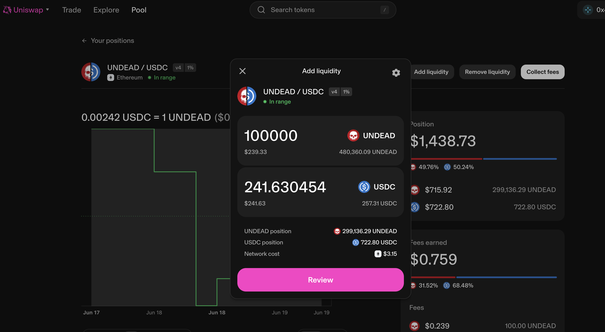
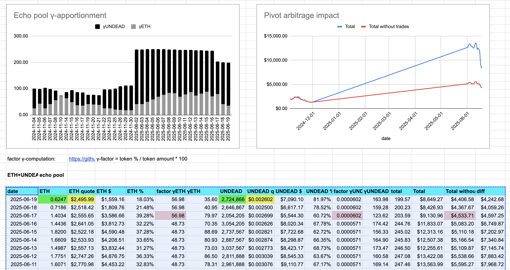

Good morning, 2025-06-20

An [interesting thing happened yesterday](https://x.com/pivocateur/status/1935723453241311275).

I closed 5 $UNDEAD pivots, making $150 (distributing $120 of that), but this put buy-pressure on $UNDEAD.

The effect was that my portfolio-value increased by net $1,423.67.

Huh.

# 2025-06-20 Status of $UNDEAD 

 
 
 
 

* rank: 7904 
* quote: $0.00261 
* market cap: $39,160 
* 24-hr volume: $240,326 (δ: $20,869 ) 

When we get LPs funded on multiple blockchains, what will $UNDEAD look like? 

[$UNDEAD data source](https://www.coingecko.com/en/coins/undead-blocks) 
## $UNDEAD performance analysis, 2025-06-20 

* "δ" indicates change since 2025-06-05 
* "a" is annualized since 2025-06-05 

 
 
 
 

* rank: 7904 (δ: -4.72% ) , a: -114.77% 
* quote: $0.00261 (δ: -13.91% ) , a: -338.54% 
* market cap: $39,160 (δ: -13.73% ) , a: -334.08% 
* 24-hr volume: $240,326 (δ: 49.57% ) , a: 1206.09% 

[2025-06-05 $UNDEAD report (archived)](https://github.com/pivoteur/biz/tree/main/blog/2025/06/05) 
# Providing Liquidity on Uniswap 

First I swap some $UNDEAD to both $ETH and $USDC in preparation to provide liquidity to the @uniswap pools. 

 
 

... but @ethereum being Ethereum again with those gas fees. 🙄

I provide 100k $UNDEAD and an equivalent amount of the pair for both the ETH/UNDEAD LP and the UNDEAD/USDC LP on Uniswap. 

 
 
 
 

# PIVOTS

## ETH+UNDEAD

I close 1 pivot for gains of:

* actual ROI: 10.12% / 388.83% APR projected
* or: 150k $UNDEAD -> $ETH -> 165k $UNDEAD
* or: $40-gain on $461 pivoted

I swap 80% of the $UNDEAD gains back to $ETH and distribute to stakers. 

The positive δ calls to open an ETH-on-UNDEAD pivot, which I do. 
I also open an UNDEAD-on-ETH hedge. 

 
 

The Echo pool composition and γ-apportionment are as charted. 

 
 

## UNDEAD+USDC

I close 1 hedge for gains of:

* actual ROI: 12.85% / 1563.68% APR projected
* or: 75k $UNDEAD -> $USDC -> 84.6k $UNDEAD
* or: $25-gain on $200 pivot

I swap 80% of the $UNDEAD gained to $ETH and distribute to stakers. 

This --^ was the first UNDEAD-on-USDC close-pivot for the protocol.

## UNDEAD+USDC 

I close 1 pivot for gains of: 

The negative δ calls to open an USDC-on-UNDEAD pivot, which I do. 

I also hedge with an UNDEAD-on-USDC pivot. 

 
 
 

The UNDEAD+USDC pivot pool composition and γ-apportionment are as charted. 

 
 
