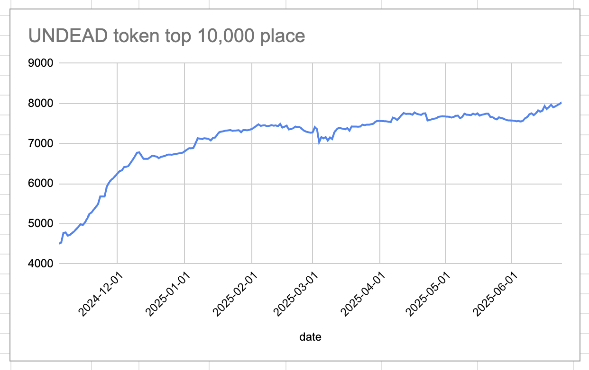
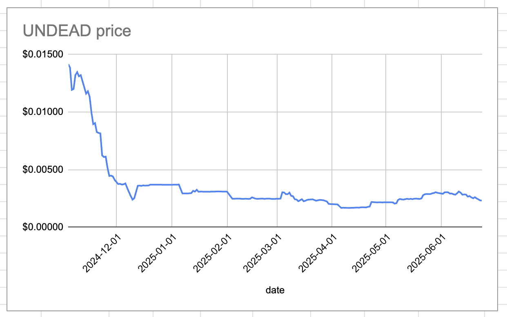
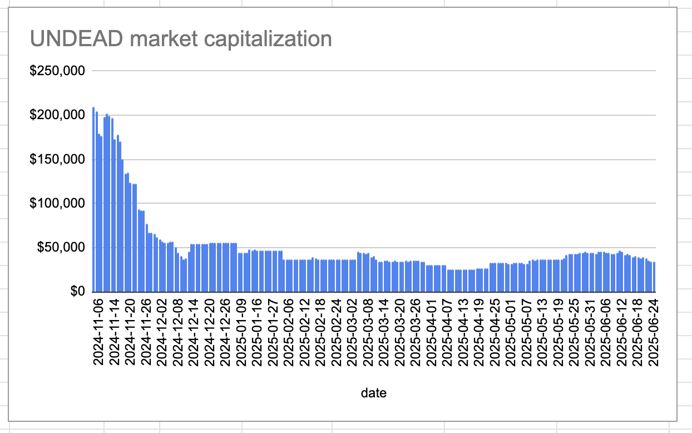
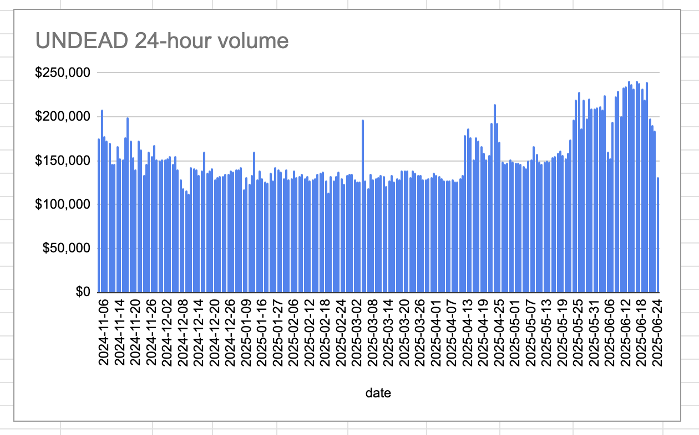
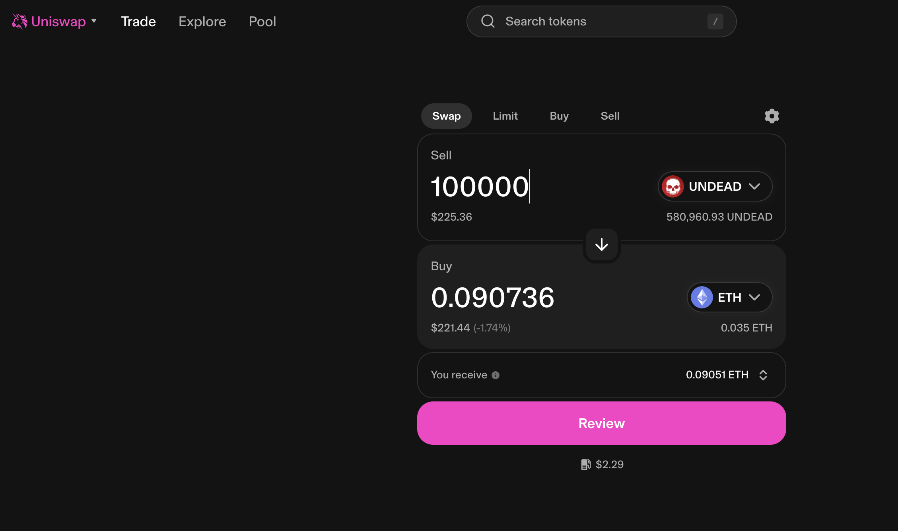
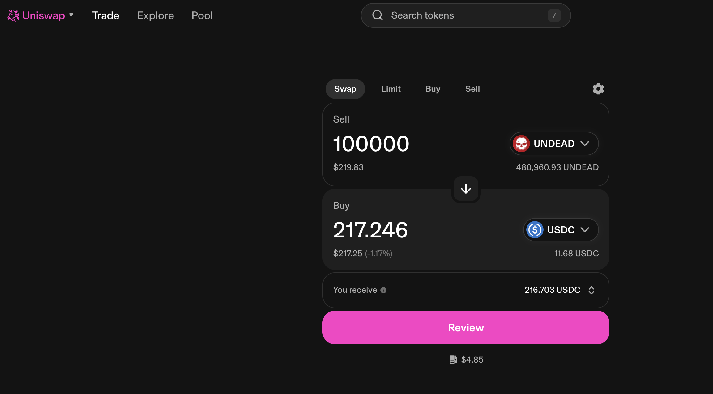

# 2025-06-24 Status of $UNDEAD 

 
 
 
 

* rank: 8033 
* quote: $0.00231 
* market cap: $34,605 
* 24-hr volume: $131,303 (δ: -$52,649 ) 

When we get LPs funded on multiple blockchains, what will $UNDEAD look like? 

[$UNDEAD data source](https://www.coingecko.com/en/coins/undead-blocks) 
## $UNDEAD performance analysis, 2025-06-24 

* "δ" indicates change since 2025-06-07 
* "a" is annualized since 2025-06-07 

 
 
 
 

* rank: 8033 (δ: -5.30% ) , a: -113.70% 
* quote: $0.00231 (δ: -21.16% ) , a: -454.21% 
* market cap: $34,605 (δ: -21.14% ) , a: -453.98% 
* 24-hr volume: $131,303 (δ: -32.24% ) , a: -692.31% 

[2025-06-07 $UNDEAD report (archived)](https://github.com/pivoteur/biz/tree/main/blog/2025/06/05) 
# Providing Liquidity on Uniswap 

First I swap some $UNDEAD to both $ETH and $USDC in preparation to provide liquidity to the @uniswap pools. 

 
 
