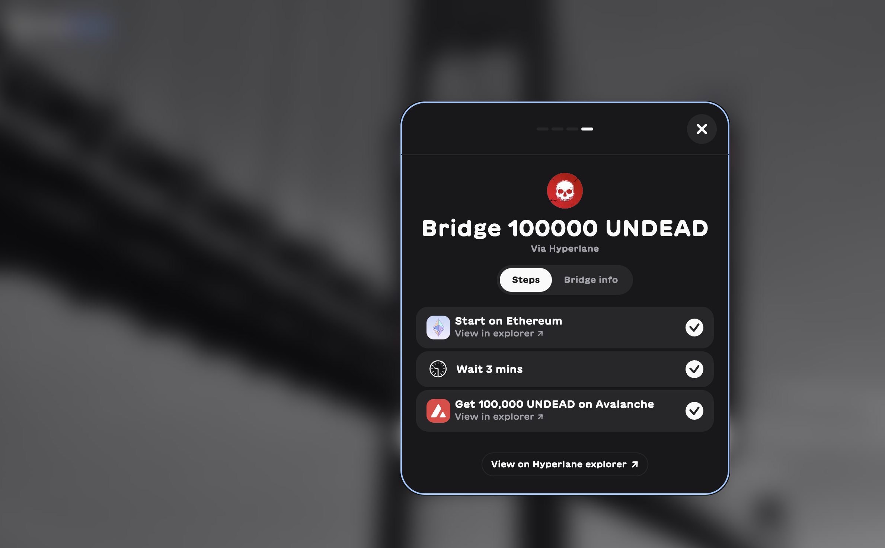

# 2025-06-25 Status of $UNDEAD 

 
 
 
 

* rank: 8022 
* quote: $0.00234 
* market cap: $34,843 
* 24-hr volume: $105,403 (δ: -$25,900 ) 

When we get LPs funded on multiple blockchains, what will $UNDEAD look like? 

[$UNDEAD data source](https://www.coingecko.com/en/coins/undead-blocks) 
## $UNDEAD performance analysis, 2025-06-25 

* "δ" indicates change since 2025-06-07 
* "α" is annualized since 2025-06-07 

 
 
 
 

* rank: 8022 (δ: -5.15% ) , α: -104.46% 
* quote: $0.00234 (δ: -20.10% ) , α: -407.50% 
* market cap: $34,843 (δ: -20.60% ) , α: -417.75% 
* 24-hr volume: $105,403 (δ: -45.61% ) , α: -924.86% 

[2025-06-07 $UNDEAD report (archived)](https://github.com/pivoteur/biz/tree/main/blog/2025/06/05) 

# Providing Liquidity

Okay, now we're going to work on getting liquidity on @avax, and tradeable liquidity, at that! How do we do that?

Via [VeraBridge](https://app.verabridge.io/).

Let's bridge 100k $UNDEAD over to @avax to start building liquidity (and @Uniswap liquidity pools) there.

Opp! Vera Bridge says I ... 'need'/'should have' $AVAX on @avax before I bridge.

Okay. Fair. Other bridges don't freak about this, but I suppose if a protocol doesn't see $AVAX on an @avax address, it may feel better doin' the supafreak.

I'll get some $AVAX there first.

Transfer/transaction fee is still $2.86.

Stupid @ethereum.

I'm going to approach this a different way.

Ciao for now.

Okay, I did some pivoting on my own portfolio @logicalgraphs, and earned some $AVAX there, which I transferred to the Pivot protocol's treasury wallet here on @avax. 

The hoops I have to jump, ... around (?) ... because I'm dealing with @ethereum. 
## Bridged UNDEAD to Avalanche

Using verabridge, I get the $UNDEAD tokens over onto Avalanche.

I must manually enter the contract for my wallet to see these tokens.

* $UNDEAD on @avax contract: 0x5a3534720A4f29FA0dc53cE474Db88973A95f65C

We need to add that contract and Avalanche blockchain to @coingecko.

# PIVOTS 

## ETH+UNDEAD 

No close pivots. 

### Open Pivot 

 

The positive δ calls to open an ETH-on-UNDEAD pivot, which I do. 

 

I also open an UNDEAD-on-ETH hedge. 

 

The Echo pool composition and γ-apportionment are as charted. 

 
 

## UNDEAD+USDC 

No close pivots. 

### Open Pivot 

 

The negative δ calls to open an USDC-on-UNDEAD pivot, which I do, after I first transfer some $UNDEAD from the treasury. 

 

I also hedge with an UNDEAD-on-USDC pivot. 

 

The UNDEAD+USDC pivot pool composition and γ-apportionment are as charted. 

 
 
# CONCLUSION 

This concludes pivot-activity for today. 

 
 

[The Pivot protocol](https://pivoteur.github.io/#) 
