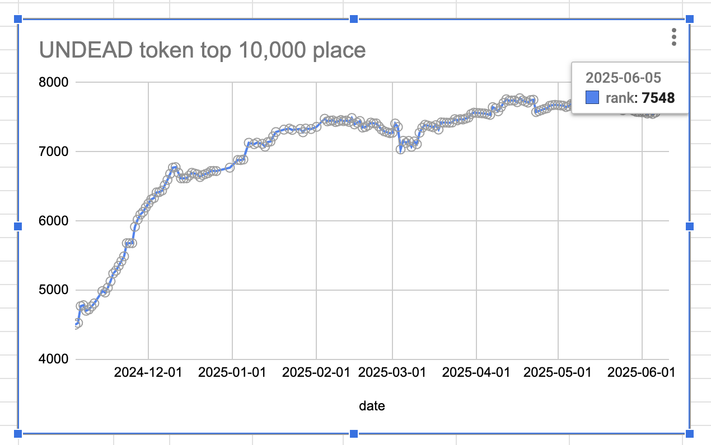
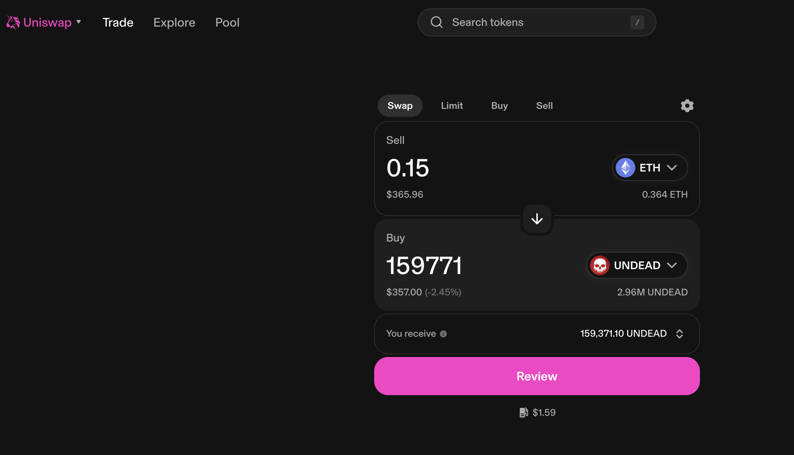
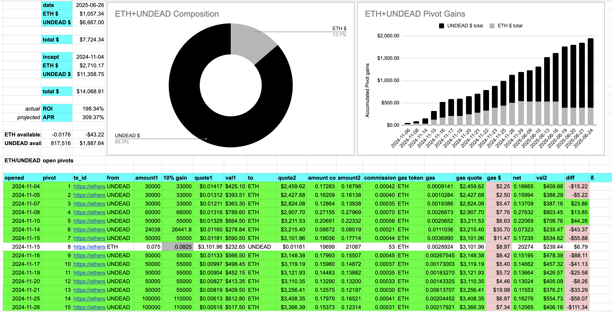

# 2025-06-26 Status of $UNDEAD 

 
 
 
 

* rank: 8024 
* quote: $0.00230 
* market cap: $34,546 
* 24-hr volume: $104,634 (δ: -$769 ) 

When we get LPs funded on multiple blockchains, what will $UNDEAD look like? 

[$UNDEAD data source](https://www.coingecko.com/en/coins/undead-blocks) 
## $UNDEAD performance analysis, 2025-06-26 

* "δ" indicates change since 2025-06-07 
* "α" is annualized since 2025-06-07 

 
 
 
 

* rank: 8024 (δ: -5.18% ) , α: -99.46% 
* quote: $0.00230 (δ: -21.26% ) , α: -408.37% 
* market cap: $34,546 (δ: -21.28% ) , α: -408.76% 
* 24-hr volume: $104,634 (δ: -46.01% ) , α: -883.80% 

[2025-06-07 $UNDEAD report (archived)](https://github.com/pivoteur/biz/tree/main/blog/2025/06/05) 
# PIVOTS 

## ETH+UNDEAD 

No close pivots. 

### Open Pivot 

 

The positive δ calls to open an ETH-on-UNDEAD pivot, which I do. 

 

I also open an UNDEAD-on-ETH hedge. 

 

The Echo pool composition and γ-apportionment are as charted. 

 
 
