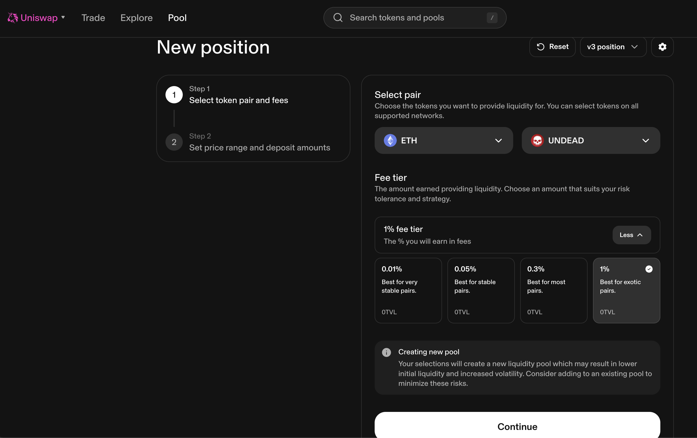

# 2025-06-28 Status of $UNDEAD 

 
 
 
 

* rank: 8065 
* quote: $0.00226 
* market cap: $33,916 
* 24-hr volume: $110,772 (δ: $3,069 ) 

When we get LPs funded on multiple blockchains, what will $UNDEAD look like? 

[$UNDEAD data source](https://www.coingecko.com/en/coins/undead-blocks) 
## $UNDEAD performance analysis, 2025-06-28 

* "δ" indicates change since 2025-06-09 
* "α" is annualized since 2025-06-09 

 
 
 
 

* rank: 8065 (δ: -4.33% ) , α: -83.25% 
* quote: $0.00226 (δ: -19.91% ) , α: -382.44% 
* market cap: $33,916 (δ: -20.75% ) , α: -398.67% 
* 24-hr volume: $110,772 (δ: -51.72% ) , α: -993.55% 

[2025-06-09 $UNDEAD report (archived)](https://github.com/pivoteur/biz/tree/main/blog/2025/06/05) 

# Liquidity Pools

Okay, this is the part where I talk about $UNDEAD liquidity pools (LPs). I do have LPs on @Uniswap, ...

... and can swap $UNDEAD on there, however, there's a problem: @KyberNetwork does not recognize Uniswap v4 pools, ...

... even though other DEX (e.g.: VeraSwap) do!

I close one v4 pool, swap the pair to $ETH, and go to set up the v3 pool

And this is why I hate @ethereum.

The v4 pools are structured so you don't pay a criminal amount of money in transaction fees.

The v3 pools? Not so much. It's gone up to $36 to establish a v3 pool, ... during no traffic.

What the actual ...?

Ah, well.

* When life hands you lemons, you make lemonaide.
* When @ethereum hands you high transaction fees, you select `cancel`.

Moving on.

