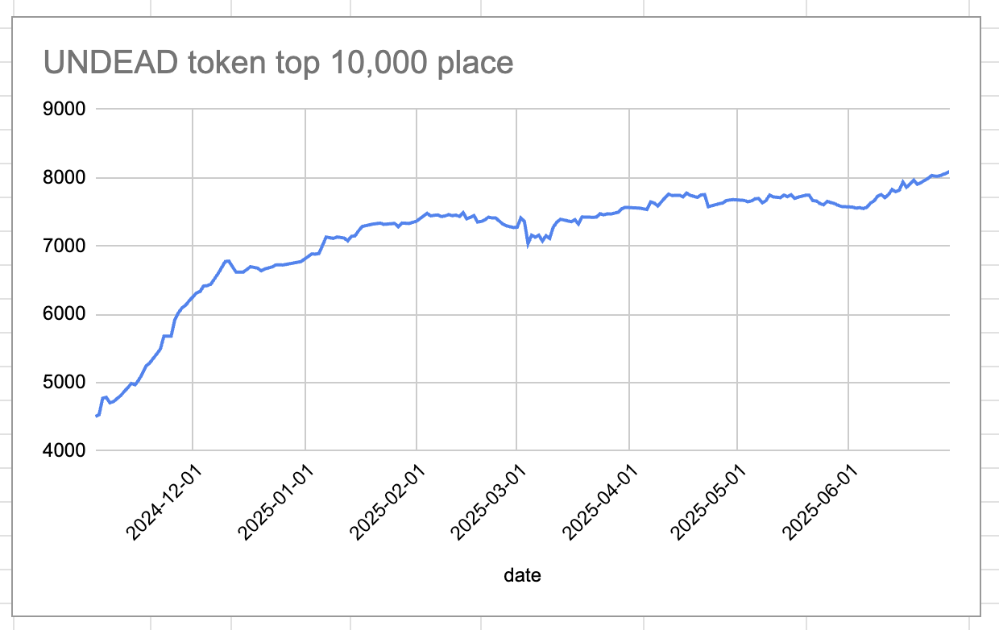
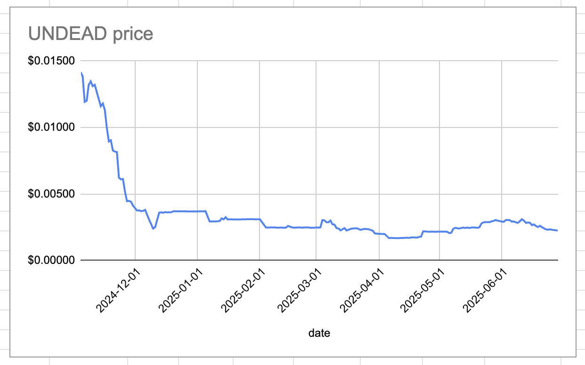

# 2025-06-29 Status of $UNDEAD 

 
 
 
 

* rank: 8090 
* quote: $0.00225 
* market cap: $33,893 
* 24-hr volume: $108,429 (δ: -$2,343 ) 

When we get LPs funded on multiple blockchains, what will $UNDEAD look like? 

[$UNDEAD data source](https://www.coingecko.com/en/coins/undead-blocks) 
## $UNDEAD performance analysis, 2025-06-29 

* "δ" indicates change since 2025-06-09 
* "α" is annualized since 2025-06-09 

 
 
 
 

* rank: 8090 (δ: -4.66% ) , α: -84.99% 
* quote: $0.00225 (δ: -20.44% ) , α: -373.02% 
* market cap: $33,893 (δ: -20.81% ) , α: -379.72% 
* 24-hr volume: $108,429 (δ: -52.74% ) , α: -962.51% 

[2025-06-09 $UNDEAD report (archived)](https://github.com/pivoteur/biz/tree/main/blog/2025/06/05) 
