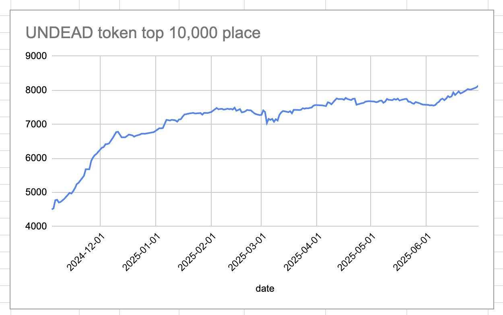
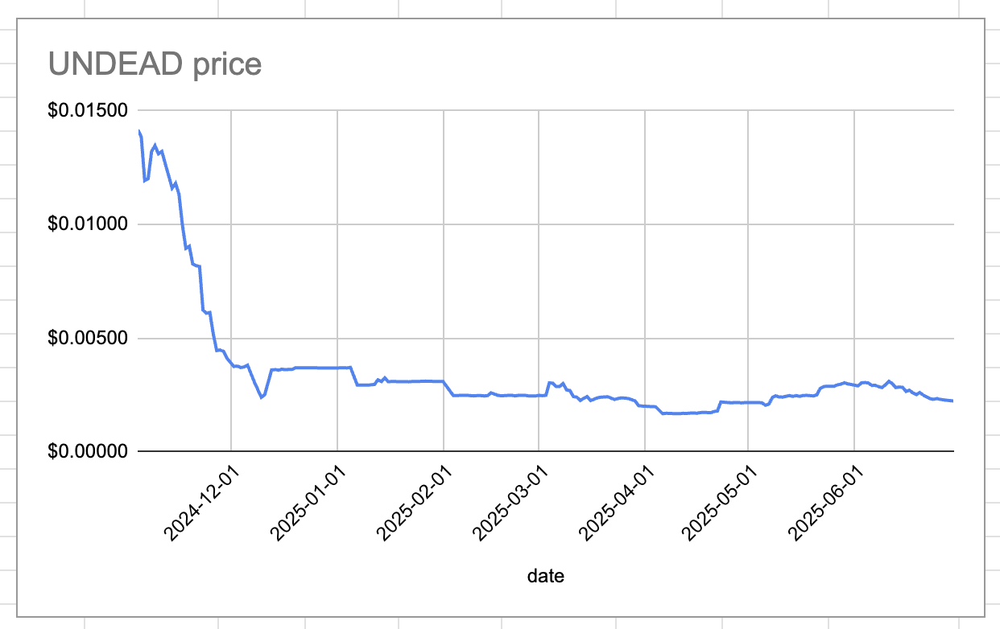
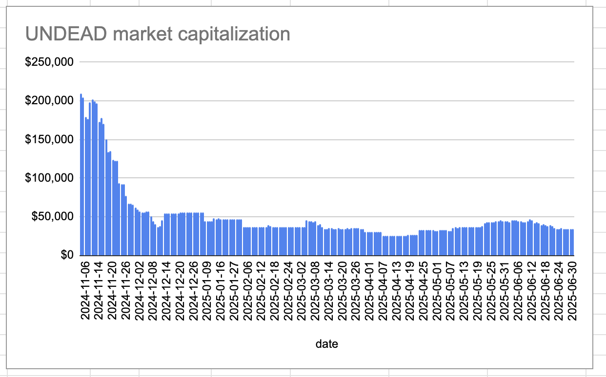
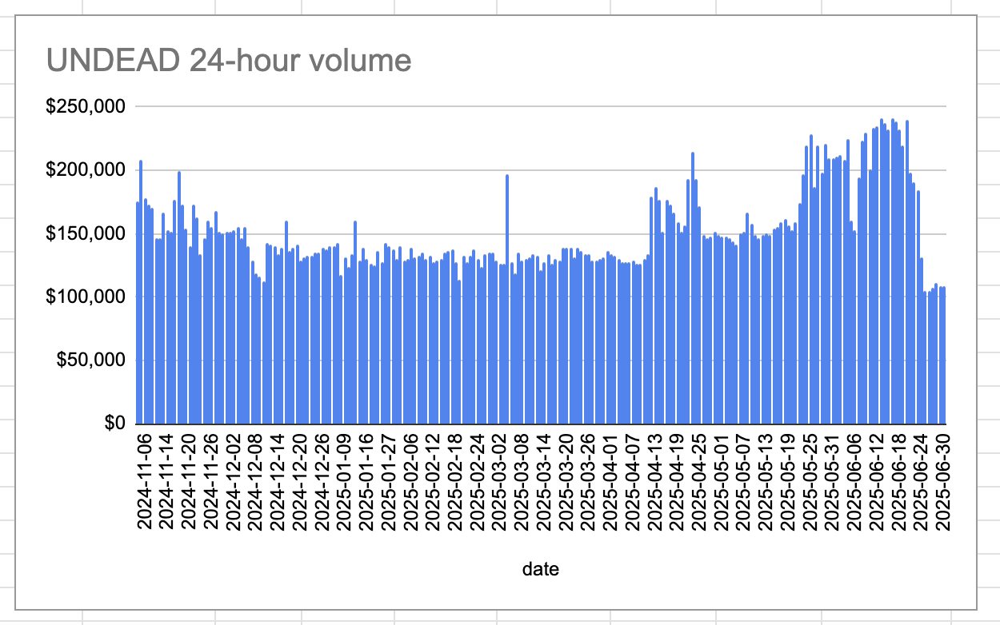

# 2025-06-30 Status of $UNDEAD 

 
 
 
 

* rank: 8138 
* quote: $0.00223 
* market cap: $33,698 
* 24-hr volume: $108,429 (δ: $0 ) 

When we get LPs funded on multiple blockchains, what will $UNDEAD look like? 

[$UNDEAD data source](https://www.coingecko.com/en/coins/undead-blocks) 
## $UNDEAD performance analysis, 2025-06-30 

* "δ" indicates change since 2025-06-05 
* "α" is annualized since 2025-06-05 

 
 
 
 

* rank: 8138 (δ: -7.82% ) , α: -114.12% 
* quote: $0.00223 (δ: -26.17% ) , α: -382.13% 
* market cap: $33,698 (δ: -25.76% ) , α: -376.12% 
* 24-hr volume: $108,429 (δ: -32.52% ) , α: -474.79% 

[2025-06-05 $UNDEAD report (archived)](https://github.com/pivoteur/biz/tree/main/blog/2025/06/05) 
