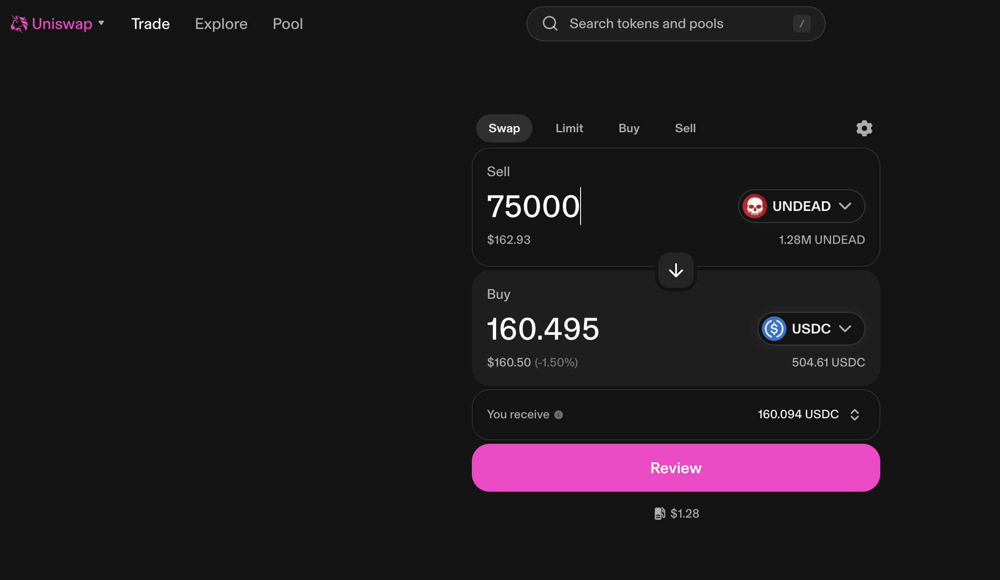

# 2025-07-01 Status of $UNDEAD 

 
 
 
 

* rank: 8135 
* quote: $0.00219 
* market cap: $32,687 
* 24-hr volume: $109,575 (δ: $1,146 ) 

When we get LPs funded on multiple blockchains, what will $UNDEAD look like? 

[$UNDEAD data source](https://www.coingecko.com/en/coins/undead-blocks) 
## $UNDEAD performance analysis, 2025-07-01 

* "δ" indicates change since 2025-06-05 
* "α" is annualized since 2025-06-05 

* rank: 8135 (δ: -7.78% ) , α: -109.18% 
* quote: $0.00219 (δ: -27.69% ) , α: -388.77% 
* market cap: $32,687 (δ: -27.99% ) , α: -392.94% 
* 24-hr volume: $109,575 (δ: -31.81% ) , α: -446.52% 

[2025-06-05 $UNDEAD report (archived)](https://github.com/pivoteur/biz/tree/main/blog/snapshot) 
# PIVOTS 

## ETH+UNDEAD 

No close pivots. 

### Open Pivot 

 

The positive δ calls to open an ETH-on-UNDEAD pivot, which I do. 

 

I also open an UNDEAD-on-ETH hedge. 

 

The Echo pool composition and γ-apportionment are as charted. 

 
 

## UNDEAD+USDC

I close 1 hedge for gains of:

* actual ROI: 10.08% / 334.45% APR projected
* or: 75k $UNDEAD -> $USDC -> 82.5k $UNDEAD
* or: $16.54-gain on $180 hedge

I swap 80% of the $UNDEAD-gains to $USDC to fund the LP UNDEAD/USDC on @avax 

## UNDEAD+USDC 

I close 1 pivot for gains of: 

### Open Pivot 

 

The negative δ calls to open an USDC-on-UNDEAD pivot, which I do. 

 

I also hedge with an UNDEAD-on-USDC pivot. 

 

The UNDEAD+USDC pivot pool composition and γ-apportionment are as charted. 

 
 
