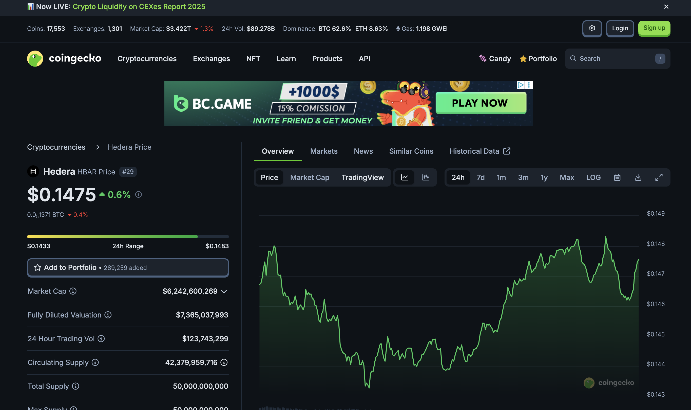
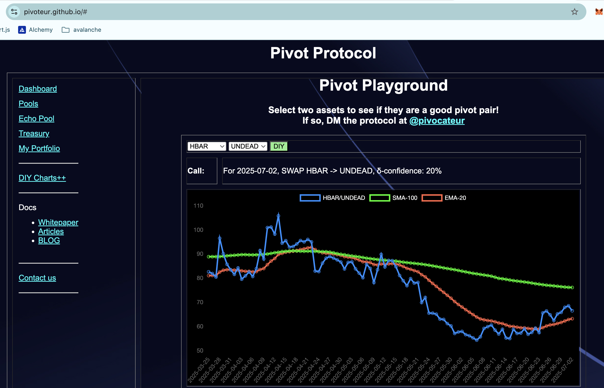
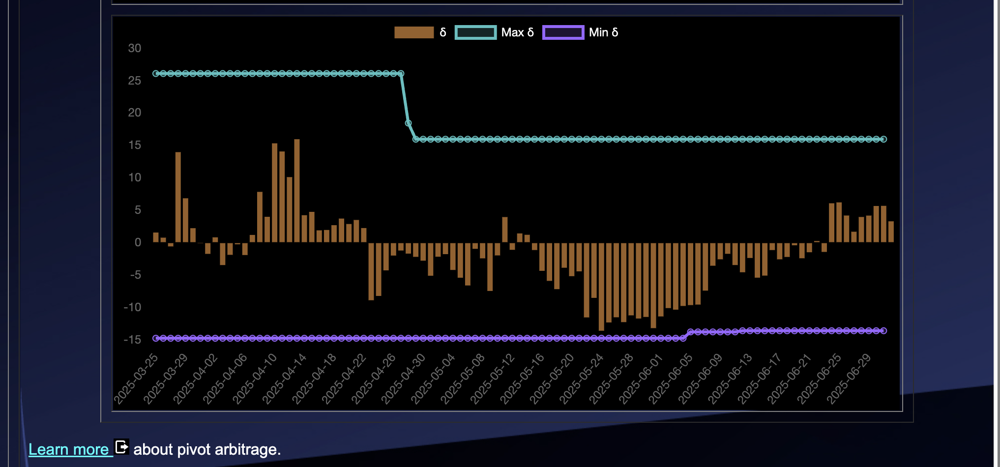
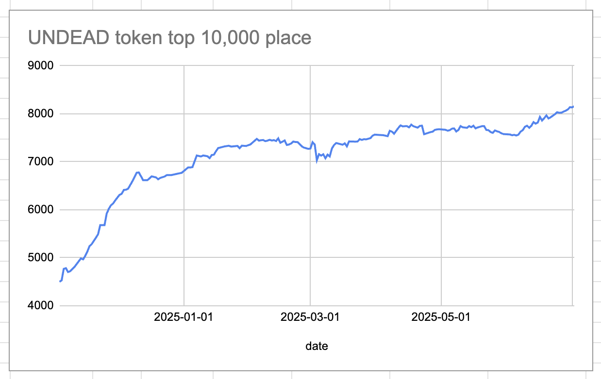
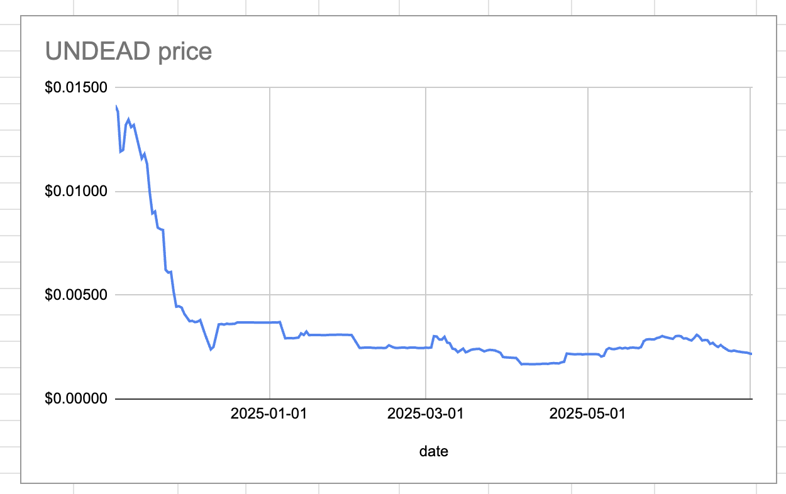
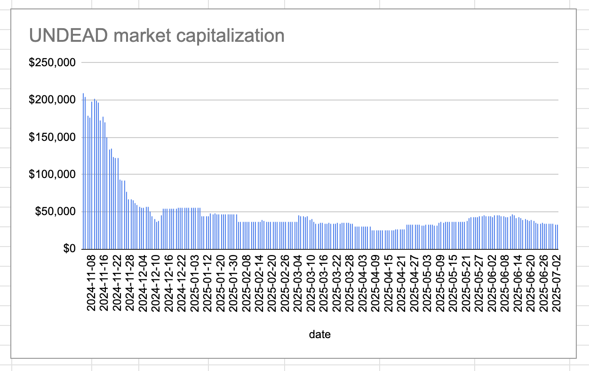
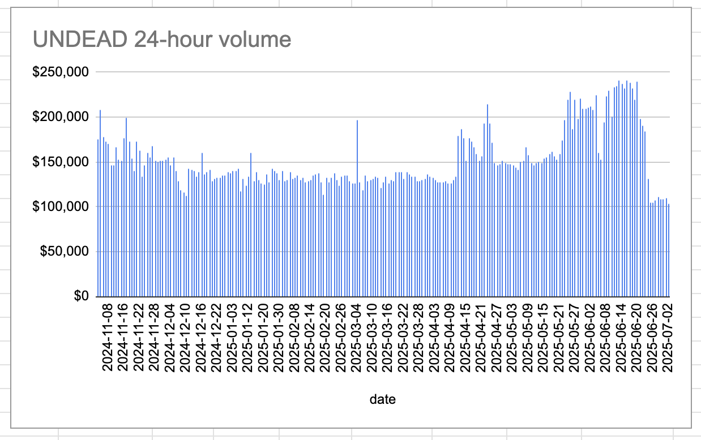

# 2025-07-02 Spotlight on Hedera / HBAR 

* rank: 29 
* quote: $0.14760 
* market cap: $6,251,337,607 
* 24-hr volume: $120,949,770 
* UNDEAD ratio: 66.536 

[HBAR data source](https://www.coingecko.com/en/coins/hedera) 
# 2025-07-02 Status of $UNDEAD 

 
 
 
 

* rank: 8158 
* quote: $0.00217 
* market cap: $32,616 
* 24-hr volume: $102,931 (δ: -$6,644 ) 

When we get LPs funded on multiple blockchains, what will $UNDEAD look like? 

[$UNDEAD data source](https://www.coingecko.com/en/coins/undead-blocks) 
