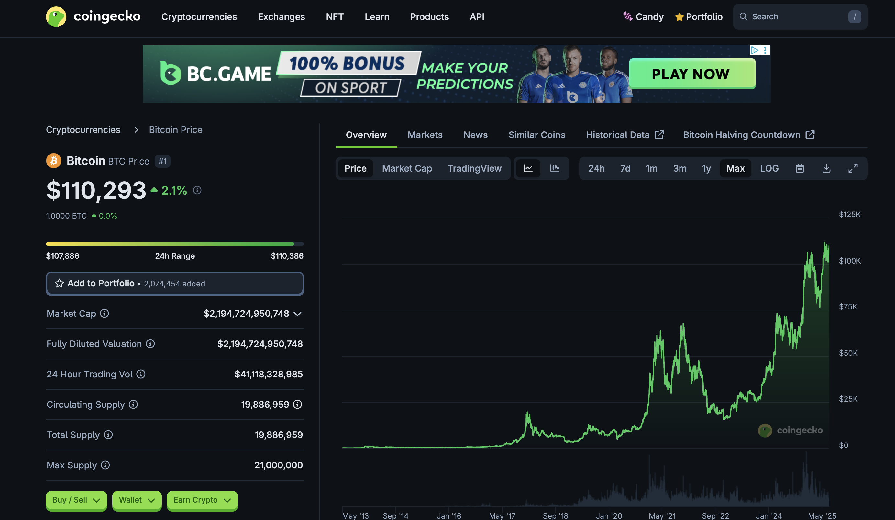
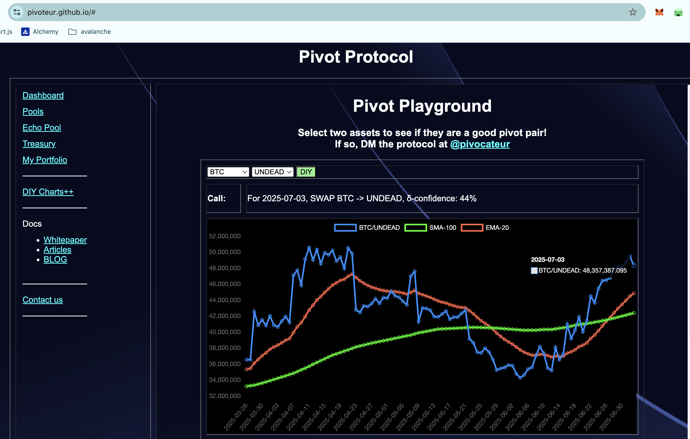
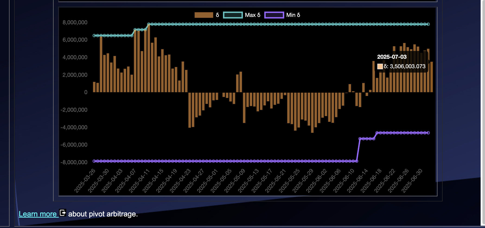
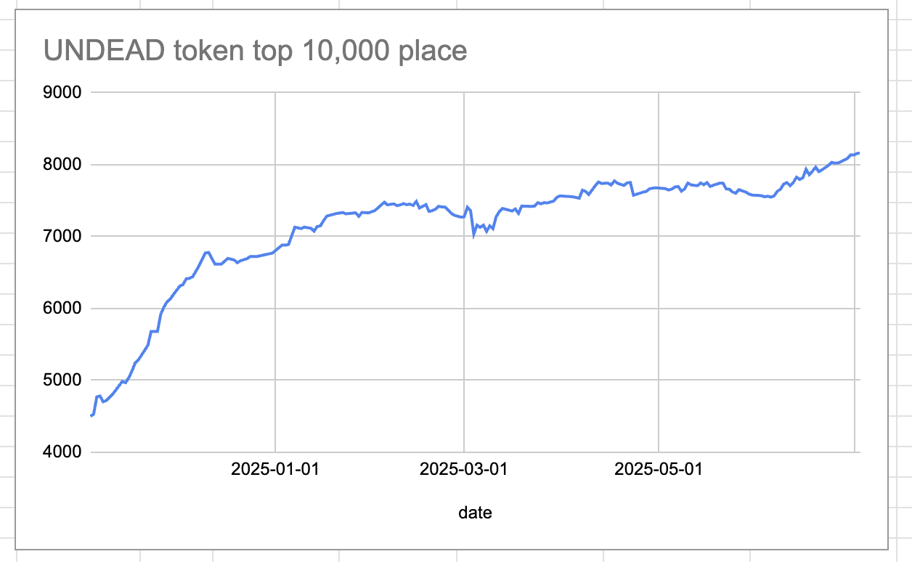
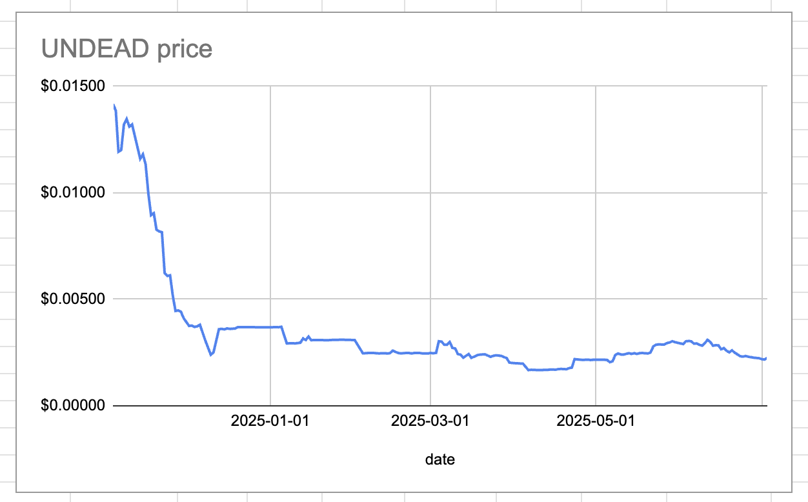
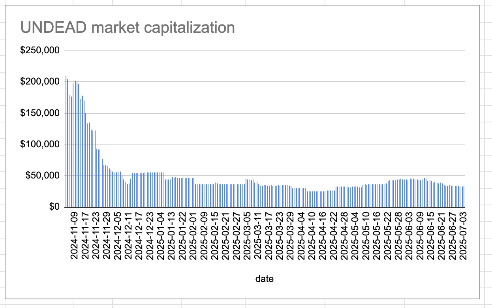
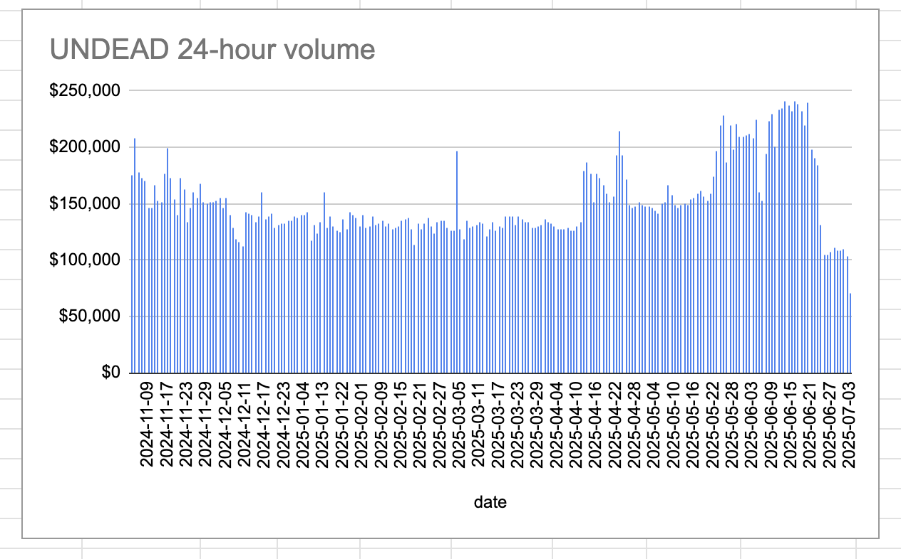

# 2025-07-03 Spotlight on Bitcoin / BTC 

 
 
 

* rank: 1 
* quote: $110,293.00000 
* market cap: $2,194,724,950,748 
* 24-hr volume: $41,118,328,985 
* UNDEAD ratio: 48.36M 

[BTC data source](https://www.coingecko.com/en/coins/bitcoin) 

# 2025-07-03 Status of $UNDEAD 

 
 
 
 

* rank: 8161 
* quote: $0.00225 
* market cap: $33,804 
* 24-hr volume: $70,374 (δ: -$32,557 ) 

[UNDEAD data source](https://www.coingecko.com/en/coins/undead-blocks) 

## $UNDEAD performance analysis, 2025-07-03 

* "δ" indicates change since 2025-06-05 
* "α" is annualized since 2025-06-05 

 
 
 
 

* rank: 8161 (δ: -8.12% ) , α: -105.87% 
* quote: $0.00225 (δ: -25.74% ) , α: -335.59% 
* market cap: $33,804 (δ: -25.53% ) , α: -332.79% 
* 24-hr volume: $70,374 (δ: -56.20% ) , α: -732.65% 

[2025-06-05 $UNDEAD report (archived)](https://github.com/pivoteur/biz/tree/main/blog/snapshot) 
