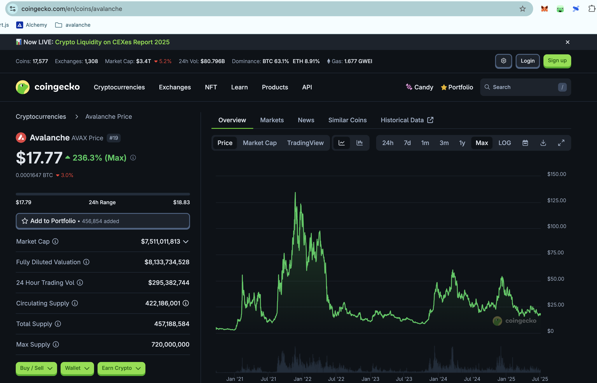
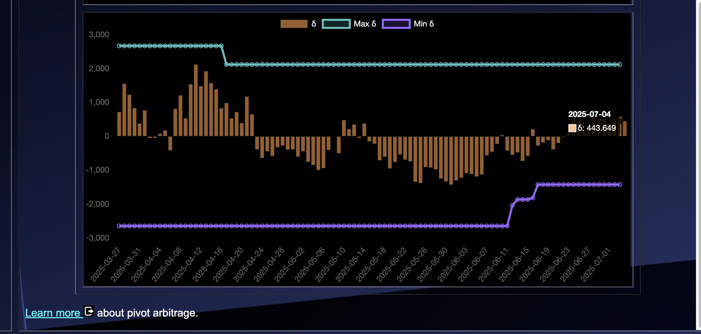

# 2025-07-04 Spotlight on Avalanche / AVAX 

 
 
 

* rank: 19 
* quote: $17.77000 
* market cap: $7,511,011,813 
* 24-hr volume: $295,382,744 
* UNDEAD ratio: 8179 

[AVAX data source](https://www.coingecko.com/en/coins/avalanche) 

# 2025-07-04 Status of $UNDEAD 

 
 
 
 

* rank: 8148 
* quote: $0.00224 
* market cap: $33,532 
* 24-hr volume: $113,493 (δ: $43,119 ) 

When we get LPs funded on multiple blockchains, what will $UNDEAD look like? 

[UNDEAD data source](https://www.coingecko.com/en/coins/undead-blocks) 

## $UNDEAD performance analysis, 2025-07-04 

* "δ" indicates change since 2025-06-05 
* "α" is annualized since 2025-06-05 

 
 
 
 

* rank: 8148 (δ: -7.95% ) , α: -100.05% 
* quote: $0.00224 (δ: -26.01% ) , α: -327.34% 
* market cap: $33,532 (δ: -26.13% ) , α: -328.85% 
* 24-hr volume: $113,493 (δ: -29.37% ) , α: -369.64% 

[2025-06-05 $UNDEAD report (archived)](https://github.com/pivoteur/biz/tree/main/blog/snapshot) 
# CONCLUSION 

This concludes pivot-activity for today. 

 
 

[The Pivot protocol](https://pivoteur.github.io/#) 
