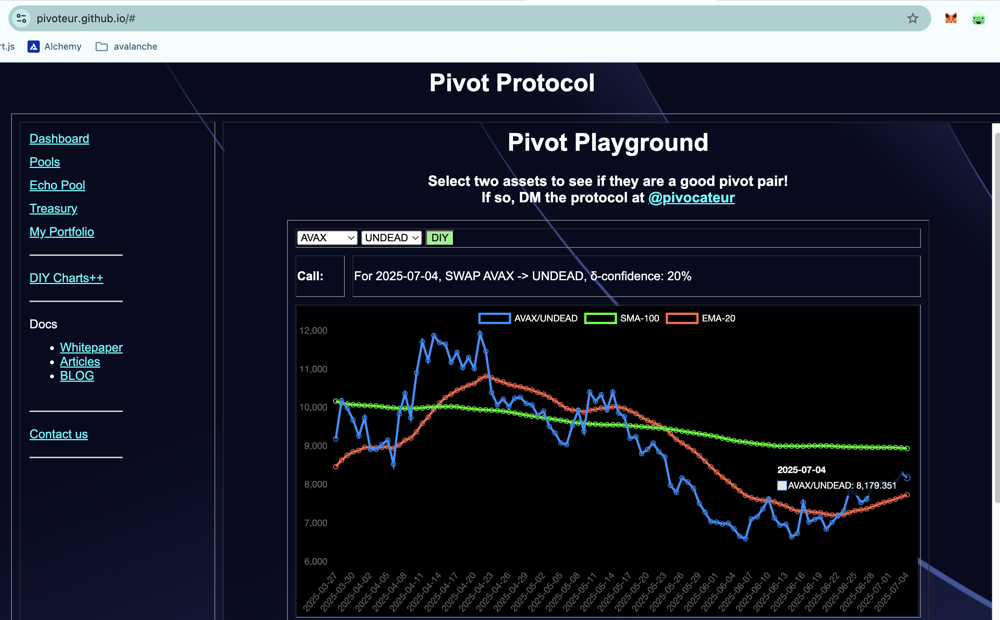

# 2025-07-04 Spotlight on Avalanche / AVAX 

 
 
 

* rank: 19 
* quote: $17.77000 
* market cap: $7,511,011,813 
* 24-hr volume: $295,382,744 
* UNDEAD ratio: 8179 

[AVAX data source](https://www.coingecko.com/en/coins/avalanche) 

# 2025-07-04 Status of $UNDEAD 

 
 
 
 

* rank: 8148 
* quote: $0.00224 
* market cap: $33,532 
* 24-hr volume: $113,493 (δ: $43,119 ) 

When we get LPs funded on multiple blockchains, what will $UNDEAD look like? 

[UNDEAD data source](https://www.coingecko.com/en/coins/undead-blocks) 

