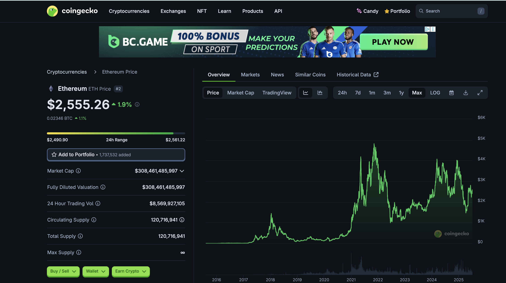
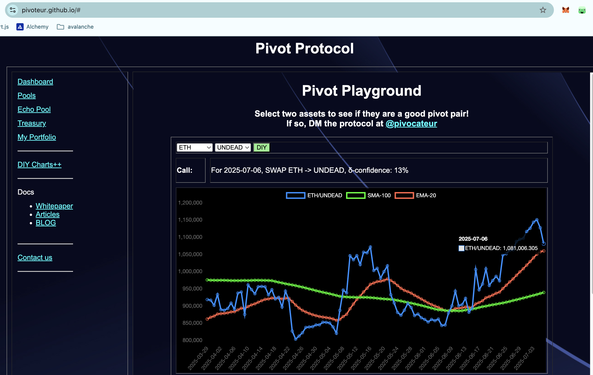
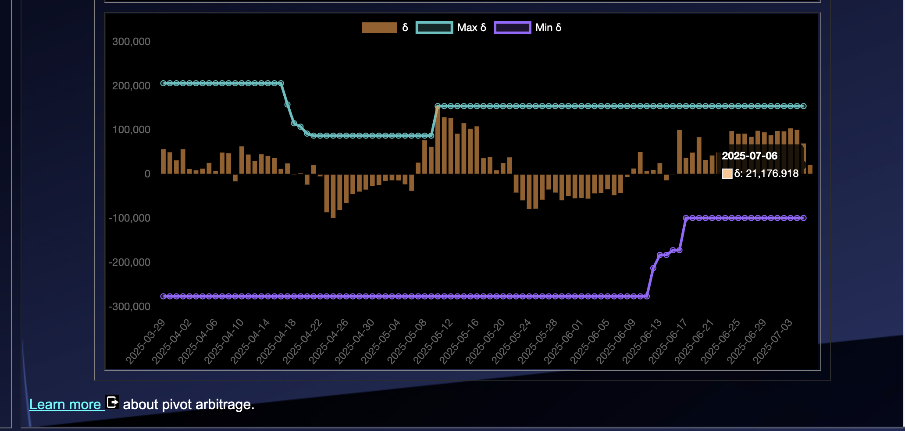
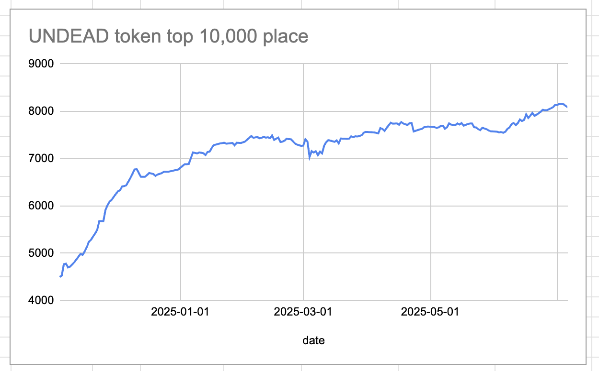
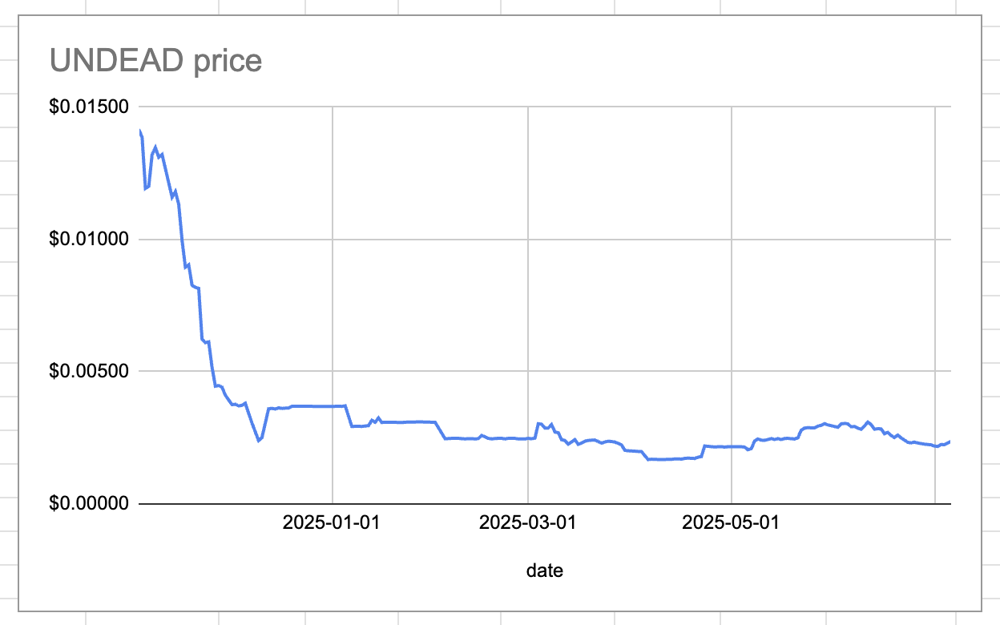
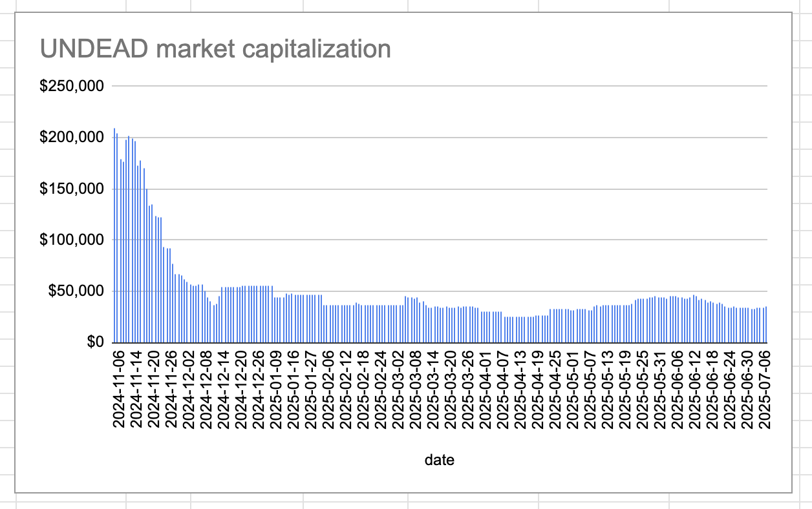
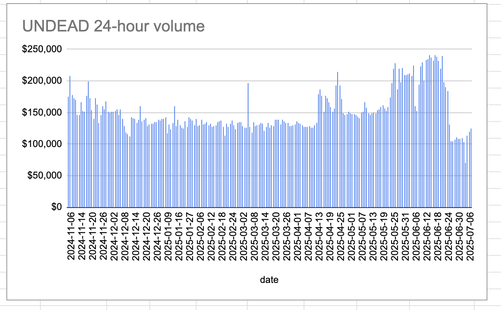
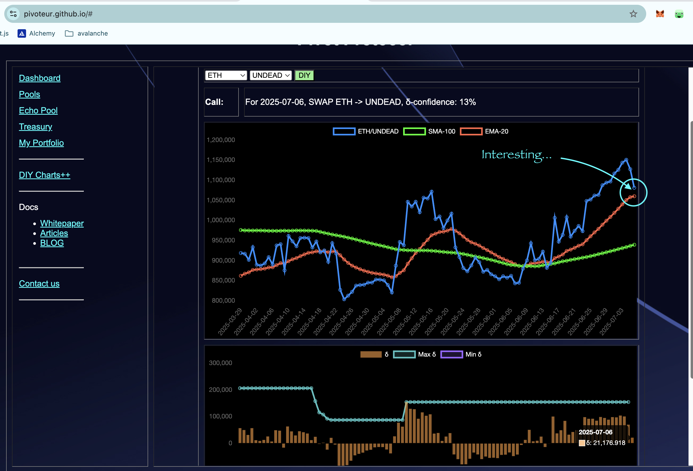
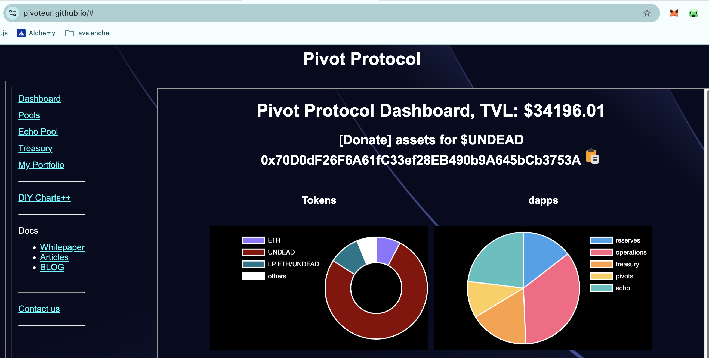
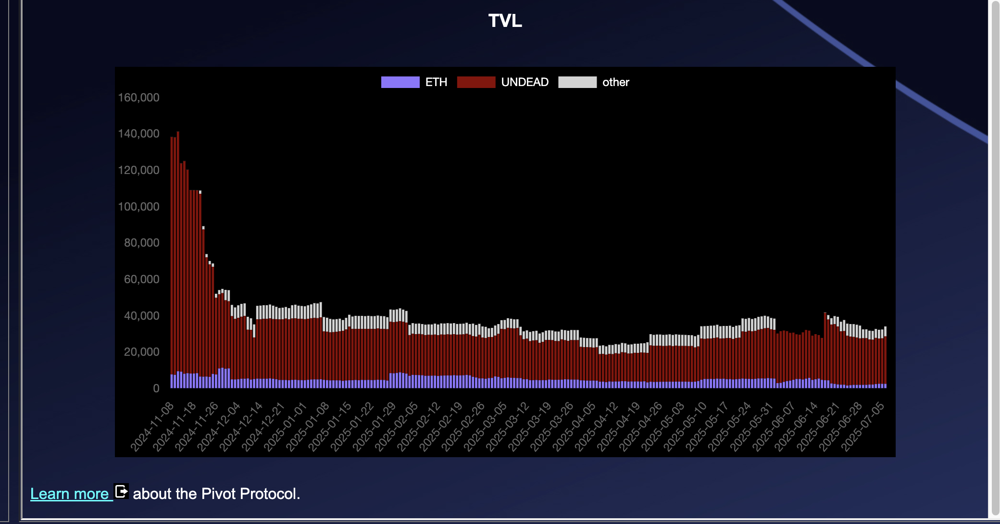

# 2025-07-06 Spotlight on Ethereum / ETH 

 
 
 

* rank: 2 
* quote: $2,555.26000 
* market cap: $308,461,485,997 
* 24-hr volume: $8,569,927,105 
* UNDEAD ratio: 1.08M

When we get LPs funded on multiple blockchains, what will $UNDEAD look like? 

[ETH data source](https://www.coingecko.com/en/coins/ethereum) 

## Ethereum retrospective

Now, I don't know if I'm been bombarded by hopium-particles, but it seems to me that the revisions to the @ethereum blockchain have brought down transaction fees significantly, from, say $20, $100, $200/transaction to 25¢-$5/transaction.

Still way, WAY too high, but it's a start.

With @ethereum being the mother of most smart-contract-based and Proof of Stake-based blockchains, and being the original host for @wagyugames @UndeadBlocks game and ERC20 token, $UNDEAD, I look forward to continued improvements and cost-reductions on this blockchain.

# 2025-07-06 Status of $UNDEAD 

 
 
 
 

* rank: 8081 
* quote: $0.00237 
* market cap: $35,538 
* 24-hr volume: $125,224 (δ: $5,866 ) 

[UNDEAD data source](https://www.coingecko.com/en/coins/undead-blocks) 

When we get LPs funded on multiple blockchains, what will $UNDEAD look like? 

## $UNDEAD performance analysis, 2025-07-06 

* "δ" indicates change since 2025-06-05 
* "α" is annualized since 2025-06-05 

 
 
 
 

* rank: 8081 (δ: -7.06% ) , α: -83.14% 
* quote: $0.00237 (δ: -21.71% ) , α: -255.64% 
* market cap: $35,538 (δ: -21.71% ) , α: -255.59% 
* 24-hr volume: $125,224 (δ: -22.07% ) , α: -259.83% 

[2025-06-05 $UNDEAD report (archived)](https://github.com/pivoteur/biz/tree/main/blog/snapshot) 

# PIVOTS 

## ETH+UNDEAD 

No close pivots. 

### Open Pivot 

 

The meh δ makes no call, but the trend is interesting. If the δ goes negative, I'll move to make a pivot, but for now, I'll wait and see where this trend goes.

# CONCLUSION 

This concludes pivot-activity for today. 

 
 

[The Pivot protocol](https://pivoteur.github.io/#) 
