# 2025-07-07 Spotlight on Aurora / AURORA 

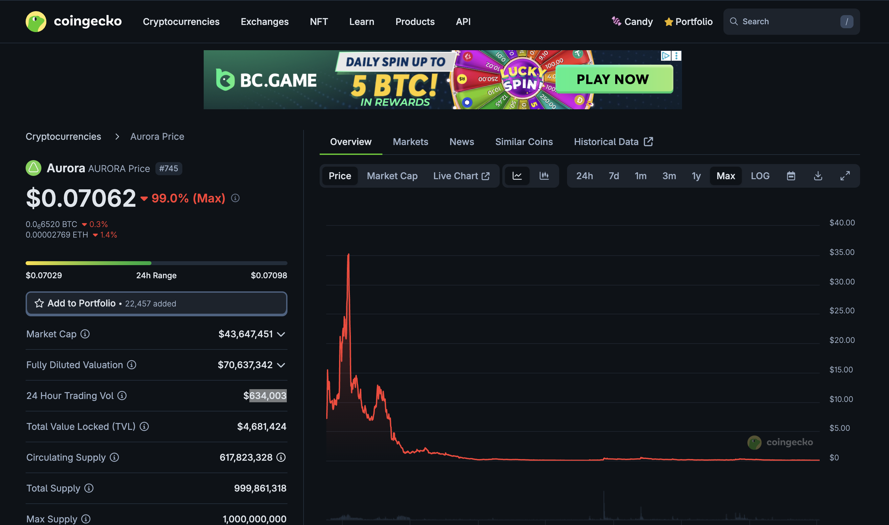 
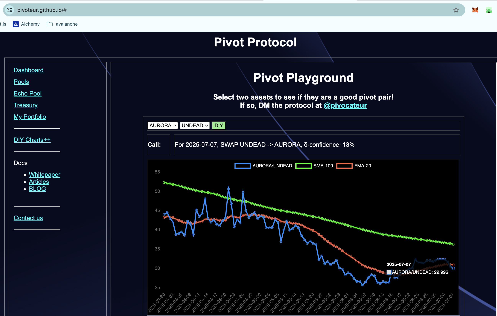 
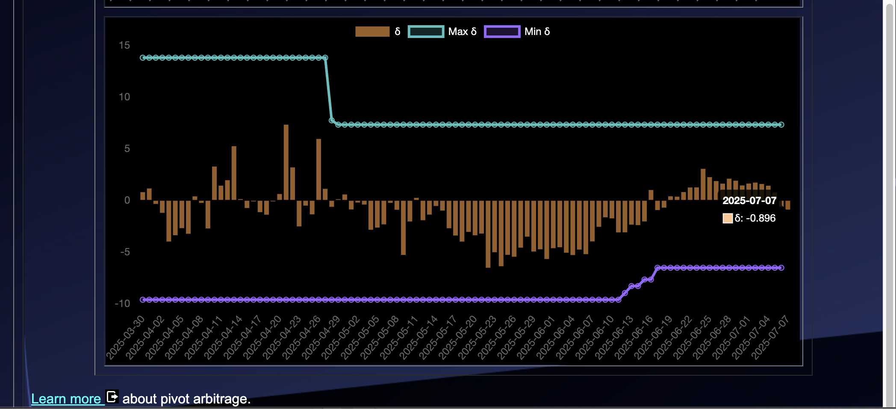 

* rank: 745 
* quote: $0.07062 
* market cap: $43,647,451 
* 24-hr volume: $634,003 
* UNDEAD ratio: 30 

[AURORA data source](https://www.coingecko.com/en/coins/aurora-near) 

# 2025-07-07 Status of Undead Blocks / UNDEAD 

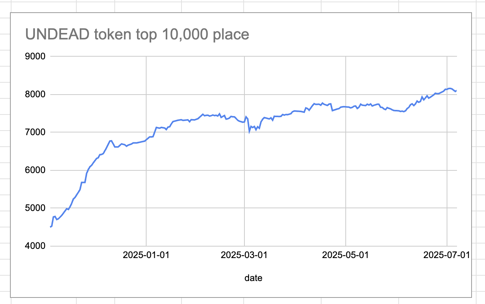 
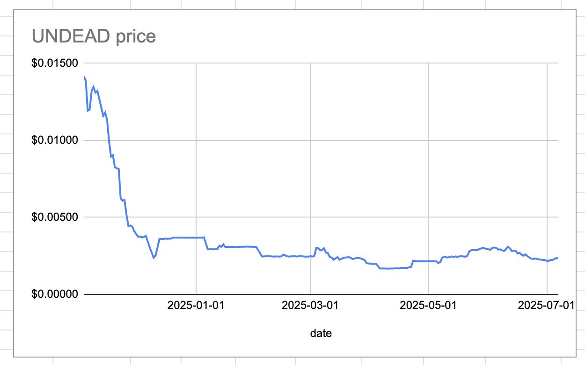 
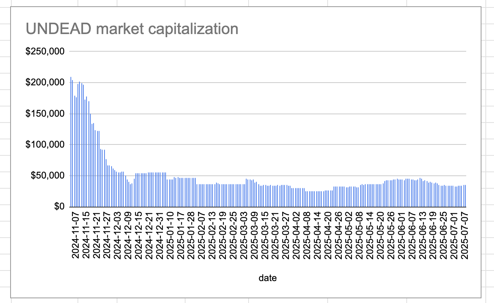 
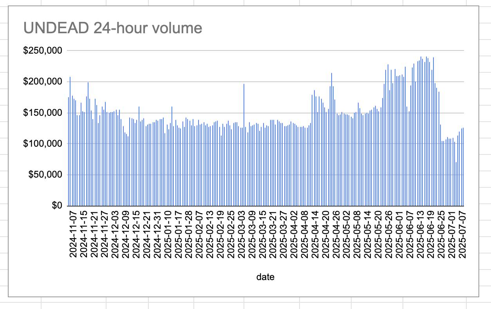 

* rank: 8108 
* quote: $0.00234 
* market cap: $35,333 
* 24-hr volume: $126,678 (δ: $1,454 ) 

[UNDEAD data source](https://www.coingecko.com/en/coins/undead-blocks) 

## $UNDEAD performance analysis, 2025-07-07 

* "δ" indicates change since 2025-06-05 
* "α" is annualized since 2025-06-05 

 
 
 
 

* rank: 8108 (δ: -7.42% ) , α: -84.63% 
* quote: $0.00234 (δ: -22.64% ) , α: -258.20% 
* market cap: $35,333 (δ: -22.16% ) , α: -252.75% 
* 24-hr volume: $126,678 (δ: -21.16% ) , α: -241.39% 

[2025-06-05 $UNDEAD report (archived)](https://github.com/pivoteur/biz/tree/main/blog/snapshot) 

# Providing Liquidity on Uniswap

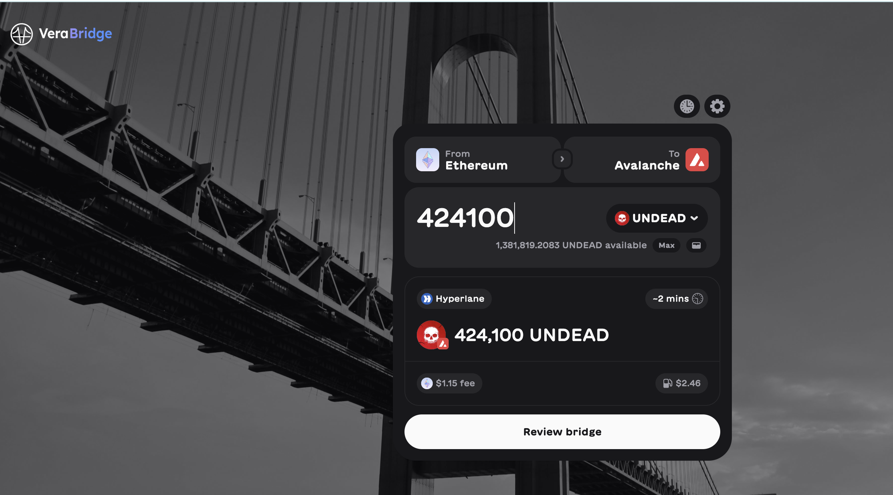

1. First I bridge $UNDEAD from @ethereum to @avax using the [Vera Bridge](https://app.verabridge.io/).

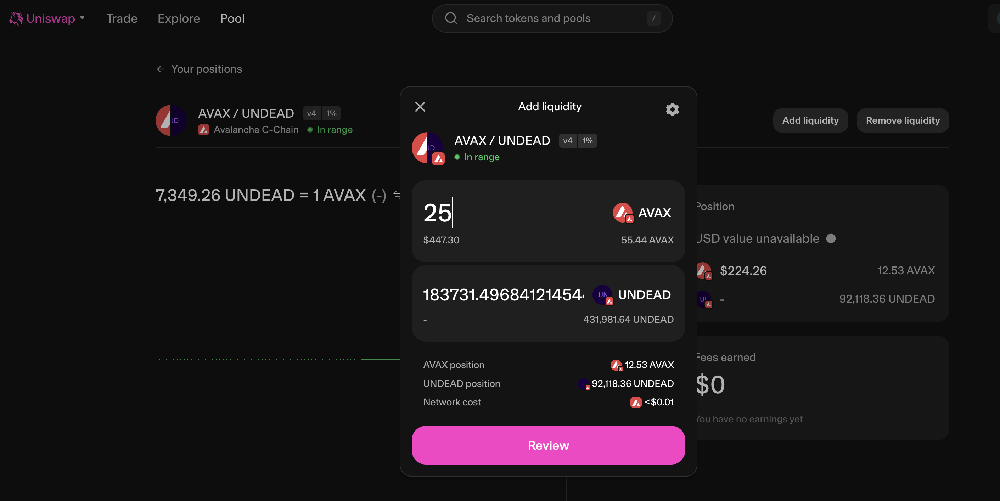

2. Then I provide liquidity to @Uniswap @avax LP AVAX/UNDEAD

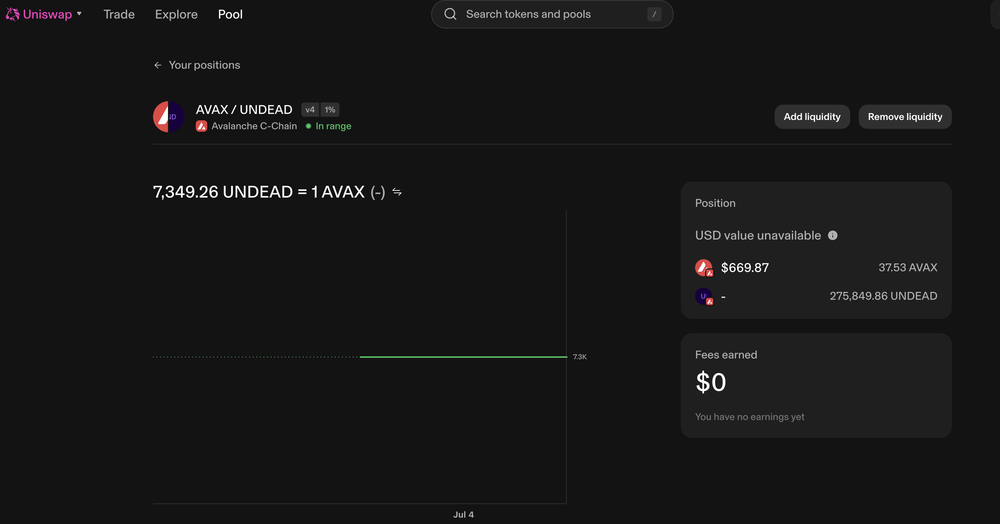

3. Liquidity provided

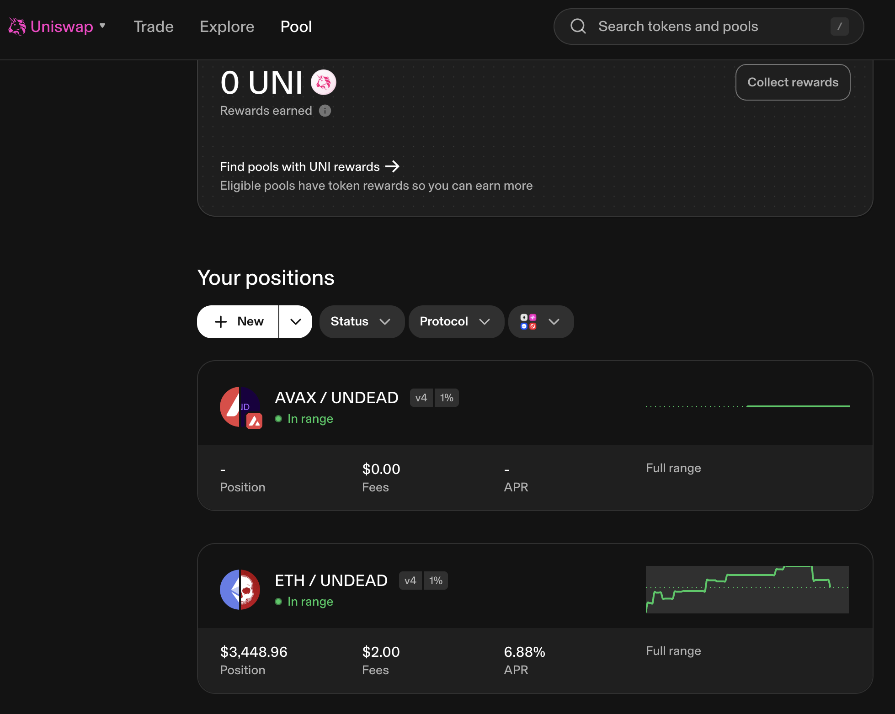

4. The $UNDEAD @Uniswap LPs.

## Impact Analysis

By providing this liquidity, a 20 $USDC swap gets:

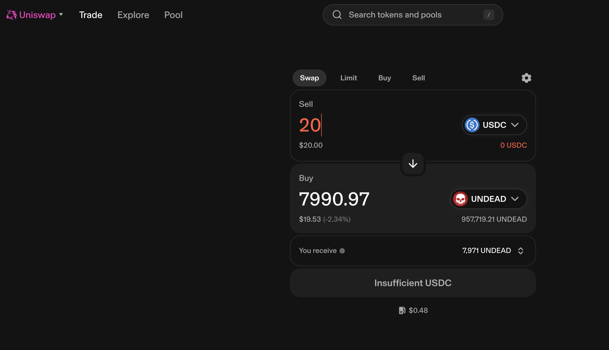

* 7990 $UNDEAD on @ethereum via @Uniswap (gas: 56¢); or,

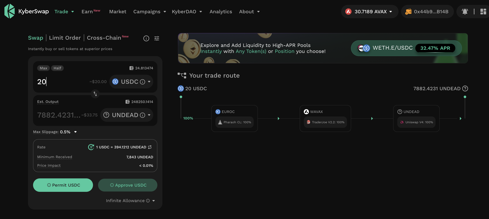

* 7880 $UNDEAD on @avax via @KyberNetwork (gas: 1¢)

The gas on @ethereum is greater than slippage on @avax, so (small) $UNDEAD trades are now viable on @avax.

# PIVOTS

## AVAX+UNDEAD

With the LP AVAX/UNDEAD established (for small trades), I move some liquidity to a new wallet and establish the AVAX+UNDEAD pivot pool.

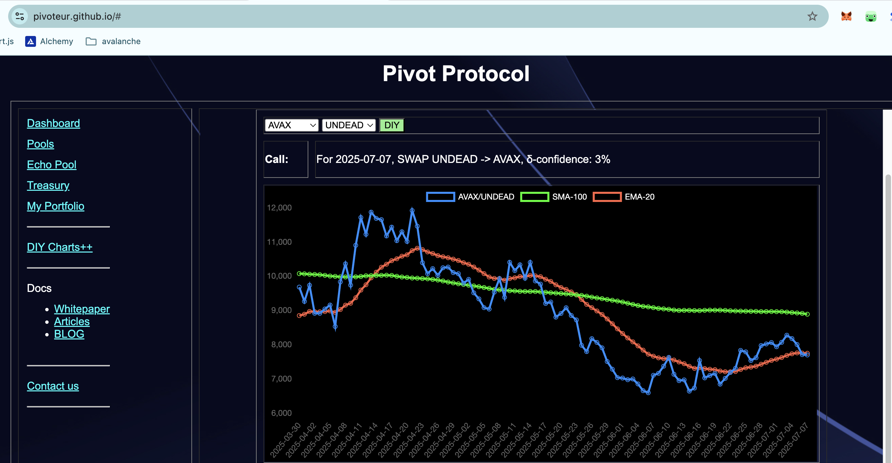
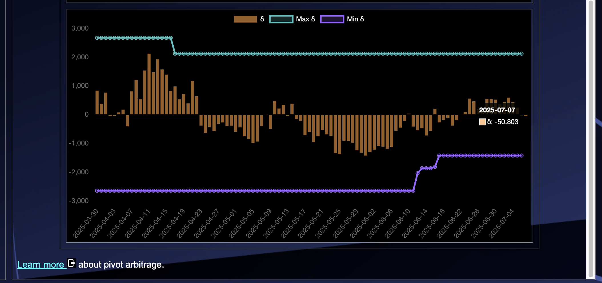
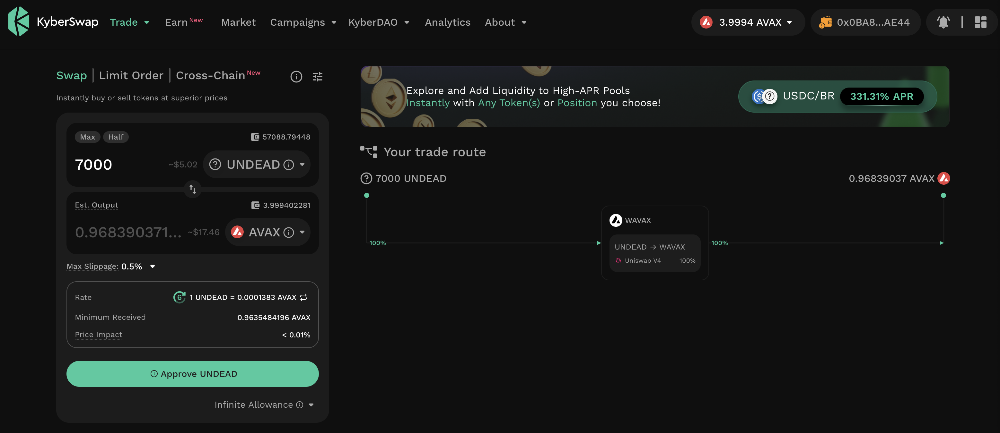
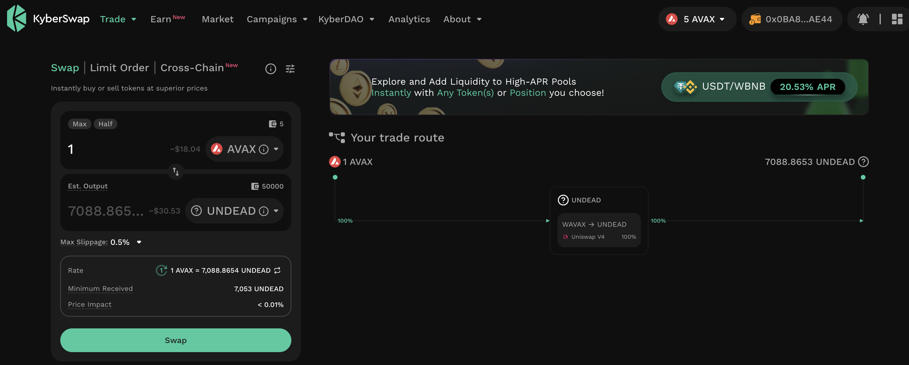

The δ is meh, so I open both an AVAX-on-UNDEAD pivot and an UNDEAD-on-AVAX pivot.

The AVAX+UNDEAD pivot pool composition and γ-apportionment are as charted.

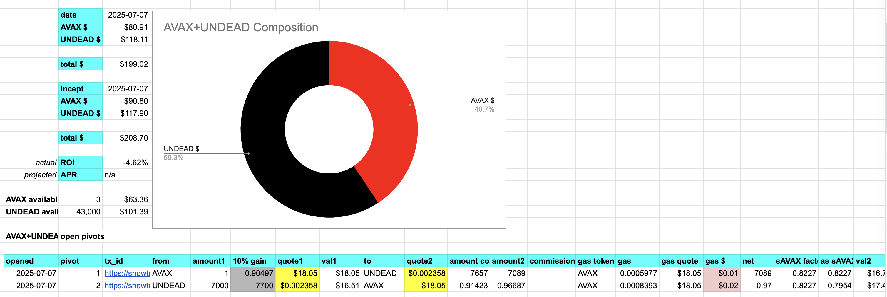
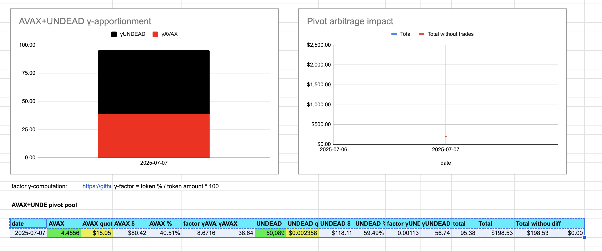
