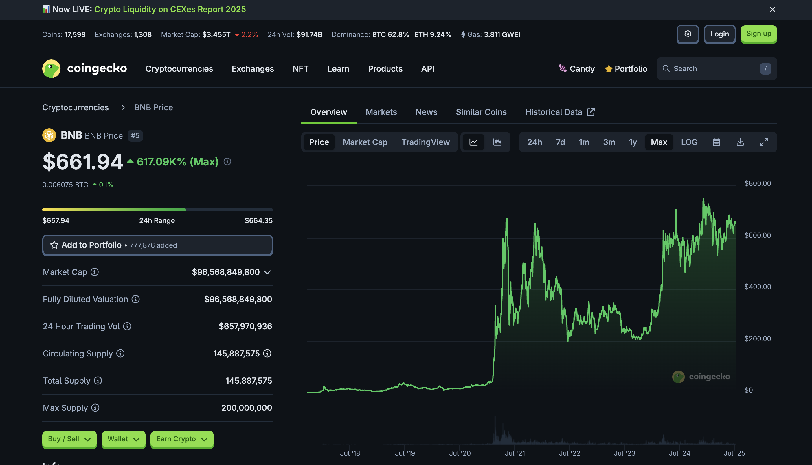
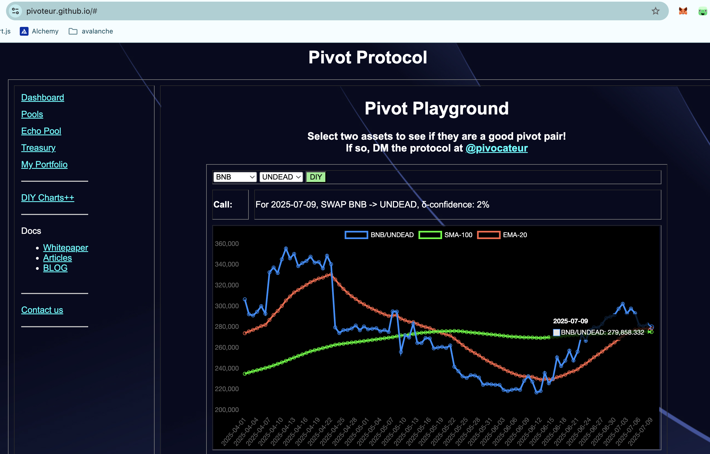
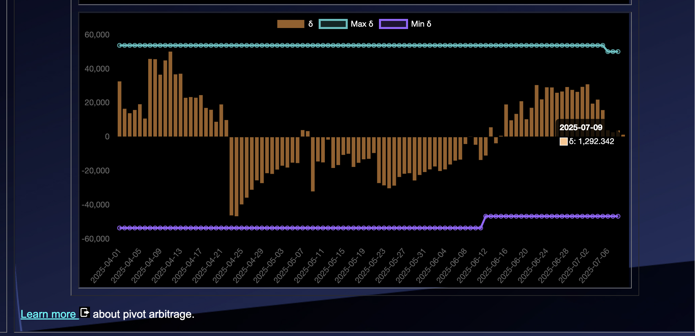
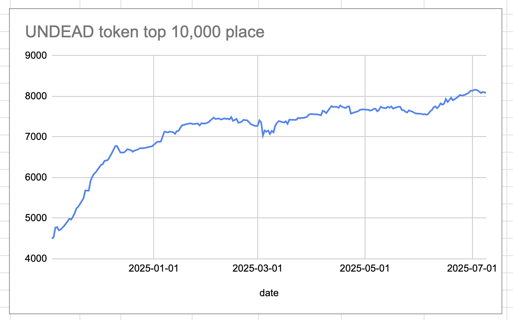
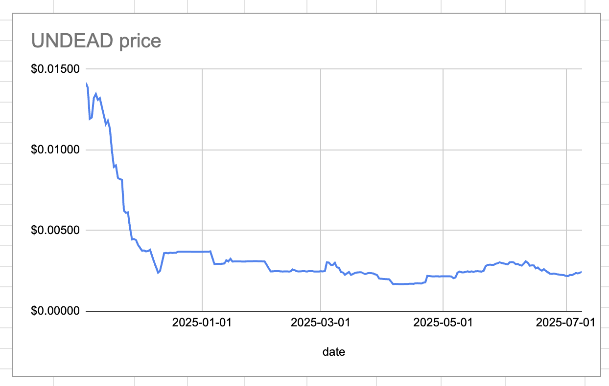
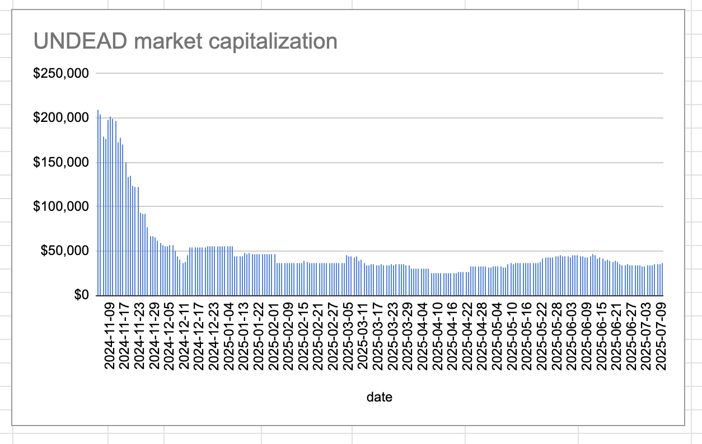
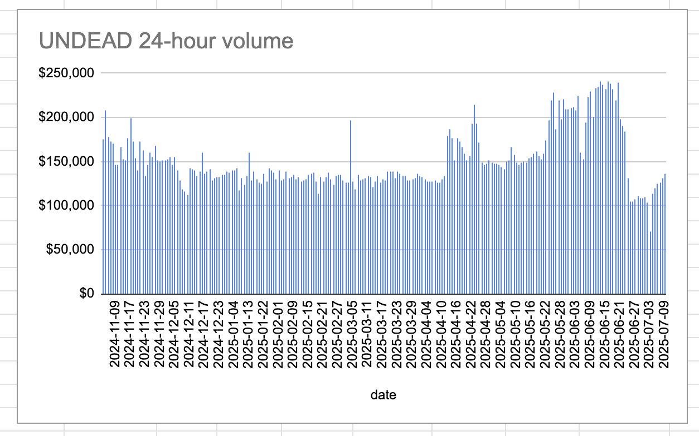

2025-07-09 Spotlight on @binance / BNB 

 
 
 

* rank: 5 
* quote: $661.94000 
* market cap: $96,568,849,800 
* 24-hr volume: $657,970,936 
* UNDEAD ratio: 280000 

[BNB data source](https://www.coingecko.com/en/coins/bnb) 

# 2025-07-09 Status of Undead Blocks / UNDEAD 

 
 
 
 

* rank: 8086 
* quote: $0.00244 
* market cap: $36,421 
* 24-hr volume: $135,756 (δ: $4,539 ) 

[UNDEAD data source](https://www.coingecko.com/en/coins/undead-blocks) 

When we get LPs funded on multiple blockchains, what will $UNDEAD look like? 

