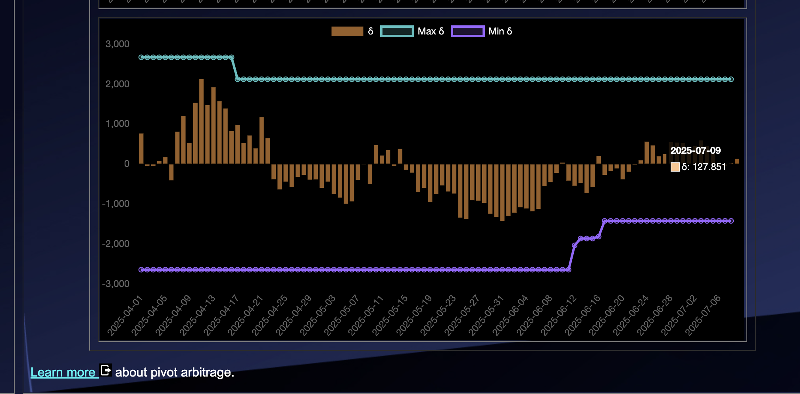

# 2025-07-09 Spotlight on @binance / BNB 

 
 
 

* rank: 5 
* quote: $661.94000 
* market cap: $96,568,849,800 
* 24-hr volume: $657,970,936 
* UNDEAD ratio: 280,000 

[BNB data source](https://www.coingecko.com/en/coins/bnb) 

# 2025-07-09 Status of Undead Blocks / UNDEAD 

 
 
 
 

* rank: 8086 
* quote: $0.00244 
* market cap: $36,421 
* 24-hr volume: $135,756 (δ: $4,539 ) 

[UNDEAD data source](https://www.coingecko.com/en/coins/undead-blocks) 

When we get LPs funded on multiple blockchains, what will $UNDEAD look like? 

## $UNDEAD performance analysis, 2025-07-09 

* "δ" indicates change since 2025-06-05 
* "α" is annualized since 2025-06-05 

 
 
 
 

* rank: 8086 (δ: -7.13% ) , α: -76.52% 
* quote: $0.00244 (δ: -19.33% ) , α: -207.54% 
* market cap: $36,421 (δ: -19.76% ) , α: -212.16% 
* 24-hr volume: $135,756 (δ: -15.51% ) , α: -166.54% 

[2025-06-05 $UNDEAD report (archived)](https://github.com/pivoteur/biz/tree/main/blog/snapshot) 

# Uniswap Liquidity Pools
 

I'm going to be opening up a new liquidity pool on @avax tomorrow, so I'll leave these liquidity pools be for now.

Do note: both LP AVAX/UNDEAD and LP ETH/UNDEAD are collecting fees for me.

Fees from my own pivots, so ... thank you ... me? 😅
# PIVOTS 

## AVAX+UNDEAD 

No close pivots. 

### Open Pivot 

 
 

The meh δ makes no call, but I open an UNDEAD-on-AVAX pivot, anyway. 

 

I also open an AVAX-on-UNDEAD pivot 

 

The AVAX+UNDEAD pivot pool composition and γ-apportionment are as charted. 

 
 
