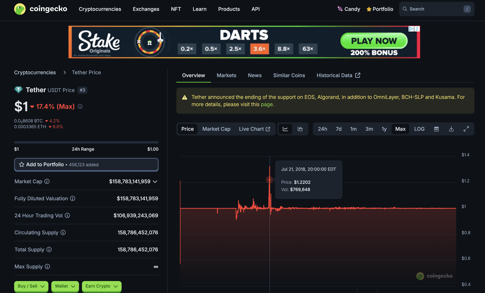
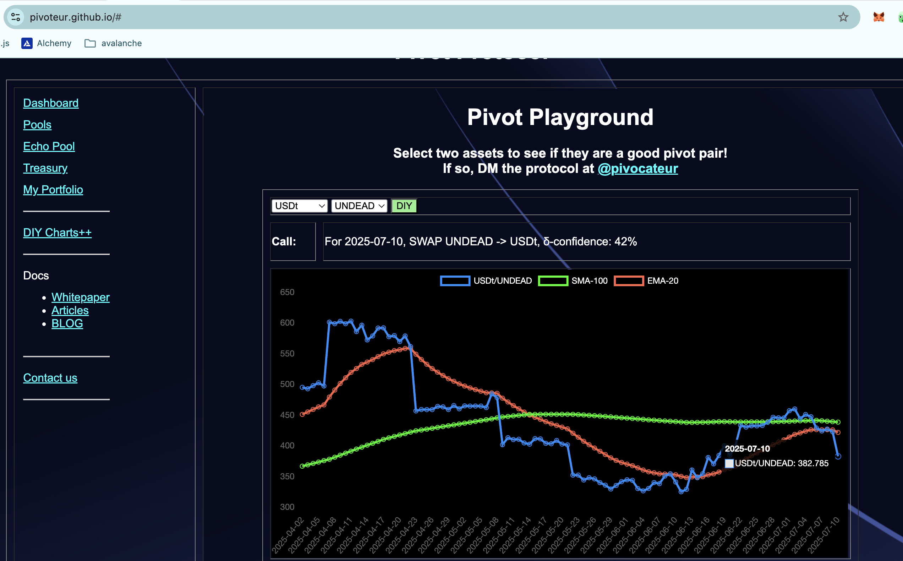
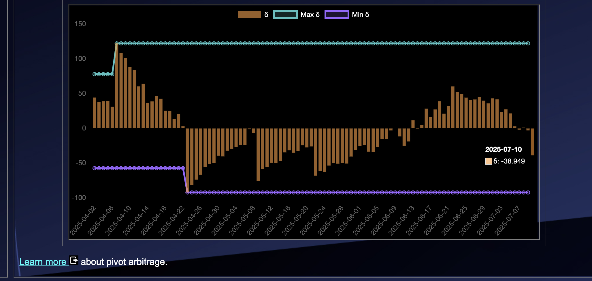
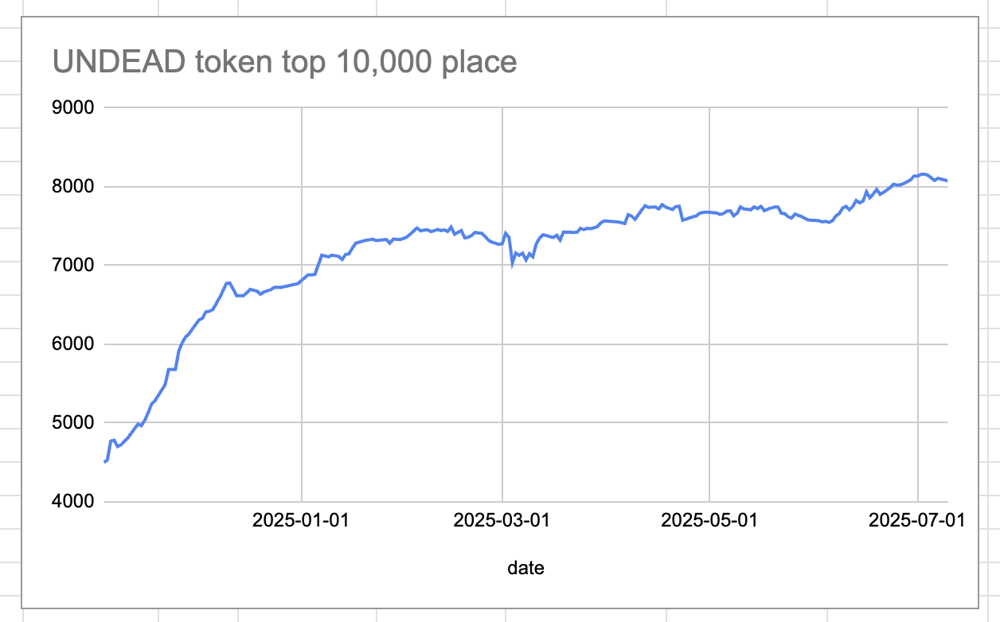
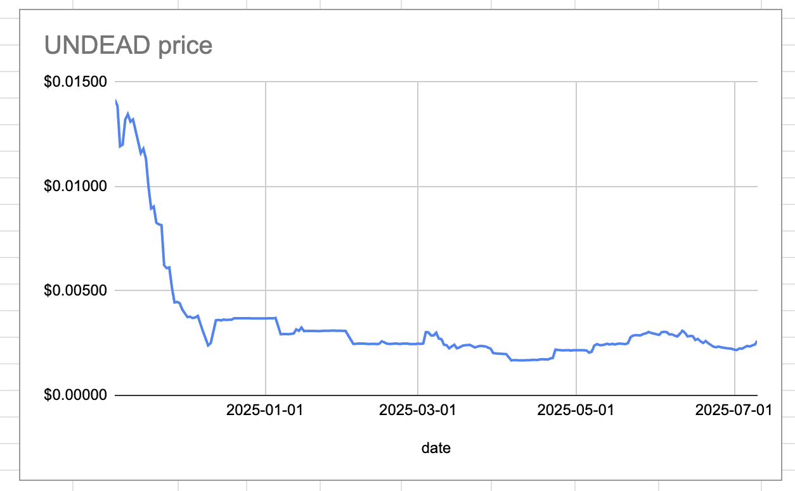
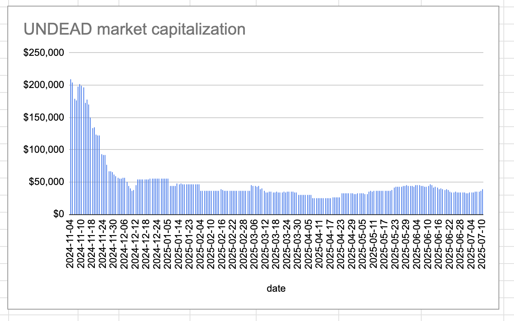
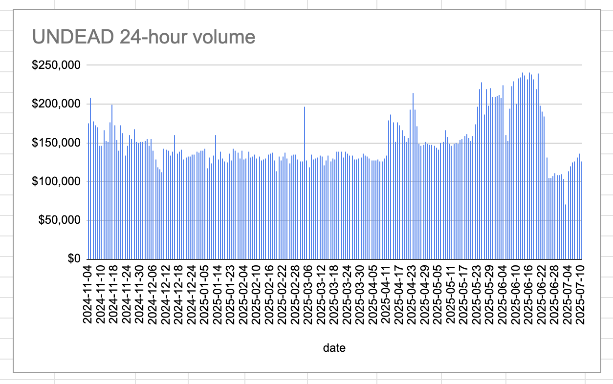

# 2025-07-10 Spotlight on @Tether_to / USDT 

 
 
 

* rank: 3 
* quote: $1.00000 
* market cap: $158,783,141,959 
* 24-hr volume: $106,939,243,069 
* UNDEAD ratio: 383 

[USDT data source](https://www.coingecko.com/en/coins/tether) 

# 2025-07-10 Status of Undead Blocks / UNDEAD 

 
 
 
 

* rank: 8073 
* quote: $0.00262 
* market cap: $39,398 
* 24-hr volume: $126,629 (δ: -$9,127 ) 

[UNDEAD data source](https://www.coingecko.com/en/coins/undead-blocks) 

When we get LPs funded on multiple blockchains, what will $UNDEAD look like? 

## $UNDEAD performance analysis, 2025-07-10 

* "δ" indicates change since 2025-06-05 
* "α" is annualized since 2025-06-05 

 
 
 
 

* rank: 8073 (δ: -6.96% ) , α: -72.54% 
* quote: $0.00262 (δ: -13.45% ) , α: -140.27% 
* market cap: $39,398 (δ: -13.20% ) , α: -137.70% 
* 24-hr volume: $126,629 (δ: -21.19% ) , α: -221.02% 

[2025-06-05 $UNDEAD report (archived)](https://github.com/pivoteur/biz/tree/main/blog/snapshot) 

# Uniswap Liquidity Pools

I have defunded the @Uniswap @ethereum LP ETH/UNDEAD in order to accumulate liquidity eventually fund @BlackholeDex LP AVAX/UNDEAD.

I will also liquidate the ETH+UNDEAD and UNDEAD+USDC pivot pools for that same end.
