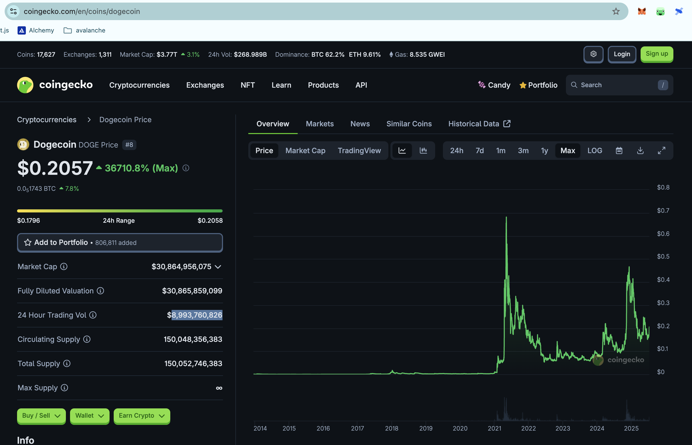
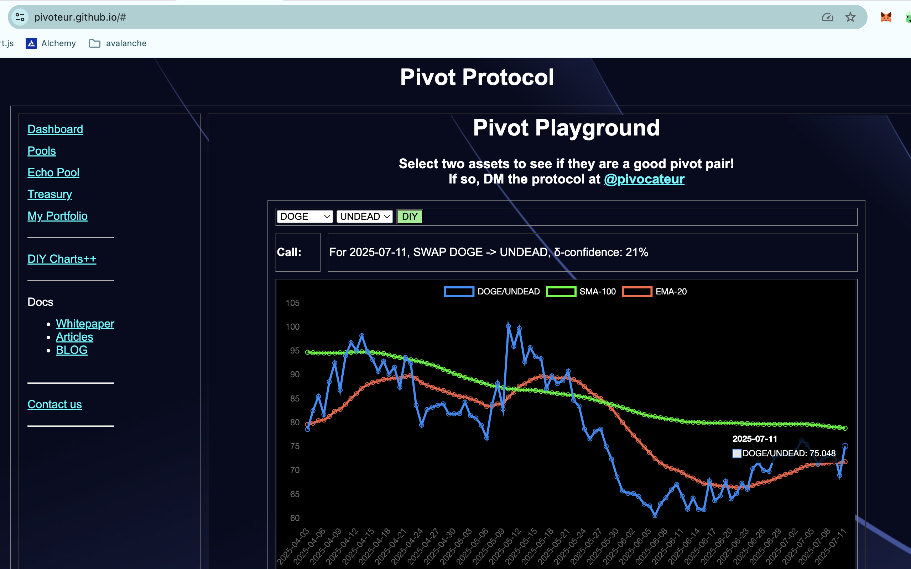
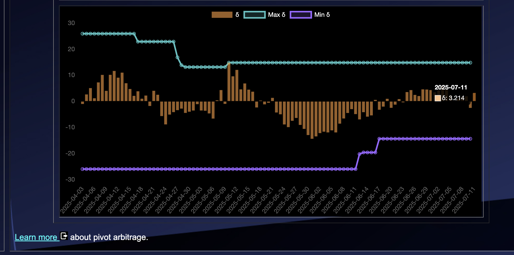

# 2025-07-11 Spotlight on @dogecoin / DOGE 

 
 
 

* rank: 8 
* quote: $0.20570 
* market cap: $30,864,956,075 
* 24-hr volume: $8,993,760,826 
* UNDEAD ratio: 75 

[DOGE data source](https://www.coingecko.com/en/coins/dogecoin) 

# 2025-07-11 Status of @UndeadBlocks / $UNDEAD 

 
 
 
 

* rank: 8073 
* quote: $0.00272 
* market cap: $40,771 
* 24-hr volume: $118,768 (δ: -$7,861 ) 

[UNDEAD data source](https://www.coingecko.com/en/coins/undead-blocks) 

When we get LPs funded on multiple blockchains, what will $UNDEAD look like? 

## $UNDEAD performance analysis, 2025-07-11 

* "δ" indicates change since 2025-06-05 
* "α" is annualized since 2025-06-05 

 
 
 
 

* rank: 8073 (δ: -6.96% ) , α: -70.52% 
* quote: $0.00272 (δ: -10.18% ) , α: -103.20% 
* market cap: $40,771 (δ: -10.18% ) , α: -103.22% 
* 24-hr volume: $118,768 (δ: -26.09% ) , α: -264.48% 

[2025-06-05 $UNDEAD report (archived)](https://github.com/pivoteur/biz/tree/main/blog/snapshot) 
