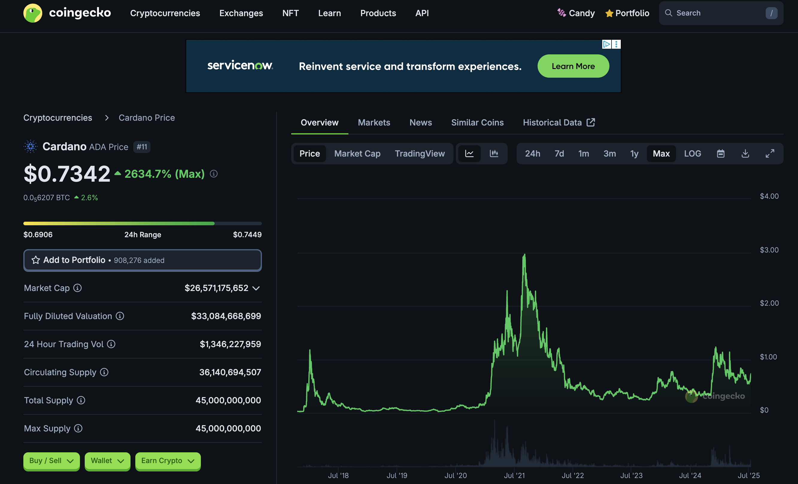
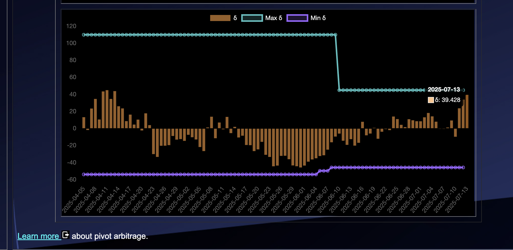

# 2025-07-13 Spotlight on Cardano / $ADA 

 
 
 

* rank: 11 
* quote: $0.73420 
* market cap: $26,571,175,652 
* 24-hr volume: $1,346,227,959 
* UNDEAD ratio: 39 

[ADA data source](https://www.coingecko.com/en/coins/cardano) 

## Analysis / pensée

Among the sea of @ethereum knock-offs, Cardano stands out for its very different approach. Every transaction has a hostage-fee that is returned by a confirmation transaction.

That means everything is twice as expensive and twice as slow.

* Does Cardano's hostage-fee and confirmation discourage scammers? Yes.
* Are scammers problematic on Ethereum-based blockchains? Yes.
* Is the Cardano approach a good one? I'm ambivalent.

It is one of the largest blockchains with the volume to show for it. So: here's to weird!

# 2025-07-13 Status of @UndeadBlocks / $UNDEAD 

 
 
 
 

* rank: 8209 
* quote: $0.00248 
* market cap: $37,202 
* 24-hr volume: $129,814 (δ: -$2,342 ) 

[UNDEAD data source](https://www.coingecko.com/en/coins/undead-blocks) 

When we get LPs funded on multiple blockchains, what will $UNDEAD look like? 

