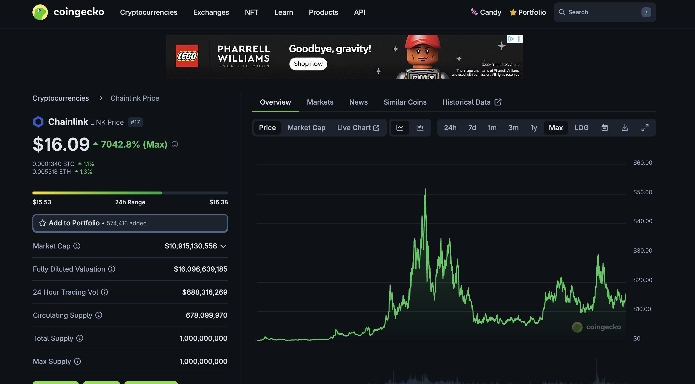
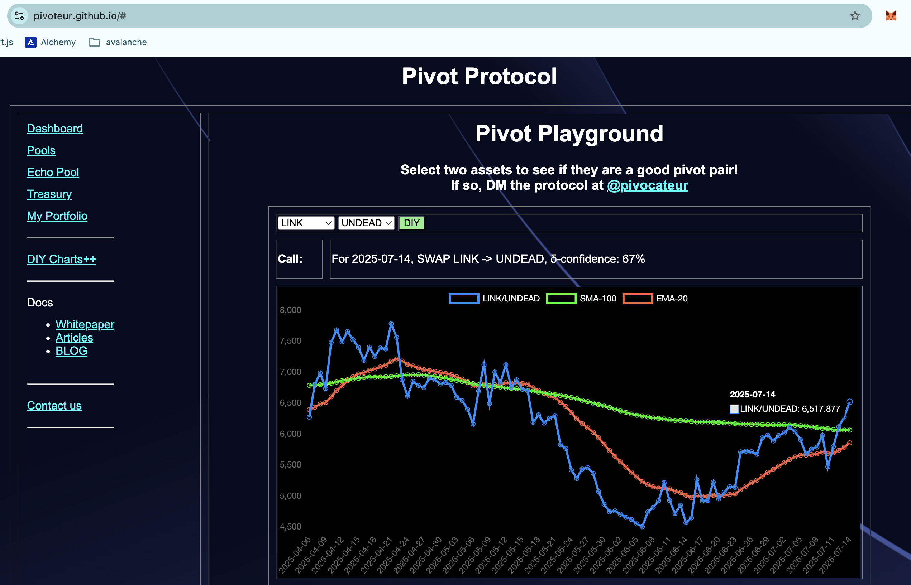
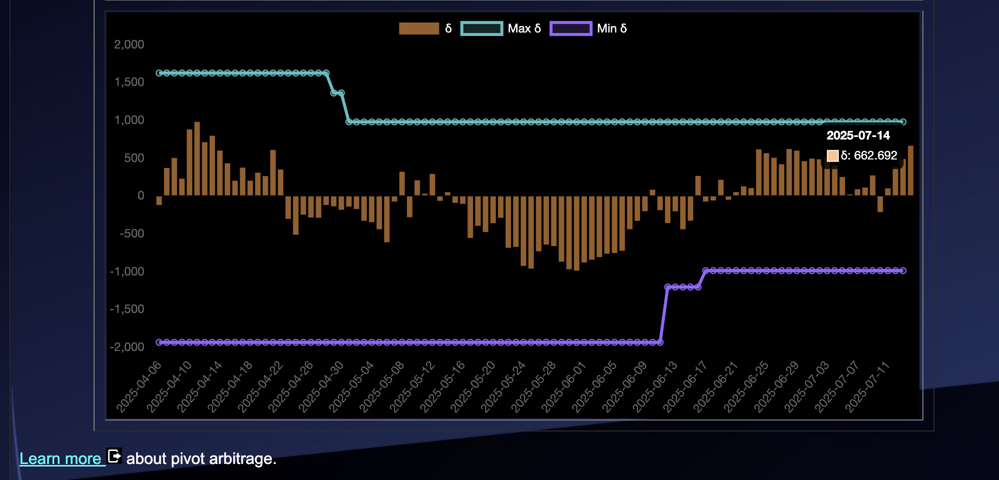
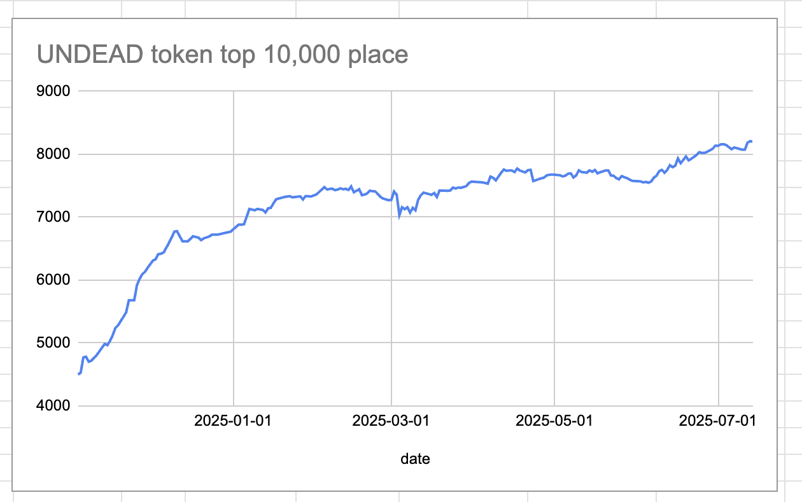
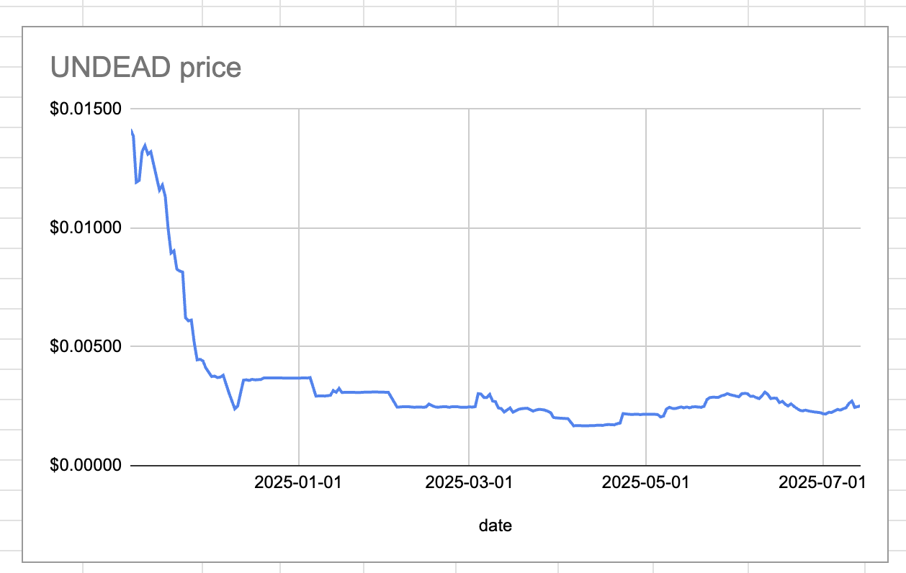
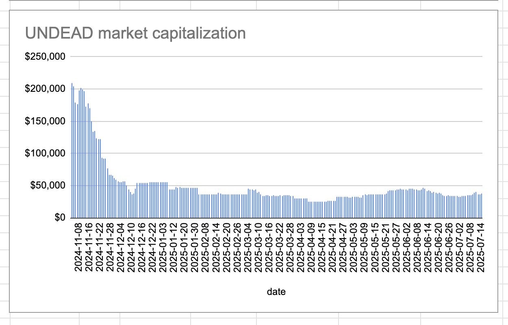
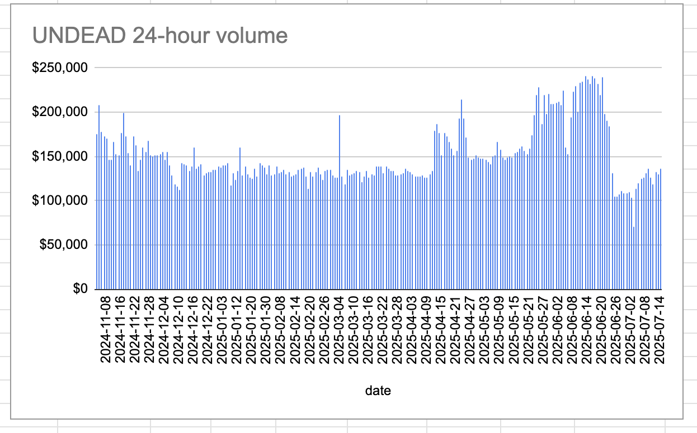

# 2025-07-14 Spotlight on Chainlink / $LINK 

 
 
 

* rank: 17 
* quote: $16.09000 
* market cap: $10,915,130,556 
* 24-hr volume: $688,316,269 
* UNDEAD ratio: 6518 

[LINK data source](https://www.coingecko.com/en/coins/chainlink) 

# 2025-07-14 Status of @UndeadBlocks / $UNDEAD 

 
 
 
 

* rank: 8201 
* quote: $0.00252 
* market cap: $37,814 
* 24-hr volume: $135,760 (δ: $5,946 ) 

[UNDEAD data source](https://www.coingecko.com/en/coins/undead-blocks) 

When we get LPs funded on multiple blockchains, what will $UNDEAD look like? 

## $UNDEAD performance analysis, 2025-07-14 

* "δ" indicates change since 2025-06-05 
* "α" is annualized since 2025-06-05 

 
 
 
 

* rank: 8201 (δ: -8.65% ) , α: -80.97% 
* quote: $0.00252 (δ: -16.72% ) , α: -156.50% 
* market cap: $37,814 (δ: -16.70% ) , α: -156.25% 
* 24-hr volume: $135,760 (δ: -15.51% ) , α: -145.16% 

[2025-06-05 $UNDEAD report (archived)](https://github.com/pivoteur/biz/tree/main/blog/snapshot) 
