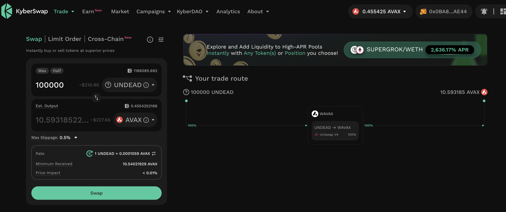
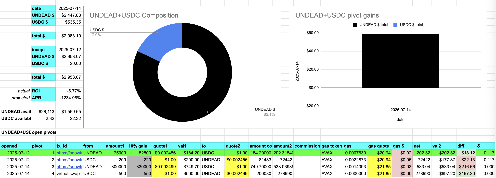

# 2025-07-14 Spotlight on Chainlink / $LINK 

 
 
 

* rank: 17 
* quote: $16.09000 
* market cap: $10,915,130,556 
* 24-hr volume: $688,316,269 
* UNDEAD ratio: 6518 

[LINK data source](https://www.coingecko.com/en/coins/chainlink) 

# 2025-07-14 Status of @UndeadBlocks / $UNDEAD 

 
 
 
 

* rank: 8201 
* quote: $0.00252 
* market cap: $37,814 
* 24-hr volume: $135,760 (δ: $5,946 ) 

[UNDEAD data source](https://www.coingecko.com/en/coins/undead-blocks) 

When we get LPs funded on multiple blockchains, what will $UNDEAD look like? 

## $UNDEAD performance analysis, 2025-07-14 

* "δ" indicates change since 2025-06-05 
* "α" is annualized since 2025-06-05 

 
 
 
 

* rank: 8201 (δ: -8.65% ) , α: -80.97% 
* quote: $0.00252 (δ: -16.72% ) , α: -156.50% 
* market cap: $37,814 (δ: -16.70% ) , α: -156.25% 
* 24-hr volume: $135,760 (δ: -15.51% ) , α: -145.16% 

[2025-06-05 $UNDEAD report (archived)](https://github.com/pivoteur/biz/tree/main/blog/snapshot) 

# PIVOTS

## AVAX+UNDEAD

I close 1 hedge for gains of:

* actual ROI: 12.24% / 2233.26% APR projected
* or: 84k $UNDEAD -> $ETH -> 112k $UNDEAD
* or: $19.59-gain on $200 hedged

I distribute 80% of the $UNDEAD gains to stakers.

# PIVOTS 

## AVAX+UNDEAD 

I close 1 pivot for gains of: 

### Open Pivots 

 
 

The positive δ calls to open an AVAX-on-UNDEAD pivot, which I do. 

 

I also open an UNDEAD-on-AVAX hedge. 

 

The AVAX+UNDEAD pivot pool composition and γ-apportionment are as charted. 

 
 
## ETH+UNDEAD 

No close pivots. 

### Open Pivot 

 
 

The positive δ calls to open an ETH-on-UNDEAD pivot, which I do. 

 

I also hedge with an UNDEAD-on-ETH pivot. 

 

The ETH+UNDEAD pivot pool composition and γ-apportionment are as charted. 

 
 
## UNDEAD+USDC 

No close pivots. 

### Open Pivot 

 
 

The meh δ makes no call, but I open an UNDEAD-on-USDC pivot, anyway. 

 

I also open an USDC-on-UNDEAD pivot 

 

The UNDEAD+USDC pivot pool composition and γ-apportionment are as charted. 

 
 

### Slippage

Slippage is crazy!

On $500 and $700 swaps slippage is $200, both ways! Do I need to establish an LP UNDEAD/USDC, I wonder? 
# CONCLUSION 

This concludes pivot-activity for today. 

 
 
 

[The Pivot protocol](https://pivoteur.github.io/#) 
