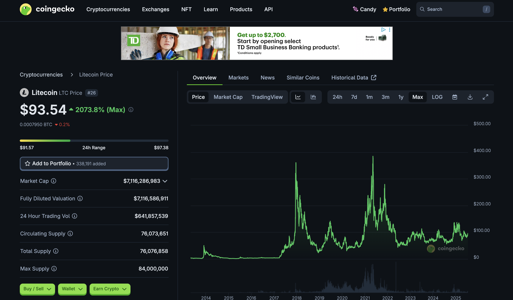
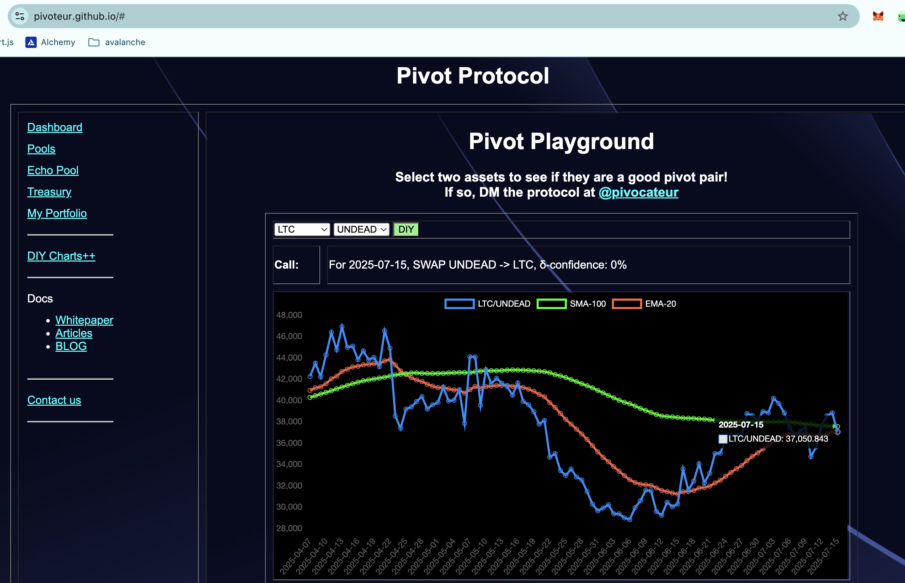
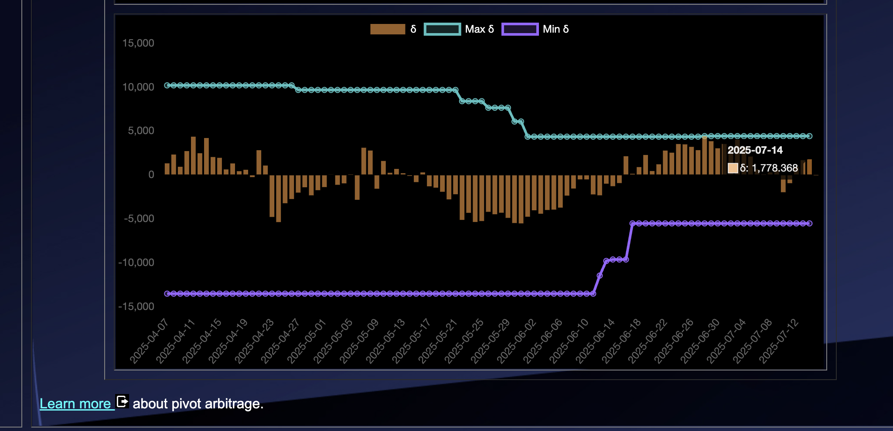
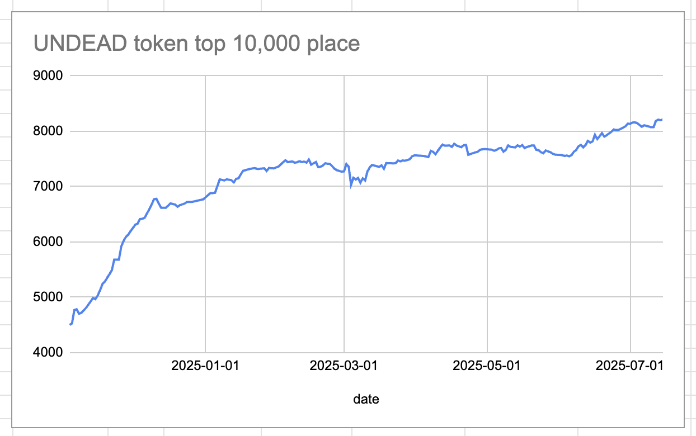
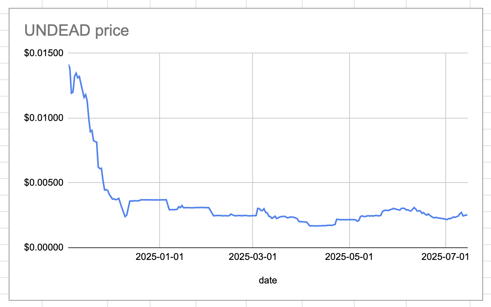
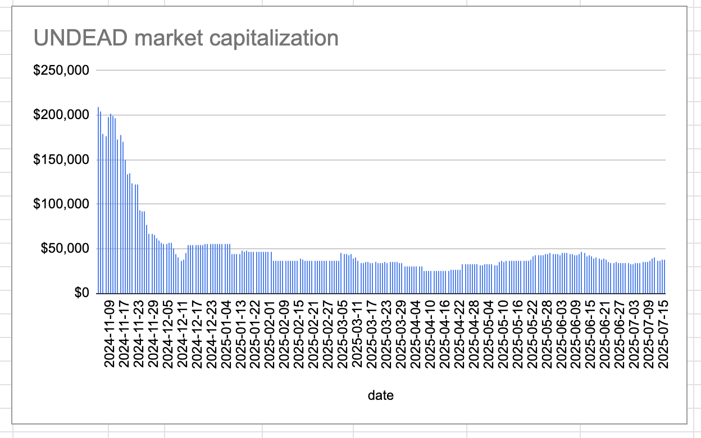
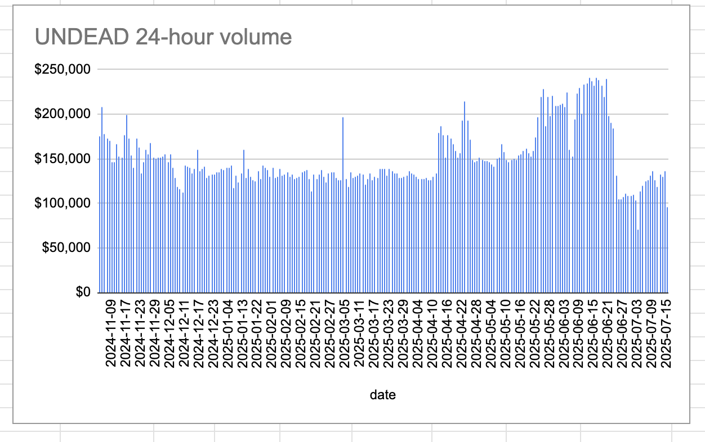

# 2025-07-15 Spotlight on Litecoin / $LTC 

 
 
 

* rank: 26 
* quote: $93.54000 
* market cap: $7,116,286,983 
* 24-hr volume: $641,857,539 
* UNDEAD ratio: 37051 

[LTC data source](https://www.coingecko.com/en/coins/litecoin) 

# 2025-07-15 Status of @UndeadBlocks / $UNDEAD 

 
 
 
 

* rank: 8213 
* quote: $0.00251 
* market cap: $37,681 
* 24-hr volume: $96,383 (δ: -$39,377 ) 

[UNDEAD data source](https://www.coingecko.com/en/coins/undead-blocks) 

When we get LPs funded on multiple blockchains, what will $UNDEAD look like? 

## $UNDEAD performance analysis, 2025-07-15 

* "δ" indicates change since 2025-06-05 
* "α" is annualized since 2025-06-05 

 
 
 
 

* rank: 8213 (δ: -8.81% ) , α: -80.39% 
* quote: $0.00251 (δ: -17.15% ) , α: -156.51% 
* market cap: $37,681 (δ: -16.99% ) , α: -155.01% 
* 24-hr volume: $96,383 (δ: -40.02% ) , α: -365.15% 

[2025-06-05 $UNDEAD report (archived)](https://github.com/pivoteur/biz/tree/main/blog/snapshot) 
