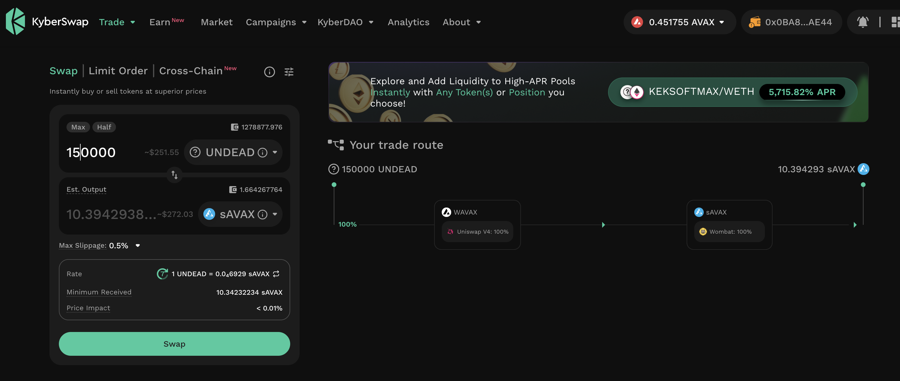
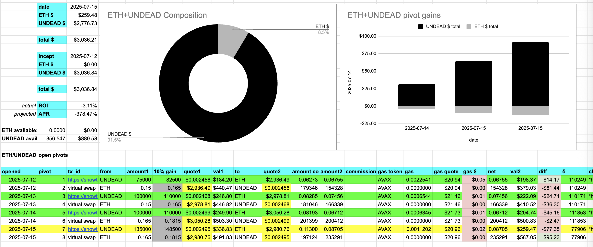

# 2025-07-15 Spotlight on Litecoin / $LTC 

 
 
 

* rank: 26 
* quote: $93.54000 
* market cap: $7,116,286,983 
* 24-hr volume: $641,857,539 
* UNDEAD ratio: 37051 

[LTC data source](https://www.coingecko.com/en/coins/litecoin) 

# 2025-07-15 Status of @UndeadBlocks / $UNDEAD 

 
 
 
 

* rank: 8213 
* quote: $0.00251 
* market cap: $37,681 
* 24-hr volume: $96,383 (δ: -$39,377 ) 

[UNDEAD data source](https://www.coingecko.com/en/coins/undead-blocks) 

When we get LPs funded on multiple blockchains, what will $UNDEAD look like? 

## $UNDEAD performance analysis, 2025-07-15 

* "δ" indicates change since 2025-06-05 
* "α" is annualized since 2025-06-05 

 
 
 
 

* rank: 8213 (δ: -8.81% ) , α: -80.39% 
* quote: $0.00251 (δ: -17.15% ) , α: -156.51% 
* market cap: $37,681 (δ: -16.99% ) , α: -155.01% 
* 24-hr volume: $96,383 (δ: -40.02% ) , α: -365.15% 

[2025-06-05 $UNDEAD report (archived)](https://github.com/pivoteur/biz/tree/main/blog/snapshot) 
# PIVOTS 

## AVAX+UNDEAD 

I close 2 hedges for gains of:

* actual ROI: 28.98% / 7051.90% APR projected
* or: 182k $UNDEAD -> $AVAX -> 235k $UNDEAD 💥
* or: $132-gain on $450 hedged 💥

I distribute 80% of the gains to stakers.

Dude! 😳

### Open Pivots 

 
 

The positive δ calls to open an AVAX-on-UNDEAD pivot, which I do. 

 

I also open an UNDEAD-on-AVAX hedge. 

 

The AVAX+UNDEAD pivot pool composition and γ-apportionment are as charted. 

 
 

## ETH+UNDEAD

I close 2 UNDEAD-on-ETH hedges for gains of:

* actual ROI: 9.77% / 7129.71% APR projected
* or: 200k $UNDEAD -> $ETH -> 224k $UNDEAD
* or: $50-gain on $500 hedged

I distribute 80% of the gains to stakers. 
echo ### Open Pivot 

 
 

The positive δ calls to open an ETH-on-UNDEAD pivot, which I do. 

 

I also hedge with an UNDEAD-on-ETH pivot. 

 

The ETH+UNDEAD pivot pool composition and γ-apportionment are as charted. 

 
 
