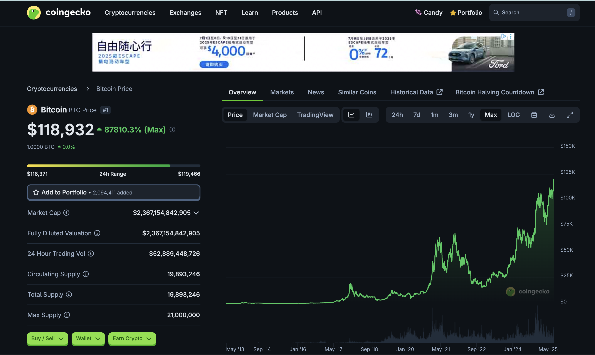
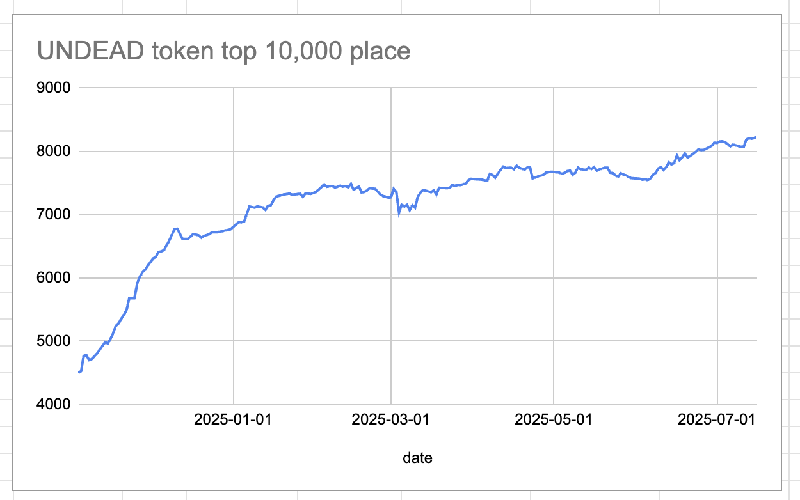
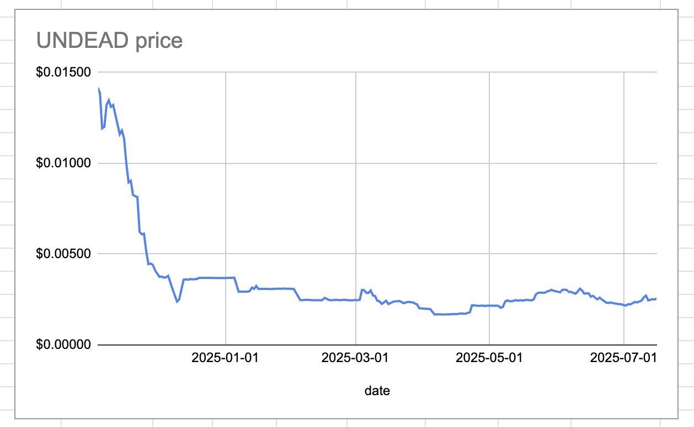
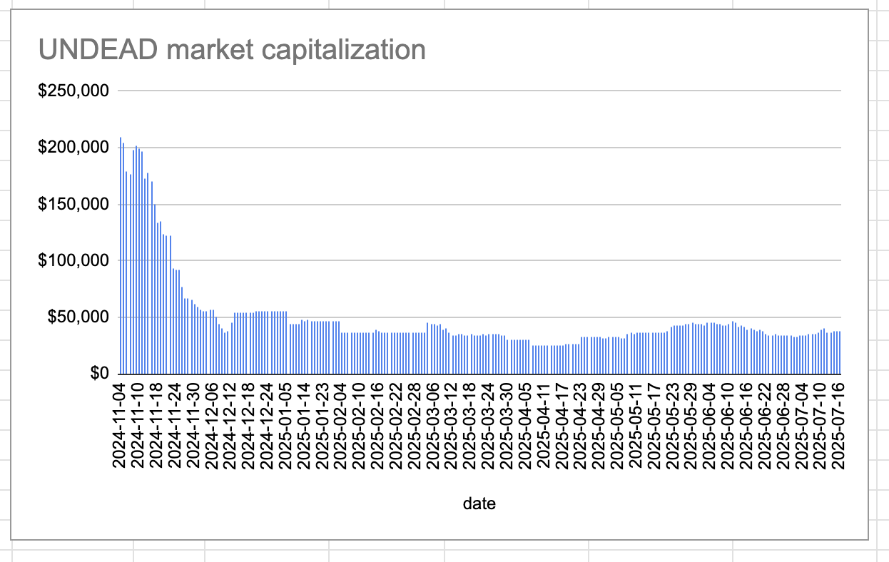
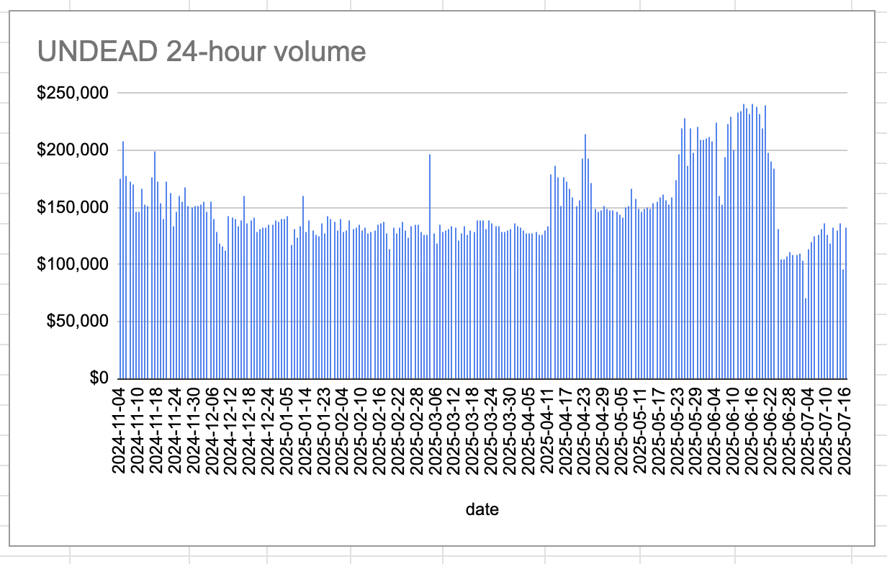
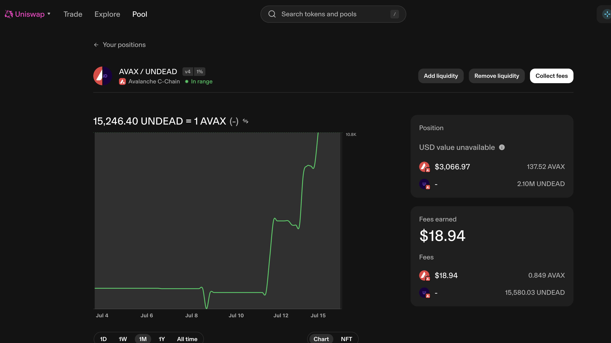
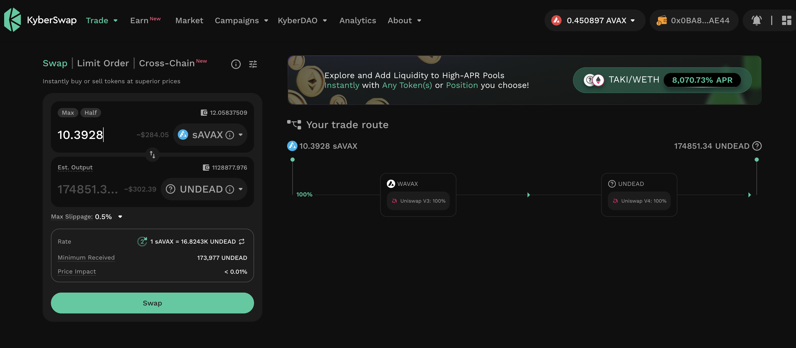

2025-07-16

$BTC price-chart.

Just because.
# 2025-07-16 Status of @UndeadBlocks / $UNDEAD 

 
 
 
 

* rank: 8240 
* quote: $0.00255 
* market cap: $38,288 
* 24-hr volume: $132,060 (δ: $35,677 ) 

[UNDEAD data source](https://www.coingecko.com/en/coins/undead-blocks) 

When we get LPs funded on multiple blockchains, what will $UNDEAD look like? 

## $UNDEAD performance analysis, 2025-07-16 

* "δ" indicates change since 2025-06-05 
* "α" is annualized since 2025-06-05 

 
 
 
 

* rank: 8240 (δ: -9.17% ) , α: -81.62% 
* quote: $0.00255 (δ: -15.63% ) , α: -139.16% 
* market cap: $38,288 (δ: -15.65% ) , α: -139.33% 
* 24-hr volume: $132,060 (δ: -17.81% ) , α: -158.58% 

[2025-06-05 $UNDEAD report (archived)](https://github.com/pivoteur/biz/tree/main/blog/snapshot) 

# $UNDEAD Liquidity Pools

@UndeadBlocks has an @Uniswap LP AVAX/UNDEAD on @avax. Stay tuned for ANNOUNCEMENTs for LPs we are launching today on DEXes on @avax.

For $UNDEAD, the fun begins: today.

You MAY want to start thinking about an investment into $UNDEAD. #NFA #DYOR 

# PIVOTS

## AVAX+UNDEAD

I close 1 hedge for gains of:

* actual ROI: 16.57% / 6046.50% APR projected
* or: 150k $UNDEAD -> $AVAX -> 175k $UNDEAD
* or: $63-gain on $265-hedge

Instead of distributing gains, I'm in conversations with stakers about using the gains to BUIDL new pools.
